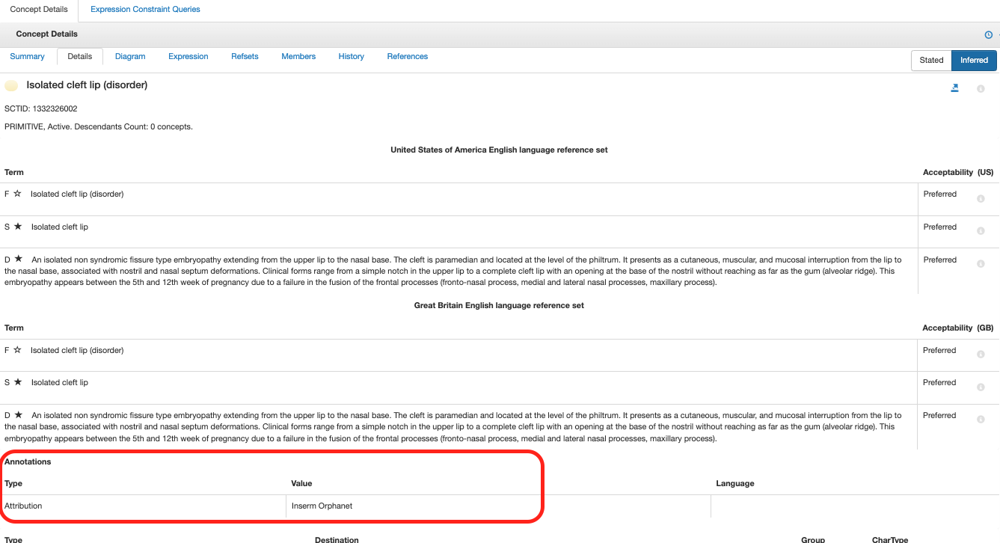

# Annotations

The purpose of annotations is to provide a formal means to represent additional information about a SNOMED CT component (concept, description, relationship) or as a member of a reference set.

Annotations are:

  * a form of metadata
  * optional and non-defining
  * constructed by following the Object-Attribute-Value pattern and stored either in annotation refsets or relationship files.

Each annotation uses a subtype of  [ 1295447006 | Annotation attribute (attribute)|](http://snomed.info/id/1295447006 "1295447006 | Annotation attribute \(attribute\) |") to represent the type of annotation with an annotation attribute value. 

## Use case

Attribution - Attributing credit to the source of information

For example,_Inserm Orphanet_ attribution annotation at 1332326002 |Isolated cleft lip (disorder)|

<figure><figcaption>
Figure 1: Details tab of 1332326002 |Isolated cleft lip (disorder)| in the browser
</figcaption></figure>

## Guidance

Annotations can be:

  * added to both new and legacy concepts. 
  * added in the international edition or extensions.
  * inactivated if incorrect or no longer relevant. An inactivation reason is not required. Each annotation attribute has its own requirements and rules on maintenance documented in separate guidance. 

Annotations in annotation refsets can be found by using ECL queries for refset members. Currently, there is only data in the refset called _Component annotation refset with string value_ , so the following ECL query yields all SNOMED CT concepts currently with an annotation: 

^ 1292992004 |Component annotation with string value reference set (foundation metadata concept)|

Annotation length is restricted up to 4000 characters and are represented by the _String_ data type which allows URL, number, and text for annotation values. Each annotation attribute should state the allowed values. 

For example,

If an attribute is only allowed for taking numbers, then URL or text should not be used for its values, because numbers are saved in different formats; numbers are saved with a prefix # and text is quoted. 

The following are documented in the respective annotation guidance, if applicable. 

  * Maintenance process
  * Validation for annotations, such as spell check
  * Annotation cardinality - Most attributes will be 0..1 but some may allow multiple values.

