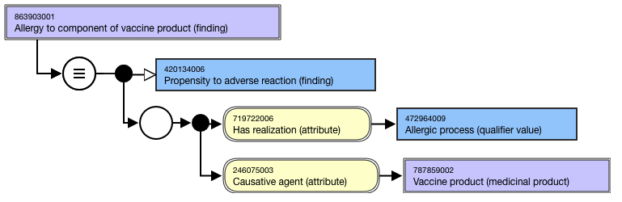
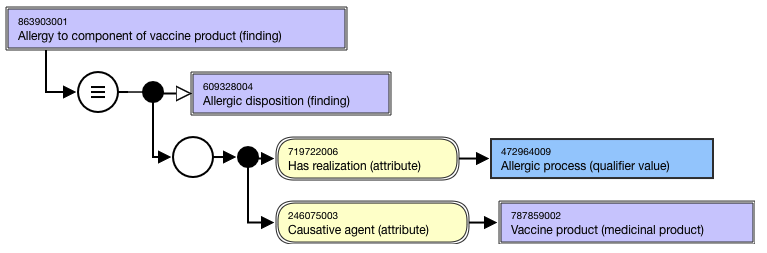
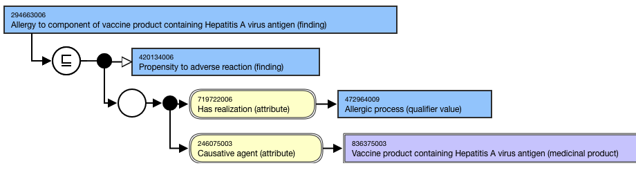
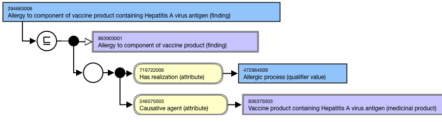
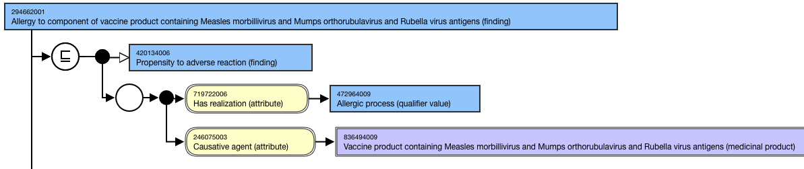
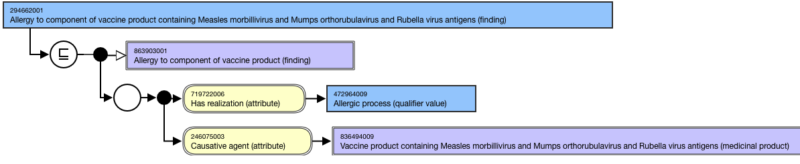

# Allergy to X vaccine

## Overview

The following modeling and terming guidelines apply to concepts in the International Release.

## Modeling

"Allergy to X vaccine" concepts shall be modeled using the proximal primitive modeling pattern. Due to the small number of concepts (n<25), no template will be created. The "Allergy to substance" template can be consulted for generalized modeling guidance.

|                            | Single or multiple ingredient vaccine                                                                                                                                                                                                                                                                                                                                                                                                                                                                |
| -------------------------- | ---------------------------------------------------------------------------------------------------------------------------------------------------------------------------------------------------------------------------------------------------------------------------------------------------------------------------------------------------------------------------------------------------------------------------------------------------------------------------------------------------- |
| Stated parent concept      | 420134006 \|Propensity to adverse reaction (finding)\|                                                                                                                                                                                                                                                                                                                                                                                                                                               |
| Semantic tag               | (finding)                                                                                                                                                                                                                                                                                                                                                                                                                                                                                            |
| Definition status          | Primitive Because 'Allergy to X vaccine' represents the propensity to an allergic reaction to any component (including excipients) of a vaccine rather than the modeled active ingredient(s), these concepts cannot be sufficiently defined. As a result, there will not be subsumption between "Allergy to X vaccine" concepts. Exceptions: Grouper concept 863903001 \|Allergy to component of vaccine product (finding)\| is modeled as sufficiently defined and subsumes the remaining concepts. |
| Attribute: Has realization | Attribute value = 472964009 \|Allergic process (qualifier value)\|                                                                                                                                                                                                                                                                                                                                                                                                                                   |
| Attribute: Causative agent | Allergy to X vaccine concepts should have one and only one \|Causative agent\| attribute. Concepts representing "vaccine product containing only" should not be used in modeling Allergy to X vaccine concepts. Range: 787859002 \|Vaccine product (medicinal product)\| Cardinality: 1..1                                                                                                                                                                                                           |

## Terming

| FSN            | Allergy to component of (finding) Allergy to component of vaccine product containing Hepatitis A virus antigen (finding) Allergy to component of vaccine product containing Streptococcus pneumoniae antigen (finding) Allergy to component of vaccine product containing Clostridium tetani and Corynebacterium diphtheriae antigens (finding) Allergy to component of vaccine product containing Measles morbillivirus and Mumps orthorubulavirus and Rubella virus antigens (finding) Use the following pattern for the FSN; align terming and case sensitivity with the FSN for the concept that represents the vaccine product that is the cause of the allergy. For example,                                                                                                                                               |
| -------------- | -------------------------------------------------------------------------------------------------------------------------------------------------------------------------------------------------------------------------------------------------------------------------------------------------------------------------------------------------------------------------------------------------------------------------------------------------------------------------------------------------------------------------------------------------------------------------------------------------------------------------------------------------------------------------------------------------------------------------------------------------------------------------------------------------------------------------------- |
| Preferred Term | Allergy to vaccine Allergy to and vaccine Allergy to and and vaccine Allergy to Hepatitis A vaccine Allergy to pneumococcal vaccine Allergy to diphtheria and tetanus vaccine Allergy to measles and mumps and rubella vaccine Use the following pattern for the PT; align terming and case significance with the PT for the disorder that is the target of the vaccine. For multiple ingredient vaccine products, the disorders must be listed in alphabetical order and separated by the word "and". For example, For national extensions modeling using "vaccine containing only" product concepts, these disorder-based descriptions will need to reflect "only" to eliminate duplicate descriptions.                                                                                                                        |
| Synonyms       | Hepatitis A vaccine allergy Pneumococcal vaccine allergy Diphtheria and tetanus vaccine allergy Measles and mumps and rubella vaccine allergy A synonym corresponding to the FSN is required. Synonyms beginning with the disorder that is the target of the vaccine are allowed.For multiple ingredient vaccine products, the disorders must be listed in alphabetical order and separated by the word "and".Note that these are not true synonyms;they may be updated and identified as "near-synonym" descriptions when that functionality becomes available although that would also potentially require updating the PT. For example, For national extensions modeling using "vaccine containing only" product concepts, these disorder-based descriptions will need to reflect "only" to eliminate duplicate descriptions. |

## Exemplars

The following illustrates the **stated** view for top level grouper 863903001 |Allergy to component of vaccine product (finding)|:

<figure><figcaption>
The following illustrates the <strong>inferred</strong> view for top level grouper 863903001 |Allergy to component of vaccine product (finding)|:
</figcaption></figure>

<figure><figcaption>
The following illustrates the <strong>stated</strong> view for 294663006 |Allergy to component of vaccine product containing Hepatitis A virus antigen (finding)|:
</figcaption></figure>

<figure><figcaption>
The following illustrates the <strong>inferred</strong> view for 294663006 |Allergy to component of of vaccine product containing Hepatitis A virus antigen (finding)|:
</figcaption></figure>

<figure><figcaption>
The following illustrates the <strong>stated</strong> view for 294662001 |Allergy to component of vaccine product containing Measles morbillivirus and Mumps orthorubulavirus and Rubella virus antigens (finding)|:
</figcaption></figure>

<figure><figcaption>
The following illustrates the <strong>inferred</strong> view for 294662001 |Allergy to component of vaccine product containing Measles morbillivirus and Mumps orthorubulavirus and Rubella virus antigens (finding)|:
</figcaption></figure>

\_

<figure><figcaption>
_
</figcaption></figure>
