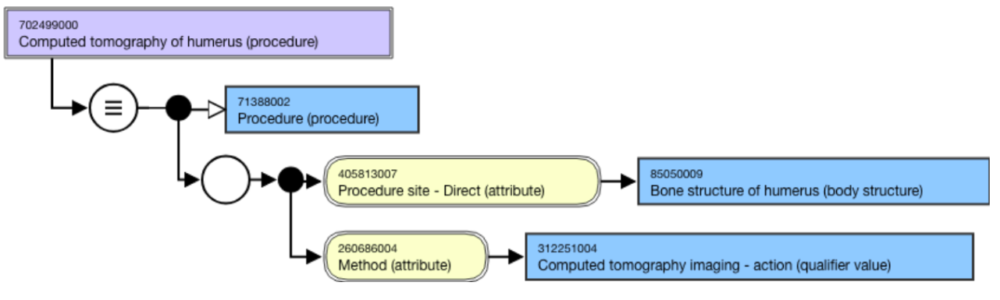
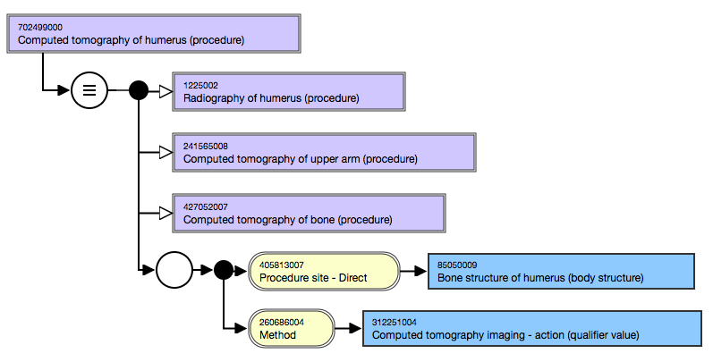
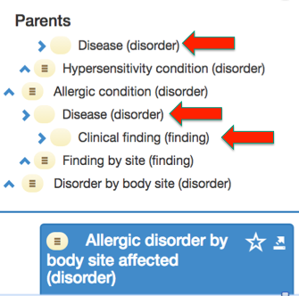

# Proximal Primitive Modeling

See glossary for definition here: [proximal primitive (PP)](https://confluence.ihtsdotools.org/display/DOCGLOSS/proximal+primitive+parent)

* For some, but not all concepts, it is a top level concept e.g. Procedure.
* The proximal primitive supertype may also be an intermediate primitive concept located between the top level concept and the concept in question.
* There may be more than one proximal primitive supertype for a concept.

The approved modelling approach is to use:

* Proximal primitive supertypes
* Attribute-value pairs sufficient to define the meaning
  * An attribute-value pair is explicitly stated for the concept, even if it is already present for a supertype concept.
  * Attribute-value pairs are grouped as required.

The classifier infers all appropriate proximal supertypes. With sufficiently defined concepts the subtypes are also inferred.

For example,

* ```
  * The _stated_ view of [ 702499000 | Computed tomography of humerus (procedure)|](http://snomed.info/id/702499000 "702499000 | Computed tomography of humerus \(procedure\) |") . The PP supertype for this concept is [ 71388002 | Procedure (procedure)|](http://snomed.info/id/71388002 "71388002 | Procedure \(procedure\) |") . It has been modeled with one stated supertype and two attribute value pairs in a relationship group.
  ```
  *

      <figure><figcaption><p>Figure 1: Stated view</p></figcaption></figure>

The _inferred_ view shows the logical definition of the concept. By using the stated relationships (for this concept and other concepts currently in the terminology), the classifier infers three defined proximal supertypes:

* ```
  * Radiography of humerus (procedure)
  ```
  * Computed tomography of upper arm (procedure)
  * Computed tomography of bone (procedure)

<figure><figcaption><p>Figure 2: Inferred view</p></figcaption></figure>

## Multiple potential primitive supertype concepts

Where more than one potential primitive supertype is identified for a concept, authors should check the primitive supertypes for subsumption of one or more other primitive supertypes. Any subsuming concept is not a PP supertype.

For example,

* ```
  * There is more than one potential primitive supertype for [ 421095001 | Allergic disorder by body site affected (disorder)|](http://snomed.info/id/421095001 "421095001 | Allergic disorder by body site affected \(disorder\) |") . However, [ 64572001 | Disease (disorder)|](http://snomed.info/id/64572001 "64572001 | Disease \(disorder\) |") is subsumed by [ 404684003 | Clinical finding (finding)|](http://snomed.info/id/404684003 "404684003 | Clinical finding \(finding\) |") , therefore [ 64572001 | Disease (disorder)|](http://snomed.info/id/64572001 "64572001 | Disease \(disorder\) |") is the proximal primitive supertype concept.
  ```

<figure><figcaption></figcaption></figure>

## GCI-Modeled primitive supertypes

For information on the effect of GCIs on modeling primitive supertypes, see [General Concept Inclusions (GCIs), GCI-Modeled Primitive Ancestor](../../General-Concept-Inclusions---GCIs_179932120.html).
