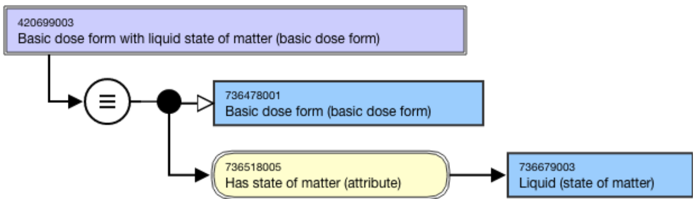
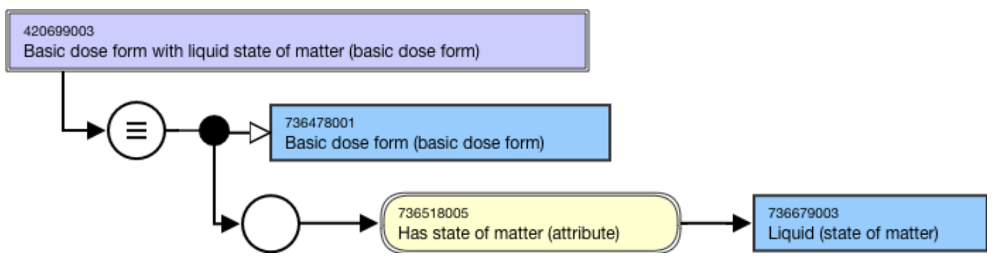
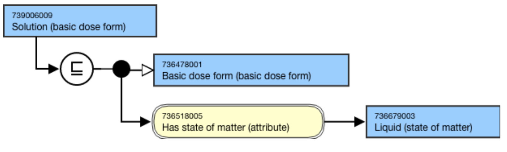
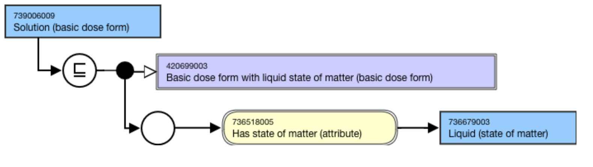

# Basic Dose Form

## Overview

The basic dose form represents a general type of pharmaceutical formulation (e.g. tablet, capsule, cream, ointment, solution, emulsion) used for medicinal products. To support fully defining concepts in the 736542009 |Pharmaceutical dose form (dose form)| hierarchy, a hierarchy representing basic dose form is required.

Concepts in the 736478001 |Basic dose form (basic dose form)| hierarchy will be used to model concepts in the 736542009 |Pharmaceutical dose form (dose form)| hierarchy; they will not be used to model concepts in the 763158003 |Medicinal product (product)| hierarchy.

The 736478001 |Basic dose form (basic dose form)| hierarchy is a descendant of 362981000 |Qualifier value (qualifier value)|.

## Modeling

Descendants shall be modeled as follows.

Parent concept| 736478001 |Basic dose form (basic dose form)  
---|---  
Semantic tag| (basic dose form)  
Definition status| Primitive

  * Exceptions:
    * Grouper concepts based on state of matter shall have _Defined_ definition status

  
Attribute:Has state of matter (attribute)| Range: <736471007 |State of matter (state of matter)Cardinality: 1..1  
  
  
## Naming Guidelines for Grouper Concept

**FSN**|  Use the following pattern for the FSN; align naming and case sensitivity with the FSN for the concept that is selected as the attribute value, excluding the semantic tag.

  * Basic dose form with <State of matter> state of matter (basic dose form)

For example,

  *     *       * Basic dose form with liquid state of matter (basic dose form)
      * Basic dose form with solid state of matter (basic dose form)

  
---|---  
**Preferred Term**|  Use the following pattern for the PT; align naming and case sensitivity with the PT for the concept that is selected as the attribute value. 

  * <State of matter PT> state of matter

For example,

  *     *       * Liquid dose form
      * Solid dose form

  
**Synonyms**|  A synonym to match the FSN is required.Additional synonyms are not allowed unless explicitly identified as an exception in the Editorial Guidelines.  
**Text Definitions**|  Preferred; not required.  
  
## Exemplars for Grouper Concept

The following illustrates the ****stated**** view for 420699003 |Basic dose form with liquid state of matter (basic dose form)|:**  
**

<figure><figcaption>
The following illustrates the *<em><strong>inferred </strong></em>*view for 420699003 |Basic dose form with liquid state of matter (basic dose form)|:
</figcaption></figure>

<figure></figure>

  

## Naming Guidelines for Basic Dose Form Concept

**FSN**|  Use the following pattern for the FSN where X is the basic dose form:

  * X (basic dose form)

For example,

  *     *       * Cream (basic dose form)
      * Gel (basic dose form)
      * Suppository (basic dose form)
      * Tablet (basic dose form)

Exceptions:

  * Plural form to be used for Granules (basic dose form)

  
---|---  
**Preferred Term**|  Use the following pattern for the PT where X is the basic dose form:

  * X

For example,

  *     *       * Cream
      * Gel
      * Suppository
      * Tablet

Exceptions:

  * Plural form to be used for _Granules_

  
**Synonyms**|  Synonyms are not allowed unless explicitly identified as an exception in the Editorial Guidelines.  
**Text Definitions**|  Text definitions are not required but are encouraged.  
  
## Exemplars for Basic Dose Form Concept

The following illustrates the ****stated**** view for 739006009 |Solution (basic dose form)|:

<figure><figcaption>
The following illustrates the <strong>inferred</strong> view for 739006009 |Solution (basic dose form)|:
</figcaption></figure>

  

<figure></figure>

  

