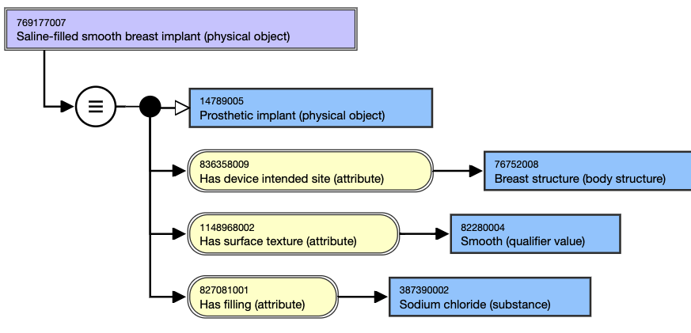
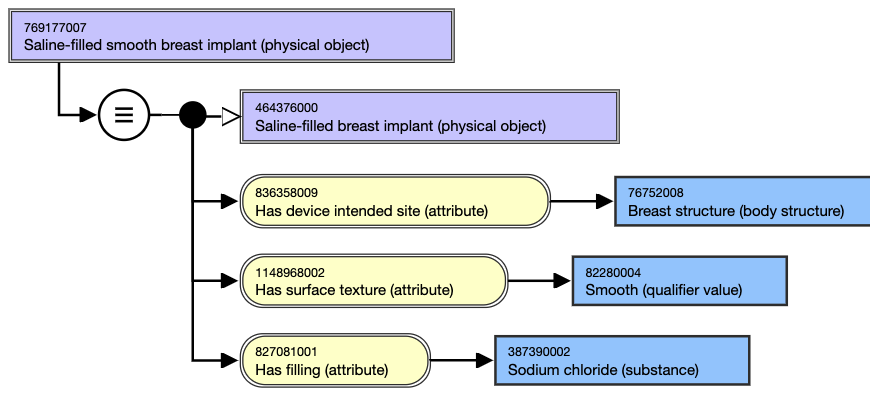

# Breast Prosthesis Naming and Modeling

## Naming Guidelines

**FSN**|  Use the following naming pattern for the FSN; align terming and case sensitivity with the FSN for the concepts selected as the attribute values, excluding the semantic tag.[filling] [surface texture] breast implant (physical object)For example,Saline-filled textured breast implant (physical object)  
---|---  
**Preferred Term**|  Use the following pattern for the PT; align terming and case sensitivity with the PT for the concept that is selected as the attribute value.[filling] [surface texture] breast implantFor example,Saline-filled textured breast implant  
**Synonym**|  Synonyms are not generally added for concepts in this hierarchy.  
  
## Modeling (stated view)

Stated parent concept(s)| 14789005 |Prosthetic implant (physical object)|  
---|---  
Semantic tag| (physical object)  
**Attribute:** Has device intended site (attribute)| 

  * Range: <<123037004 |Body structure (body structure)|
    * NOTE: While the MRCM allowed range includes the top-level concept, 123037004 |Body structure (body structure)|, only the descendants should be used in modeling breast prosthesis concepts.
  * Cardinality: 0..1

  
**Attribute:****Has filling (attribute)**| 

  * Range: <<105590001 |Substance (substance)|
    * NOTE: While the MRCM allowed range includes the top-level concept, 105590001 |Substance (substance)|, only the descendants should be used in modeling breast prosthesis concepts.
  * Cardinality: 0..*

  
 **Attribute:****Has surface texture (attribute)**| 

  * Range: 82280004 |Smooth (qualifier value)| OR 860647008 |Textured (qualifier value)|
  * Cardinality: 0..*

  
  
## Exemplars

The following illustrates the **stated** view for 769177007 |Saline-filled smooth breast implant (physical object)|:

<figure><figcaption>
The following illustrates the <strong>inferred</strong> view for 769177007 |Saline-filled smooth breast implant (physical object)|:
</figcaption></figure>

<figure></figure>
