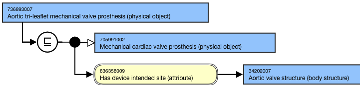
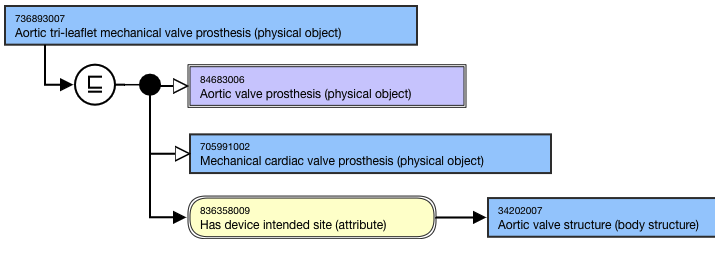

# Cardiac Valve Prosthesis Naming and Modeling

## Naming Guidelines

**FSN**|  Use the following naming pattern for the FSN; align terming and case sensitivity with the FSN for the concepts selected as the attribute values, excluding the semantic tag.[is sterile] [compositional material] [device intended site] cardiac valve prosthesis (physical object)For example,Biologic cardiac valve prosthesis (physical object)Aortic valve prosthesis (physical object)  
---|---  
**Preferred Term**|  Use the following naming pattern for the PT; align terming and case sensitivity with the PT for the concept that is selected as the attribute value.[is sterile] [compositional material] [device intended site] cardiac valve prosthesisFor example,Biologic cardiac valve prosthesisAortic valve prosthesis  
Synonym| Synonyms are not generally added for concepts in this hierarchy.

  * Exceptions:
    * _Heart_ in place of _cardiac_ , such as in "biologic heart valve prosthesis"
    * "Bioprosthesis" for biologic cardiac valve prosthesis

  
  
## Modeling (stated view)

Stated parent concept(s)| 14789005 |Prosthetic implant (physical object)|303619008 |Cardiac implant (physical object)|  
705991002 |Mechanical heart valve prosthesis (physical object)|, if applicable258166002 |Custom made implant (physical object)|, if applicable  
---|---  
Semantic tag| (physical object)  
  
**Attribute:** Has device intended site (attribute)| 

  * Range: <<123037004 |Body structure (body structure)|
    * NOTE: 
    * NOTE: While the MRCM allowed range includes the top-level concept, 123037004 |Body structure (body structure)|, only the descendants should be used in modeling cardiac valve prosthesis concepts.
  * Cardinality: 0..1

  
Attribute: **Has compositional material (attribute)**| 

  * Range: <<105590001 |Substance (substance)|
    * NOTE: While the MRCM allowed range includes the top-level concept, 105590001 |Substance (substance)|, only the descendants should be used in modeling cardiac valve prosthesis concepts.
  * Cardinality: 0..*

  
Attribute: Is sterile (attribute)| 

  * Range: 31874001 |True (qualifier value)| OR 64100000 |False (qualifier value)
  * Cardinality: 0..1

  
  
## Exemplars

The following illustrates the **stated** view for 736893007 |Aortic tri-leaflet mechanical valve prosthesis (physical object)|:

<figure><figcaption>
The following illustrates the <strong>inferred</strong> view for 736893007 |Aortic tri-leaflet mechanical valve prosthesis (physical object)|:
</figcaption></figure>

<figure></figure>
