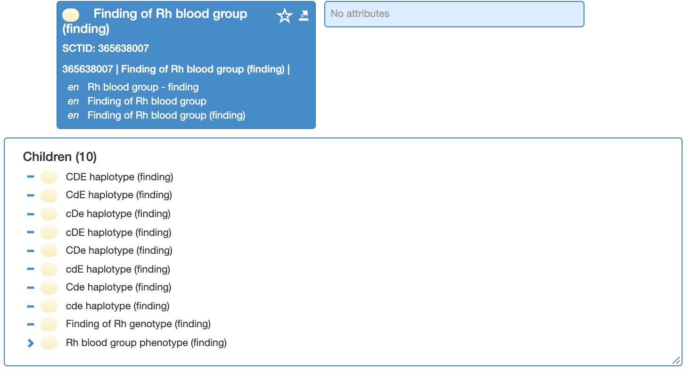

# Case Significance

Generally, SNOMED CT descriptions begin with an upper case letter; the rest of the words in the description lower case except for abbreviations, proper nouns, i.e. names of people, organizations, taxonomic groups (e.g. species, genus, family), etc. 

With regard to organism naming:

  * Non-taxonomic groupers, such as “Human herpes simplex virus”, are recorded with a case sensitivity indicator of  _Entire term case insensitive_(ci).
  * There are cases where the authoritative resources do not have an entry for the official name of an organism. For these concepts, the associated literature is referenced for naming and case sensitivity assignments.
    * For example,
      * “Severe acute respiratory syndrome coronavirus 2” is below species level and does not have an entry in the authoritative resource, _International Committee on Taxonomy of Viruses_ (ICTV). Therefore, it is recorded with a case sensitivity indicator of  _Entire term case insensitive_ (ci), since the majority of references do not capitalize “severe”.

| Case Sensitivity |   |   |   |
|---|---|---|---|
| Case Sensitivity Indicator | Values | Meaning | Examples |
| cI | 900000000000020002 \| Only initial character case insensitive (core metadata concept) \| | First character of the description may or may not be capitalized while the case of the rest of the description cannot be changed | Family history of Prader-Willi syndrome (situation) Neonatal jaundice with Dubin-Johnson syndrome (disorder) Born in Australia (finding) Penicillin resistant Streptococcus pneumoniae (organism) |
| CS | 900000000000017005 \| Entire term case sensitive (core metadata concept) \| | Cannot change any case in the description Changing case may change the meaning of the term or is not commonly used | Down syndrome English as a second language (finding) pH measurement (procedure) mm (qualifier value) |
| ci | 900000000000448009 \| Entire term case insensitive (core metadata concept) \| | Entire description may be lower or upper case Changing case does not change the meaning of the term | Fracture of tibia (disorder) Blood compatibility test (procedure) Bite of fish (event) Floor mat (physical object) |

Special attention is to be paid to the possibility of altering the semantics of those concepts whose FSN uniqueness depends upon case significance. 

For example, 

The subtypes of 365638007 |Finding of Rh blood group (finding)| vary in meaning depending upon the description's case of the letters c, d, and e.

<figure><figcaption>
Figure 1: Stated view of 365638007 |Finding of Rh blood group (finding)| and subtypes
</figcaption></figure>

  

Case sensitivity can be changed on an existing description without inactivating the description.

The common name for |Structure of pharyngotympanic tube (body structure)| is eustachian tube. While the term originated eponymously, it is not the name of the person from whom the body structure was named after. Therefore, the case significance is ci for case insensitive. 

### Extensions

SNOMED CT includes three case significance values, "ci", "cI" and "CS". However, this range of values depends on the languages and linguistic norms. For the International Edition, where the first character of descriptions is always capitalized, the value "Only initial character case insensitive" ("cI") is necessary. This value is not required for descriptions in extensions that do not adhere to this convention. When appropriate, it is also acceptable to limit the range to a single case significance value.

## Numeric values

Numeric values will not display differently if switched between upper and lower case, so numeric values should be treated as case  _insensitive_ characters in a term. 

If a description begins with a numeric value and the word following the number does not begin with a capital letter, the case sensitivity indicator is ci for _Entire term case insensitive_.

For example,

  *     * The concept  [ 33635003 | Serotonin (substance)|](http://snomed.info/id/33635003 "33635003 | Serotonin \(substance\) |") has the synonym, 5-hydroxytryptamine. The description is recorded in SNOMED CT in lower case, not 5-Hydroxytryptamine, but the case sensitivity indicator is  _ci_ for _Entire term case insensitive_.

If a description begins with a numeric value and follows with an abbreviation that contains a capital letter, the case sensitivity indicator is cl for _Initial character case insensitive_.

For example, 

  * The concept [ 387407006 | Tioguanine (substance)|](http://snomed.info/id/387407006 "387407006 | Tioguanine \(substance\) |") has the synonym, 6-TG. Apply the case sensitivity indicator of cl for  _Only initial character case insensitive_.

## Special characters

Special characters such as <, %, >, . , &, ^, will not display differently if switched between upper and lower case, so numeric values should be treated as case  _insensitive_ characters in a term. The rules for numeric values apply similarly to special characters. 

If a description begins with a special character and the word(s) and/or symbol(s) following the special character begins with a capital letter, the case sensitivity indicator is cl for  _Initial character case insensitive_.

For example,

  *     * The concept  [ 277976001 | Less than 35 degrees C (qualifier value)|](http://snomed.info/id/277976001 "277976001 | Less than 35 degrees C \(qualifier value\) |") has the synonym, <35 degrees C. The description starts with a special character that is case insensitive but contains an abbreviation "C" for Celsius that is case sensitive, so the case sensitivity indicator applied to the synonym is cl for _Only_ i _nitial character case insensitive_.

Words derived from the Greek alphabet, for example, alpha, beta, delta, gamma, omega, etc., are case insensitive wherever they are in the description in the substance hierarchy. 

## Assessment scales and Staging systems

SNOMED CT descriptions representing assessment scales and staging systems should be capitalized per the name of the scale or staging system. Legacy concepts may not follow this pattern.

For example,

  *     * Ages and Stages Questionnaires Third Edition (assessment scale)
    * Fagerstrom test for nicotine dependence (assessment scale)

    * National Cancer Institute histologic grading system (staging scale)
    * Clark system for melanoma staging (staging scale)

Gram staining is a common laboratory technique used to differentiate bacteria based on their cell wall constituents. Laboratory test results may be _Gram positive_ or _Gram negative_. The technique was developed by a Danish physician, Hans Christian Gram. Consequently _Gram_ , when referring to the technique, should always begin with an upper case _G_.
