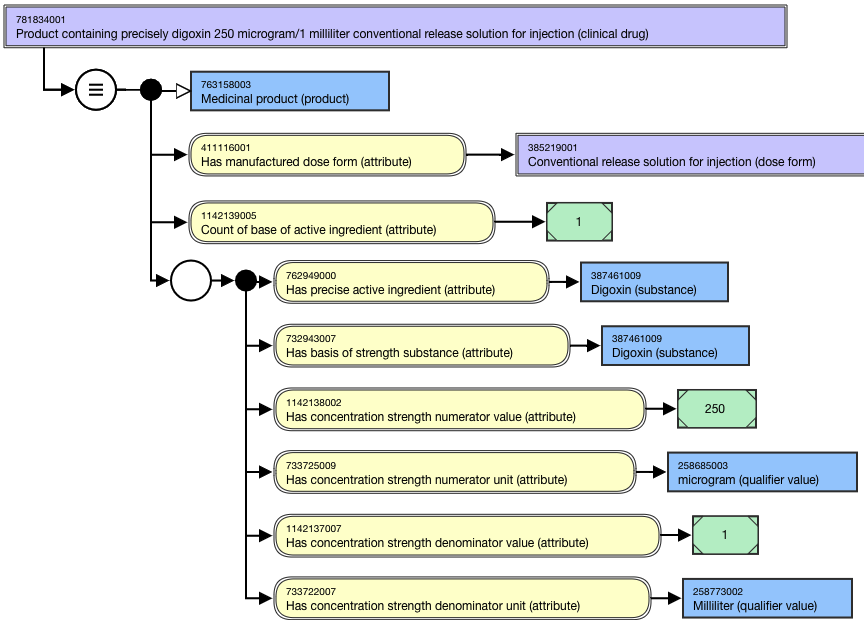
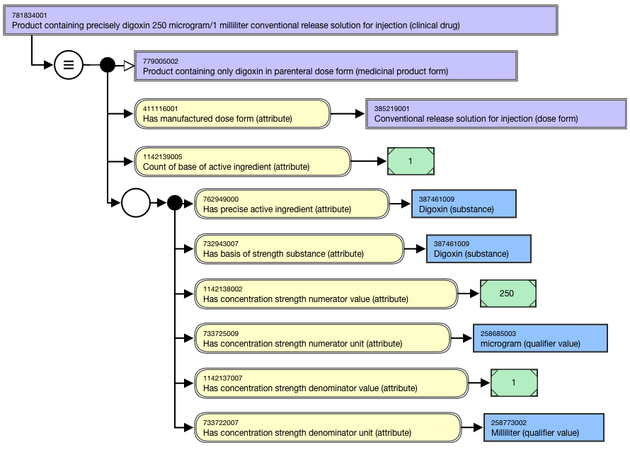
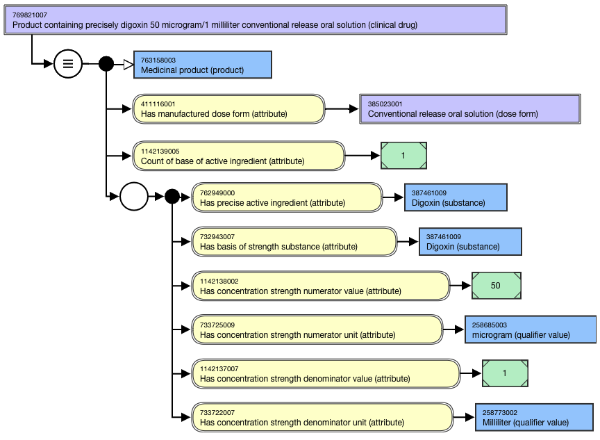
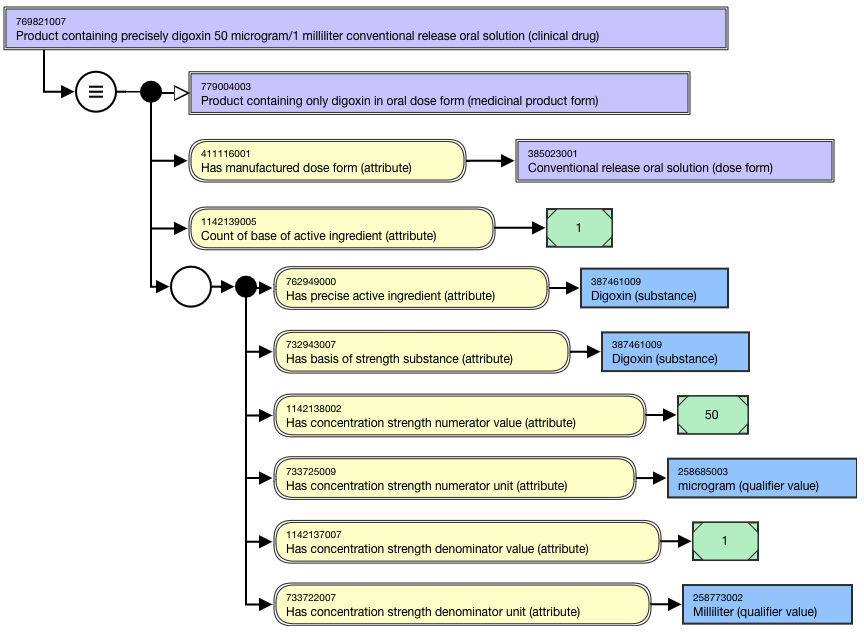
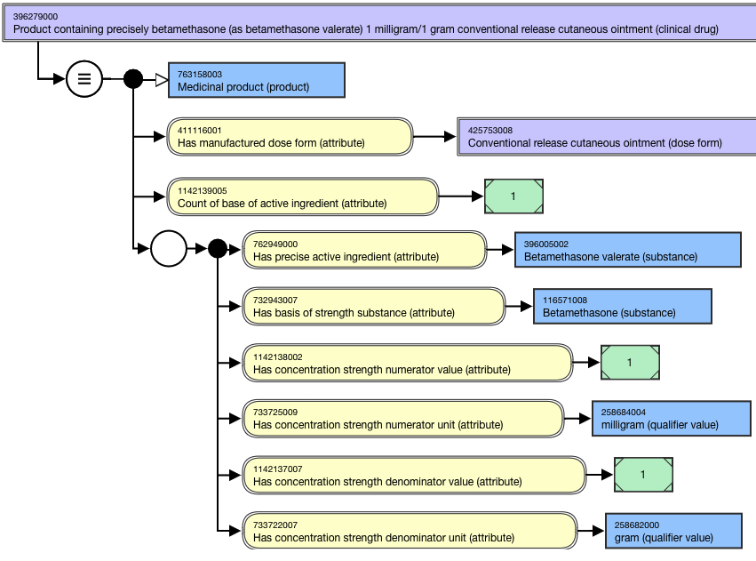
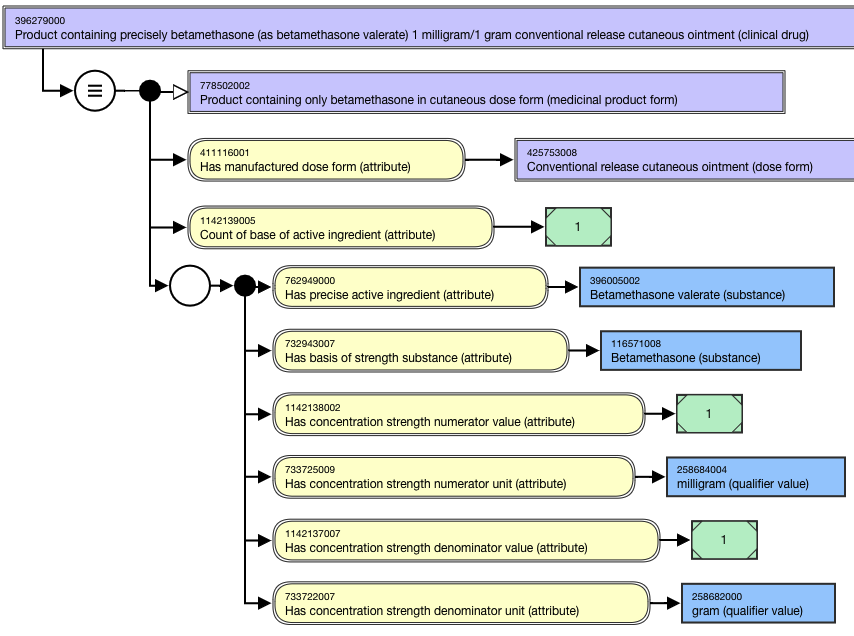
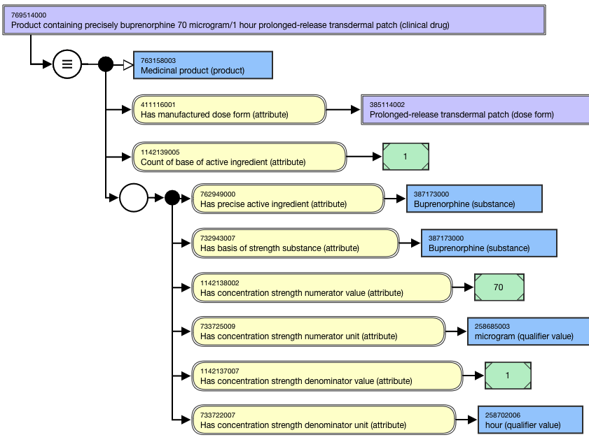
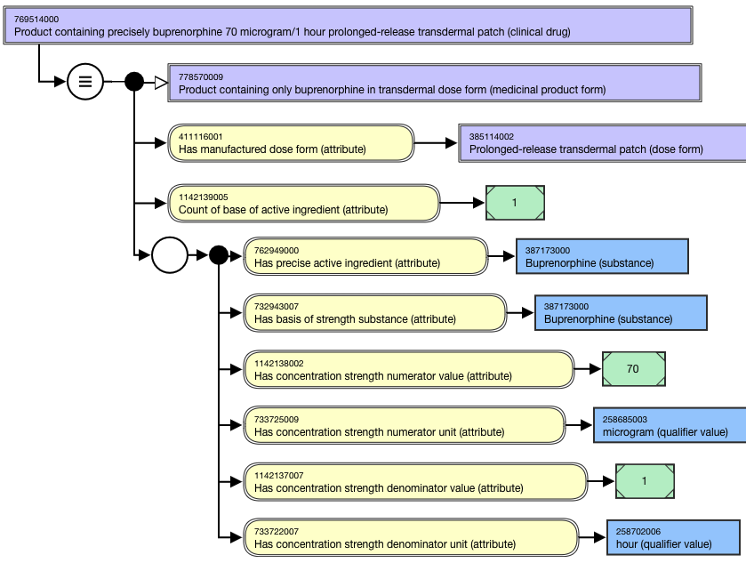

# Clinical Drug with Continuous Dose Form

## Overview

Clinical drugs representing continuous dose form (e.g., solutions, suspensions, creams, ointments, patches) are modeled using concentration strength attributes; presentation strength attributes are not allowed for these concepts in the International Release.

For example,

  *     * Product containing precisely zidovudine 10 milligram/1 milliliter conventional release oral solution (clinical drug)
    * Product containing precisely amikacin (as amikacin sulfate) 250 milligram/1 milliliter conventional release solution for injection (clinical drug)
    * Product containing precisely clotrimazole 10 milligram/1 gram conventional release cutaneous cream (clinical drug)
    * Product containing precisely mupirocin (as mupirocin calcium) 20 milligram/1 gram conventional release nasal ointment (clinical drug)
    * Product containing precisely buprenorphine 70 microgram/1 hour prolonged-release transdermal patch (clinical drug)

## Modeling

| Stated parent | 763158003 \|Medicinal product (product)\| |
|---|---|
| Semantic tag | (clinical drug) |
| Definition status | Concepts with product strength that is "not equal to" (e.g. with product strength expressed as a range, greater than, or less than) are primitive Defined Exception: |
| Attribute: Has manufactured dose form | While the allowed range for this attribute is broader, the CD-precise continuous dose from concepts should only use <736542009 \| Pharmaceutical dose form (dose form), excluding grouper concepts based on intended site (e.g. 740596000 \|Cutaneous dose form (dose form)\|, 385268001 \|Oral dose form (dose form)\|). Range: 736542009 \|Pharmaceutical dose form (dose form)\| Cardinality: 1..1 Powder and granules for oral suspension, solution, etc., may be modeled using concentration strength and the administrable dose form (e.g. 1145409004 \|Product containing precisely amoxicillin 25 milligram/1 milliliter and clavulanic acid (as clavulanate potassium) 6.25 milligram/1 milliliter conventional release oral suspension (clinical drug)\|) |
| Attribute: Count of base of active ingredient (attribute) | Concrete Type: Integer Range: >#0.. Cardinality: 1..1 |
| Relationship group | One relationship group containing one instance of each of the following attributes is required for each precise active ingredient. |
| Has precise active ingredient | The Precise Active Ingredient (PAI) cannot be modeled as a substance hydrate or solvate unless the BoSS is expressed as a hydrate or solvate. Concepts containing pancreatic enzymes will be modeled based on the discrete enzymes; because of variability between real clinical drugs, synonyms representing a total amount in a particular product will not be included in the International Release. Range: <105590001 \|Substance (substance) excluding concepts representing structural groupers, dispositions, or combined substances Cardinality: 1..1 per relationship group |
| Has basis of strength substance | Range: <105590001 \|Substance (substance) excluding concepts representing structural groupers, dispositions, or combined substances Cardinality: 1..1 per relationship group |
| Has concentration strength numerator value | Concrete Type: Decimal Range: >#0.. Cardinality: 1..1 per relationship group |
| Has concentration strength numerator unit | Range: <767524001\|Unit of measure (qualifier value)\| Cardinality: 1..1 per relationship group |
| Has concentration strength denominator value | Concrete Type: Decimal Range: >#0.. Cardinality: 1..1 per relationship group For this pattern, the attribute value must be 1. The denominator strength value is required for concepts in theInternational Releaseeven though the value = 1,because including denominators for only some concepts negatively affects the classification results. |
| Has concentration strength denominator unit | liquid dose form: the denominator unit should be 258773002 \|Milliliter (qualifier value)\|. semi-solid dose form: the denominator unit should be 258682000 \| gram (qualifier value) \| for weight/weight concentration and 258773002 \|Milliliter (qualifier value)\| for weight/volume concentration. Representing semi-solid dose forms in weight/weight concentration is preferred. Range: <767524001 \|Unit of measure (qualifier value)\| Cardinality: 1..1 per relationship group For Clinical drug concepts with: |

## Naming

Use one of the following patterns for the FSN and PT. 

| FSN | Product containing precisely <BoSS FSN> <Concentration strength numerator value FSN> < Concentration strength numerator unit FSN> / <Concentration strength denominator value FSN> < Concentration strength denominator unit FSN> <Manufactured dose form FSN> (clinical drug) Product containing precisely amitriptyline hydrochloride 5 milligram/1 milliliter conventional release oral solution (clinical drug) Product containing precisely buprenorphine 70 microgram/1 hour prolonged-release transdermal patch (clinical drug) Product containing precisely clotrimazole 10 milligram/1 gram conventional release cutaneous cream (clinical drug) Product containing precisely zidovudine 10 milligram/1 milliliter conventional release oral solution (clinical drug) Product containing precisely lopinavir 80 milligram/1 milliliter and ritonavir 20 milligram/1 milliliter conventional release oral solution (clinical drug) Product containing precisely <BoSS FSN> (as <Precise active ingredient FSN> ) < Concentration strength numerator value FSN> < Concentration strength numerator unit FSN> / <Concentration strength denominator value FSN> < Concentration strength denominator unit FSN> <Manufactured dose form FSN> (clinical drug) Product containing precisely amikacin (as amikacin sulfate) 250 milligram/1 milliliter conventional release solution for injection (clinical drug) Product containing precisely mupirocin (as mupirocin calcium) 20 milligram/1 gram conventional release nasal ointment (clinical drug) Where Precise active ingredient = BoSS: For example, Where Precise active ingredient is not = BoSS: For example, |
|---|---|
| Preferred Term | <BoSS PT> <Concentration strength numerator value PT> <Concentration strength numerator unit PT> / <Concentration strength denominator value PT> < Concentration strength denominator unit PT> <Manufactured dose form PT> Amitriptyline hydrochloride 5 mg/mL oral solution Buprenorphine 70 microgram/hour prolonged-release transdermal patch Clotrimazole 10 mg/g cutaneous cream Zidovudine 10 mg/mL oral solution Lopinavir 80 mg/mL and ritonavir 20 mg/mL oral solution <BoSS PT> (as <Precise active ingredient PT> ) <Concentration strength numerator value PT> <Concentration strength numerator unit PT> / <Concentration strength denominator value PT> < Concentration strength denominator unit PT> <Manufactured dose form PT> Amikacin (as amikacin sulfate) 250 mg/mL solution for injection Mupirocin (as mupirocin calcium) 20 mg/g nasal ointment Where Single ingredient with BoSS = Precise active ingredient: For example, Where Single ingredient with BoSS is not = Precise active ingredient: For example, |
| Synonyms | Synonyms converting metric units to percent or parts per millions may be included for medical gas concepts (e.g. Helium 79% and oxygen 21% gas for inhalation, Helium 790,000 ppm and oxygen 210,000 ppm gas for inhalation). |

## Exemplars

The following illustrates the **stated** view for 781834001 |Product containing precisely digoxin 250 microgram/1 milliliter conventional release solution for injection (clinical drug)|:

<figure><figcaption>
The following illustrates the <strong>inferred</strong> view for 781834001 |Product containing precisely digoxin 250 microgram/1 milliliter conventional release solution for injection (clinical drug)|:
</figcaption></figure>

<figure><figcaption>
The following illustrates the <strong>stated</strong> view for 769821007 |Product containing precisely digoxin 50 microgram/1 milliliter conventional release oral solution (clinical drug)|:
</figcaption></figure>

<figure><figcaption>
The following illustrates the <strong>inferred</strong> view for 769821007 |Product containing precisely digoxin 50 microgram/1 milliliter conventional release oral solution (clinical drug)|:
</figcaption></figure>

  

<figure><figcaption>
The following illustrates the <strong>stated</strong> view for 396279000 |Product containing precisely betamethasone (as betamethasone valerate) 1 milligram/1 gram conventional release cutaneous ointment (clinical drug)|:
</figcaption></figure>

<figure><figcaption>
The following illustrates the <strong>inferred</strong> view for 396279000 |Product containing precisely betamethasone (as betamethasone valerate) 1 milligram/1 gram conventional release cutaneous ointment (clinical drug)|:
</figcaption></figure>

  

<figure><figcaption>
The following illustrates the <strong>stated</strong> view for 769514000 |Product containing precisely buprenorphine 70 microgram/1 hour prolonged-release transdermal patch (clinical drug)|:
</figcaption></figure>

<figure><figcaption>
The following illustrates the <strong>inferred</strong> view for 769514000 |Product containing precisely buprenorphine 70 microgram/1 hour prolonged-release transdermal patch (clinical drug)|:
</figcaption></figure>

  

<figure></figure>

  

