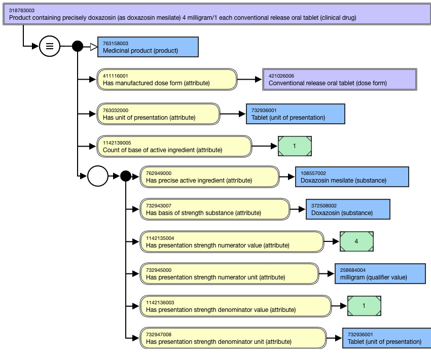
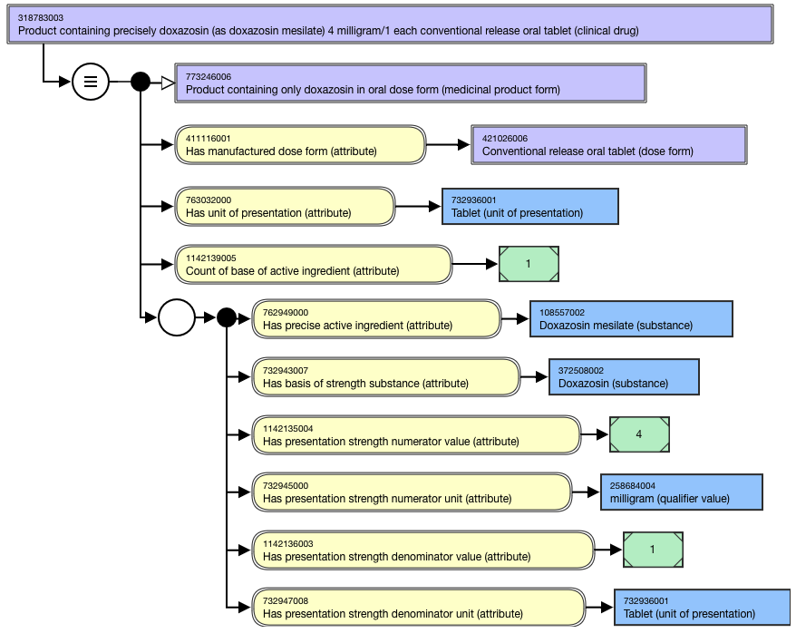
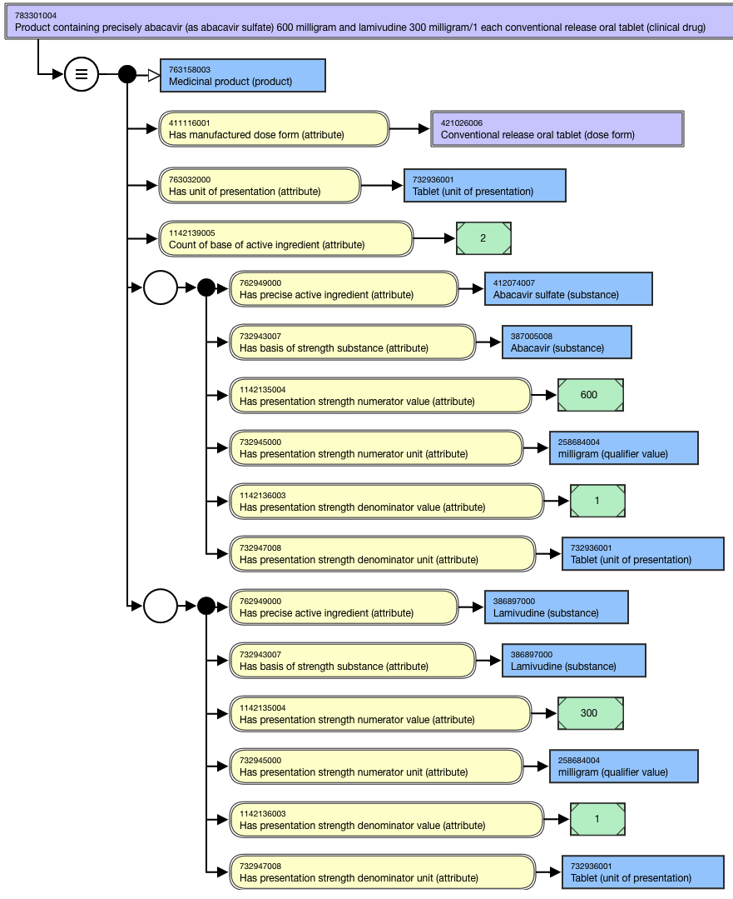
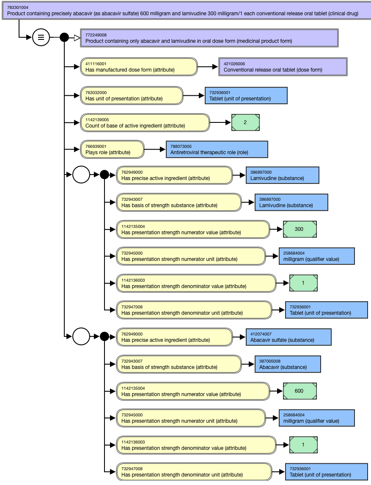

# Clinical Drug with Discrete Dose Form

## Overview

CD-precise concepts representing discrete dose form (e.g. tablets, capsules, pessaries, suppositories, sachets, ampules or vials containing solid dose forms such as powders or granules, and metered dose delivery products such as inhalers and spray) are modeled using _presentation_ strength attributes; concentration strength attributes are not allowed for these concepts in the International Release.

For example,

  *     * Product containing precisely abacavir 300 milligram/1 each conventional release oral tablet (clinical drug)
    * Product containing precisely abacavir 600 milligram and lamivudine 300 milligram/1 each conventional release oral tablet (clinical drug)
    * Product containing precisely afatinib (as afatinib dimaleate) 30 milligram/1 each conventional release oral tablet (clinical drug)
    * Product containing precisely aztreonam 500 milligram/1 vial powder for conventional release solution for injection (clinical drug)
    * Product containing precisely flucloxacillin (as flucloxacillin sodium) 250 milligram/1 vial powder for conventional release solution for injection (clinical drug)
    * Product containing precisely budesonide 200 microgram/1 actuation conventional release powder for inhalation (clinical drug)

When a product has a metered delivery, the strength is "per actuation" not as a concentration. 

For example,

  *     * 1263426000 |Product containing precisely xylometazoline hydrochloride 140 microgram/1 actuation conventional release nasal spray (clinical drug)|

### Sodium valproate and Valproic acid

The Count of active ingredient (attribute) relationship has been added to certain single-ingredient valproic acid or sodium valproate clinical drug concepts to prevent incorrect subsumption under multiple-ingredient concepts (such as those containing both sodium valproate and valproic acid). This modeling ensures correct classification, particularly when substances share a base moiety but differ at the modification level.

For example,

  *     * 765633006 |Product containing precisely sodium valproate 200 milligram/1 each prolonged-release oral tablet (clinical drug)| includes a |Count of active ingredient (attribute)| to prevent it from being inferred as a parent of 1204385002 |Product containing precisely sodium valproate 200 milligram and valproic acid 87 milligram/1 each prolonged-release oral tablet (clinical drug)|.

In addition, when any concept in a sibling set requires the additional |Count of active ingredient| attribute to classify correctly, this attribute should also be added to all sibling concepts for consistency. 

## Modeling

Stated parent| 763158003 |Medicinal product (product)  
---|---  
Semantic tag| (clinical drug)  
Definition status| Defined

  * Exception:
    * Concepts with product strength that is "not equal to" (e.g. with product strength expressed as a range, greater than, or less than) will have a definition status of Primitive.

  
**Attribute:****Has manufactured dose form**|  Range: <736542009 |Pharmaceutical dose form (dose form)

  *     *       * While the allowed range for this attribute is broader, the CD-precise discrete dose form concepts should only use <736542009 |Pharmaceutical dose form (dose form)|, excluding grouper concepts based on intended site (e.g. 740596000 |Cutaneous dose form (dose form)|, 385268001 |Oral dose form (dose form)|)

Cardinality: 1..1Powder and granules for oral suspension, solution, etc. may be modeled using concentration strength and the administrable dose form (e.g. 1145409004 |Product containing precisely amoxicillin 25 milligram/1 milliliter and clavulanic acid (as clavulanate potassium) 6.25 milligram/1 milliliter conventional release oral suspension (clinical drug)|)  
**Attribute:****Has unit of presentation**|  Range: <732935002 |Unit of presentation (unit of presentation)|Cardinality: 1..1  
**Attribute:****Count of base of active ingredient (attribute)**|  Concrete Type: IntegerRange: >#0..Cardinality: 1..1  
Relationship group| One relationship group containing one instance of each of the following attributes is required for each precise active ingredient.  
  
  * Has precise active ingredient

| Range: <105590001 |Substance (substance)| excluding concepts representing structural groupers, dispositions, or combined substancesCardinality: 1..1 per relationship groupNote:

  * The PAI cannot be modeled as a substance hydrate or solvate unless the BoSS is expressed as a hydrate or solvate.
  * Concepts containing pancreatic enzymes are modeled based on the discrete enzymes; because of variability between real clinical drugs, synonyms representing a total amount in a particular product will not be included in the International Release.

  
  
  * Has basis of strength substance

| Range: <105590001 |Substance (substance)| excluding concepts representing structural groupers, dispositions, or combined substancesCardinality: 1..1 per relationship group  
  
  * **Has presentation strength numerator value**

|  Concrete Type: DecimalRange: >#0..Cardinality: 1..1 per relationship group  
  
  * **Has presentation strength numerator unit**

|  Range: <767524001 |Unit of measure (qualifier value)| Cardinality: 1..1 per relationship group  
  
  * Has presentation strength denominator value

| Concrete Type: DecimalRange: >#0..Cardinality: 1..1 per relationship groupFor this pattern, the attribute value is 1.The denominator strength value is required for concepts in the International Release even if the value = 1, because including denominators for only some concepts negatively affects the classification results.  
  
  * Has presentation strength denominator unit

| 

  * Range: <767524001 |Unit of measure (qualifier value)| 
    * While the allowed range for this attribute is broader, the CD-precise concepts representing discrete dose forms should only use <732935002 |Unit of presentation (unit of presentation).
  * Cardinality: 1..1 per relationship group

  
  
## Naming

Use one of the following patterns for the FSN and PT.

FSN| **Where Precise active ingredient = BoSS **and Unit of presentation = discrete solid dose form (e.g. capsule, lozenge, pessary, suppository, tablet):****

  * Product containing precisely <BoSS FSN> <Presentation strength numerator value FSN> <Presentation strength numerator unit FSN>/<Presentation strength denominator value FSN> each <Manufactured dose form FSN> (clinical drug)

For example,

  *     *       *         * Product containing precisely abacavir 300 milligram/1 each conventional release oral tablet (clinical drug)
        * Product containing precisely abacavir 600 milligram and lamivudine 300 milligram/1 each conventional release oral tablet (clinical drug)
        * Product containing precisely atropine sulfate 600 microgram/1 each conventional release oral tablet (clinical drug)
        * Product containing precisely codeine sulfate 15 milligram/1 each conventional release oral tablet (clinical drug)

**Where Precise active ingredient**is not = BoSS**and Unit of presentation = discrete solid dose form (e.g. capsule, lozenge, pessary, suppository, tablet):******

  * Product containing precisely <BoSS FSN> (as <Precise active ingredient FSN>) <Presentation strength numerator value FSN> <Presentation strength numerator unit FSN>/<Presentation strength denominator value FSN> each <Manufactured dose form FSN> (clinical drug)

For example,

  *     *       *         * Product containing precisely doxazosin (as doxazosin mesilate) 4 milligram/1 each conventional release oral tablet (clinical drug)
        * Product containing precisely disopyramide (as disopyramide phosphate) 150 milligram/1 each prolonged-release oral tablet (clinical drug)

****Where Precise active ingredient = BoSS and Unit of presentation = other discrete dose form (e.g. actuation, vial, sachet)****

  * Product containing precisely <BoSS FSN> <Presentation strength numerator value FSN> <Presentation strength numerator unit FSN>/Presentation strength denominator value FSN> <Presentation strength denominator unit FSN> Manufactured dose form FSN> (clinical drug)

For example,

  *     *       *         * Product containing precisely aztreonam 500 milligram/1 vial powder for conventional release solution for injection (clinical drug)
        * Product containing precisely budesonide 200 microgram/1 actuation conventional release powder for inhalation (clinical drug)

**Where Precise active ingredient is not = BoSS and Unit of presentation = other discrete dose form (e.g. actuation, vial, sachet)**

  * Product containing precisely <BoSS FSN> (as <Precise active ingredient FSN>) <Presentation strength numerator value FSN> <Presentation strength numerator unit FSN>/<Presentation strength denominator value FSN> <Presentation strength denominator unit FSN> Manufactured dose form FSN> (clinical drug)

For example,

  *     *       *         * Product containing precisely flucloxacillin (as flucloxacillin sodium) 250 milligram/1 vial powder for conventional release solution for injection (clinical drug)
        * Product containing precisely buserelin (as buserelin acetate) 100 microgram/1 actuation conventional release nasal spray (clinical drug)

  
---|---  
Preferred Term| **Where BoSS = Precise active ingredient:**

  * <BoSS PT> <Presentation strength numerator value PT> <Presentation strength numerator unit PT> <Manufactured dose form PT> <Has unit of presentation PT>

For example,

  *     *       *         * Abacavir 300 mg oral tablet
        * Abacavir 600 mg and lamivudine 300 mg oral tablet
        * Atropine sulfate 600 microgram oral tablet  

        * Codeine sulfate 15 mg oral tablet
        * Aztreonam 500 mg powder for solution for injection vial
        * Budesonide 200 microgram/actuation powder for inhalation
        * Buserelin (as buserelin acetate) 100 microgram/actuation nasal spray
        * Ivacaftor 25 mg oral granules sachet

**Where BoSS is not = Precise active ingredient:**

  * <BoSS PT> (as <Precise active ingredient PT>) <Presentation strength numerator value PT> <Presentation strength numerator unit PT> <Manufactured dose form PT> <Has unit of presentation PT>

For example,

  *     *       *         * US PT: Doxazosin (as doxazosin mesylate) 4 mg oral tablet
        * GB PT: Doxazosin (as doxazosin mesylate) 4 mg oral tablet
        * US/GB PT: Disopyramide (as disopyramide phosphate) 150 mg prolonged-release oral tablet
        * US PT: Floxacillin (as floxacillin sodium) 250 mg powder for solution for injection vial
        * GB PT: Flucloxacillin (as flucloxacillin sodium) 250 mg powder for solution for injection vial

  
Synonyms| Synonyms matching the FSN are not required.  
  
## Exemplars

The following illustrates the **stated** view for 318783003 |Product containing precisely doxazosin (as doxazosin mesilate) 4 milligram/1 each conventional release oral tablet (clinical drug)|:

<figure><figcaption>
The following illustrates the <strong>inferred</strong> view for 318783003 |Product containing precisely doxazosin (as doxazosin mesilate) 4 milligram/1 each conventional release oral tablet (clinical drug)|:
</figcaption></figure>

<figure><figcaption>
The following illustrates the <strong>stated</strong> view for 783301004 |Product containing precisely abacavir (as abacavir sulfate) 600 milligram and lamivudine 300 milligram/1 each conventional release oral tablet (clinical drug)|:
</figcaption></figure>

<figure><figcaption>
The following illustrates the <strong>inferred</strong> view for 783301004 |Product containing precisely abacavir (as abacavir sulfate) 600 milligram and lamivudine 300 milligram/1 each conventional release oral tablet (clinical drug)|:
</figcaption></figure>

<figure></figure>

  

  

  

