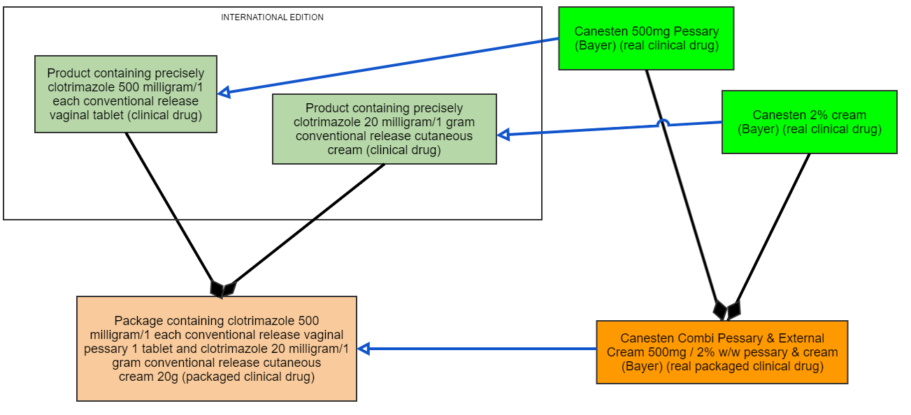
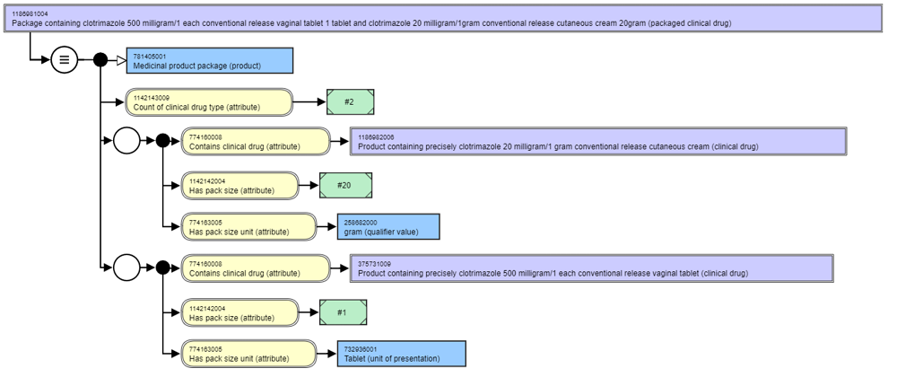
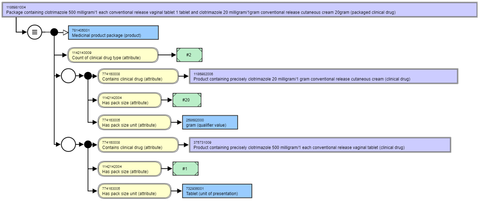
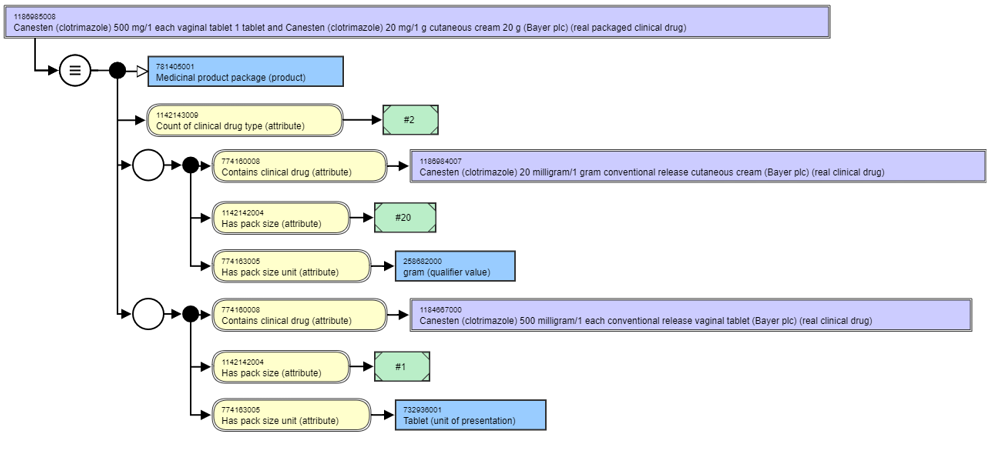
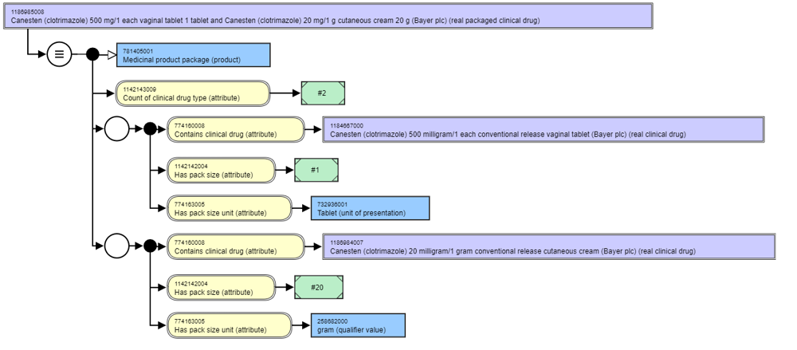

# Combination (Real) Packaged Clinical Drugs

# Definition

The representation of a medicinal product as it is supplied in a package that contains within the package more than one type of clinical drug. 

# Use Cases

The use cases supported by the Combination (Real) Packaged Clinical Drug concept type are the same as those for the basic real packaged clinical drug with the additional detail that administration records may wish to identify which of the particular component clinical drugs were administered at any particular point in time of the administration event (using AIDC or similar).

# Discussion

For abstract concepts, the combination packaged clinical drug contains two or more different clinical drugs.

For real concepts, the combination real packaged clinical drug contains two or more different real clinical drugs. The package is placed in the supply chain using a single name (which may be a trade or brand name) by a single supplier organisation, even if one or more of the component real clinical drugs is sourced from a different organisation. For this reason, the 774158006 |Has product name| and 774159003 |Has supplier| attributes are optionally included.

A combination packaged clinical drug may also be called a _component product_ or a _multi-component package_ as the product itself is a package that contains more than one type of component element (clinical drug) within it. It may also be known as or a _kit_ or a _combination medicinal product_. Occasionally a combination packaged clinical drug may be known as a _compound product_ , but this term risks being confused with products that are extemporaneously compounded by a pharmacist from a formula provided by the prescriber for an individual patient (sometimes also known as _magistral products_).

Examples of combination packaged clinical drug include a package each containing:

  * clotrimazole cutaneous cream and one or more clotrimazole vaginal tablets for treatment of vaginal candidiasis
  * clotrimazole cutaneous cream and one or more fluconazole oral capsules for treatment of vaginal candidiasis
  * combinations of ethinylestradiol and levonorgestrel tablets in different strengths and which may also include inert tablets for oral contraception (note that in this example, the components are themselves multi-ingredient items)
  * amoxicillin, clarithromycin and lansoprazole for treatment of Helicobacter infection
  * a budesonide dispersible tablet and the vehicle to disperse it in to make a rectal solution for treatment of colitis
  * rasburicase 1.5 mg powder for solution for injection and the diluent solution

This specification for national drug extensions recommends that a combination packaged clinical drug should be represented only as packaged products (real packaged clinical drugs, and if an abstract representation is required, as packaged clinical drugs), with their individual components represented as clinical drugs. For practical implementation of a national terminology, mechanisms such as reference sets may be used to include combination packaged clinical drug with other classes of medicinal product (such as clinical drugs) to aid users in finding and selecting these products. 

The following diagram gives an example of how the packaged medicinal product classes should be used to describe combination medicinal products:

<figure><figcaption>
<em>Figure 1: Diagram of options for a national extension describing combination real packaged clinical drugs</em>
</figcaption></figure>

In some representations of combination packages, and particularly in ISO 11615 in IDMP, a _combined dose form_ concept is used in the name of the combination product (for example, pessary and cream). Although useful as a concept to describe the dose form using a single attribute and value, a combination dose form concept does not easily support knowing which component has which dose form. The model used here, whereby each clinical drug is described with its appropriate dose form and they are brought together into the packaged product containing the components, does not require the use of combination dose form concepts. 

For those combination packages that contain a diluent as an item in the package, national extensions may decide not to explicitly describe the diluent as a component but merely to describe its presence in the text of the fully specified name for the real packaged medicinal product; alternatively, the national extension may author a _diluent_ clinical drug concept and use that as one of the components of the combination product. If the constitution of the diluent is known (e.g., water for injections, 0.9% sodium chloride solution for injection), the clinical drug for the diluent can be explicitly described. Dual chamber products containing the two components (where one is the diluent) in a single unit of presentation can be described as combination products if required.

# Attributes

The following table describes the attributes for combination (real) packaged clinical drugs in a national extension.

The (real) packaged clinical drug class is related to the clinical drug class by a composition relationship, and therefore, the [ 774160008 | Contains clinical drug (attribute)|](http://snomed.info/id/774160008 "774160008 | Contains clinical drug \(attribute\) |") is used to make the association between the packaged clinical drug and the clinical drugs it contains. 

Representation of packaged medicinal products should use Clinical Drugs that have presentation strength (either only, or in addition to, concentration strength) whenever possible in order to be able to accurately describe the number of presentation units present in the package. The exception is for continuous products such as semi-solid dose forms of creams, gels, etc. where strength pattern 3a is used (see [Ingredient Strength Attributes](Ingredient-Strength-Attributes_303923286.html)). In all cases, the pack size and pack size unit should relate to the denominator unit of the strength.

| Semantic tag | (packaged clinical drug) OR (real packaged clinical drug) |   |
|---|---|---|
| Definition status | 900000000000073002\|Sufficiently defined concept definition status (core metadata concept)\| Note: This can only be the case if extensions author concepts to represent real clinical drugs and/or product names and manufacturer / supplier organisations |   |
| Attribute: 1142143009 \|Count of clinical drug type (attribute)\| | INT (integer) 1..1 This attribute provides the number (count) of distinct clinical drug (concepts) present in the package. For combination packages, this value should be greater than one Range Cardinality Note |   |
| Attribute Attribute: 774158006 \|Has product name (attribute)\| | Extensions must author product name concepts within their extension using the root of 774167006 \| Product name (product name) \| from the Qualifier hierarchy 0..1 The attribute value should represent the (authorised) product name; this may or may not be a trademarked name and is often referred to as the "brand name" (see section below) This attribute should only be valued in the rare circumstances when the product name for the combination product is known to be different from the product name of the component real clinical drugs <774167006\|Product name (product name)\| Cardinality Notes |   |
| Attribute: 774159003 \|Has supplier (attribute)\| Attribute: 774159003 \|Has supplier (attribute)\| | Extensions must author concepts to value supplier organisation information within their extension using the root of 774164004 \| Supplier (supplier) \| from the Qualifier hierarchy 0..1 The attribute value should represent the holder of the marketing authorisation or authorisation for supply; this may or may not be the organisation responsible for the actual manufacture of the product (see section below) This attribute should only be valued in the rare circumstances when the supplier for the combination product is known to be different from the supplier of component real clinical drugs <774164004\|Supplier (supplier)\| Cardinality Notes |   |
| Role Group 1..* for combination packaged clinical drugs | Attribute: 774160008 \|Contains clinical drug (attribute)\| | 1..1 This attribute value represents the real clinical drug that is contained in the packaged product It is currently not possible to explicitly specify an expression to describe the range of (real) clinical drugs from a national extension to populate this attribute, since a range cannot currently recognise a set of concepts with a particular semantic tag - in this case "(real clinical drug)". For the interim, the range is specified as the descendants of the root medicinal product concept: 763158003 \|Medicinal product (product)\|. <763158003\|Medicinal product (product)\| Cardinality Note |
|   | Attribute: 1142142004 \|Has pack size (attribute)\| 1142142004 \|Has pack size (attribute)\| | INT (integer) 1..1 This attribute r epresents the amount or quantity of the clinical drug in the role group present in the package; for presentation strength it is the number of countable units of presentation in the package; for concentration strength it is the mass or volume of the continuous dose form in the package Range Cardinality Note |
|   | Attribute: 774163005 \|Has pack size unit (attribute)\| | 1..1 This attribute value represents the unit of measure of the pack size in the role group; for presentation strength it is the unit of presentation in the package; for concentration strength it is the unit of mass (e.g. gram) or volume (e.g. millilitre) of the continuous dose form in the package. More specific range expressions such as "One of EITHER <732935002 \| Unit of presentation (unit of presentation) OR <258680008 \| Unit of mass (qualifier value) OR <258769000 \| Unit of volume (qualifier value)" are currently not supported, nor are rules based on the strength patterns that (for example) assert "if the clinical drug has a unit of presentation of 'tablet' then the Has_pack_size_unit will be valued as 'tablet'". <767524001\|Unit of measure (qualifier value)\| Cardinality Note |

# Example Diagrams

### Example: combination packaged clinical drug: stated view followed by the inferred view

<figure><figcaption>
<em>Figure 4: Example of a combination packaged clinical drug - stated view</em>
</figcaption></figure>

** _

<figure><figcaption>
_**
</figcaption></figure>

_Figure 3: Example of a combination packaged clinical drug - inferred view_

###  Example: combination real packaged clinical drug: stated view followed by the inferred view

<figure><figcaption>
<em>Figure 4: Example of a combination real packaged clinical drug - stated view</em>
</figcaption></figure>

** _

<figure><figcaption>
_**
</figcaption></figure>

_Figure 5: Example of a combination real packaged clinical drug - inferred view_

# IDMP Compatibility

Since the ISO 11615 standard treats all Packaged Medicinal Products in the same manner whether they are standard products or combination products, and because the associations between the manufactured item(s) present in the package are described using recursive relationships, the Combination Real Packaged Medicinal Product is equivalent to a Packaged Medicinal Product identified by a PCID. As with the Real Packaged Medicinal Product, the Combination Real Packaged Medicinal Product is a representation of the _real world product_ authorised for sale and/or supply that exists for all jurisdictions and is marketed into the supply chain for use, it is a concept that should form the 1:1 join between representation in the regulatory domain (IDMP) and representation in the clinical domain (SNOMED CT and national medicinal product terminologies) even if some national medicinal product terminologies choose not to represent it.

  

