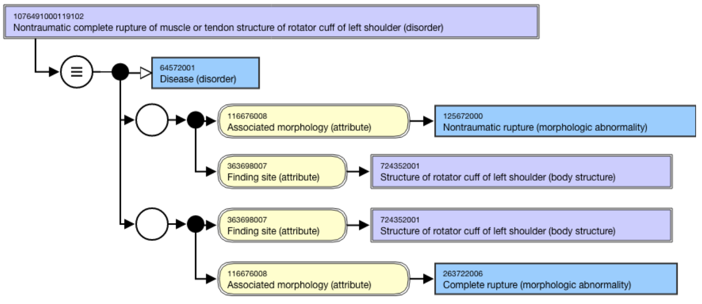
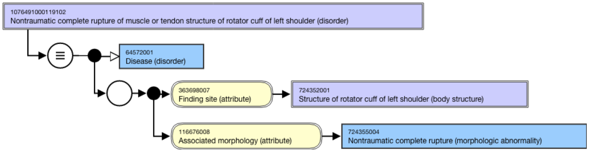

# Combining morphologic abnormalities

When modeling a concept requiring two role groups with the same body structure but two different morphologies (because a combined morphology does not exist), then those morphologic abnormalities can be combined to create a single morphologic abnormality concept. Keep the newly-created morphologic abnormality concept primitive, as all morphologic abnormality concepts are primitive.   

For example,  
**Disorder concept**| **Associated morphology**| **Associated morphology**| ** _Combined_ Associated morphology**  
Calcified hematoma of head (disorder)| Pathologic calcification, calcified structure (morphologic abnormality)| Hematoma (morphologic abnormality)| 

#### Calcified hematoma (morphologic abnormality)  
  
  

Another example is [1076491000119102 |Nontraumatic complete rupture of muscle or tendon structure of rotator cuff of left shoulder (disorder)|](http://snomed.info/id/1076491000119102).

If this disorder had the same finding site of |Structure of rotator cuff of left shoulder (body structure)| with two different morphologic abnormalities of |Nontraumatic rupture| and |Complete rupture|, then those two morphologic abnormality concepts can be combined to create a single, primitive, morphologic abnormality concept of |Nontraumatic complete rupture (morphologic abnormality)|. This will prevent modeling with two relationship groups. 

Instead of modeling as in this stated view: 

<figure><figcaption>
Model as shown in this stated view:
</figcaption></figure>

  

  

  

  

  

  

  

  

  

  

  

  

  

  

  

<figure></figure>
