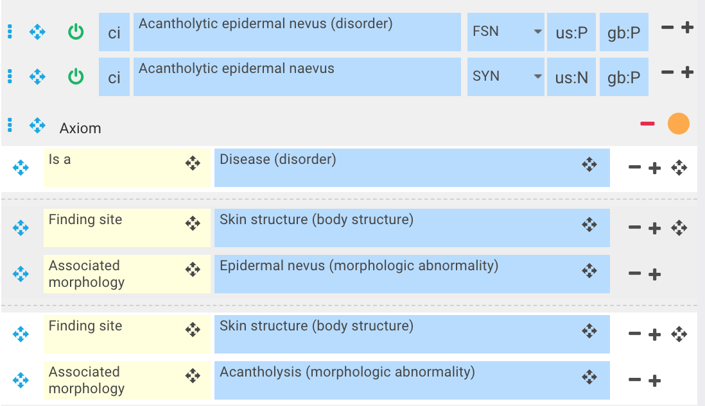
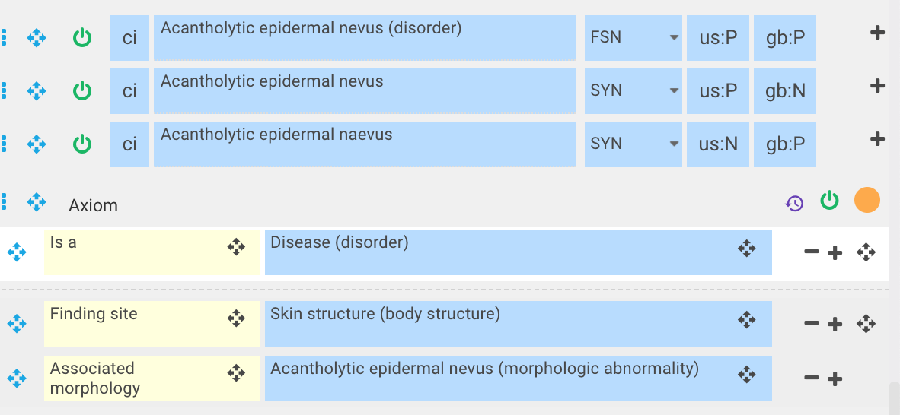

# Combining morphologies

When modeling a concept requiring two role groups with the same finding site/body structure but two different morphologies (because a combined morphology does not exist), then those two morphologic abnormalities can be combined to create a new single, combined |(morphologic abnormality)| concept. Keep the newly created morphologic abnormality concept primitive as all morphologic abnormality concepts should be primitive. Limit the combination to two morphological concepts into a single concept; combining more than two morphological concepts into a single combined concept is not permitted.

Example,   
If [400067002 |Acantholytic epidermal nevus (disorder)|](http://snomed.info/id/400067002) had the same Finding site of |Skin structure (body structure)| with two different morphologic abnormalities of |Epidermal nevus (morphologic abnormality)| and |Acantholysis (morphologic abnormality)|, then those two morphologic abnormality concepts can be combined to create a single, primitive, morphologic abnormality concept of |Acantholytic epidermal nevus (morphologic abnormality)|. This will prevent modeling with two relationship groups. 

Instead of modeling as per this diagram in the stated view with two morphologies of the same finding site: 

<figure><figcaption>
Model as in the stated view of this diagram with a combined morphology:
</figcaption></figure>

  

<figure><figcaption>
Morphologies can be combined to create a single morphologic abnormality concept where doing so creates a specialization of the morphology e.g. 55075001 |Bleeding ulcer (morphologic abnormality)|. Where morphologies are different e.g. abscess and cellulitis, they can not be combined.
</figcaption></figure>

  

  

  

  

  

  

  

  

  

  

  

  

  

  

Combining morphologies to create a specialization is done when modeling a concept that requires two role groups with the same body structure and two morphology values. Creating a combined morphology concept enables one role group to be used. 

## Neoplasm exception

Subtypes of 108369006 |Neoplasm (morphologic abnormality)| are not to be combined. These morphologies represent histological cell types that are recognized internationally by pathologists, classified by WHO, and aligned with the ICD-O classification. 

  

