# Concepts Representing a Substance or its Modifications

## Overview

The substance redesign project has made a number of decisions regarding the representation of a substance and its modifications.

1. Modification indicates that the concept is a structural modification of another concept, where the intrinsic physicochemical properties of the substance do not change.
2. The intrinsic physicochemical properties do not encompass non-intrinsic characteristics of a substance, such as toxicity, bioavailability, or extended release (in the case of medicinal products).
3. Modification concepts that exist to group modifications or derivatives of a specific substance are not to be created.
4. Metabolite groupers in the substances hierarchy are considered roles. No further concepts of this format will be created in the |Substance| hierarchy. Existing concepts will only be retained where there is a specific requirement and will be modeled as a child of |Metabolite (substance)|. See [Metabolites](Metabolites_174691621.html).
5. Structural groupers that reference modifications as a chemical group will be retained. Where the structural group name also refers to a specific chemical, the grouper will be re-termed “Substance with X structure”. See relative section [Substance Groupers Based on Structure](Substance-Groupers-Based-on-Structure_174691414.html).
6. There is no requirement to introduce a new semantic tag in order to distinguish concepts representing a substance or its modifications from any other type of concept in the |Substance| hierarchy.

## Modeling

| Semantic tag                  | (substance)                                  |
| ----------------------------- | -------------------------------------------- |
| Definition status             | Primitive                                    |
| Attribute: Is modification of | Range: < 105590001 \|Substance (substance)\| |

## Exemplar

The following illustrates the **stated** view of 125691000 |Sotalol hydrochloride (substance)|:

<figure>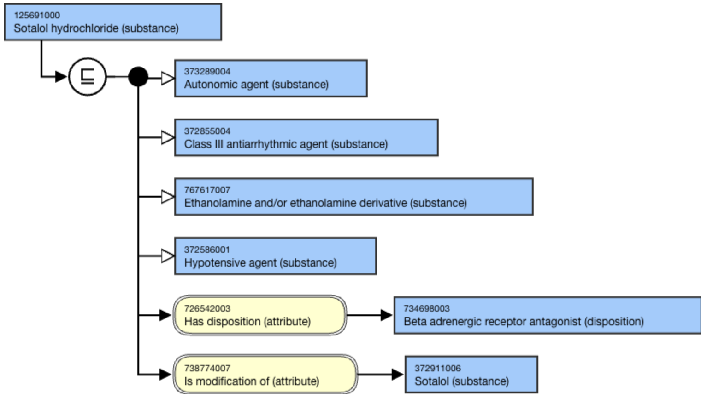<figcaption><p>The following illustrates the <strong>inferred</strong> view for 125691000 |Sotalol hydrochloride (substance)|:</p></figcaption></figure>

<figure>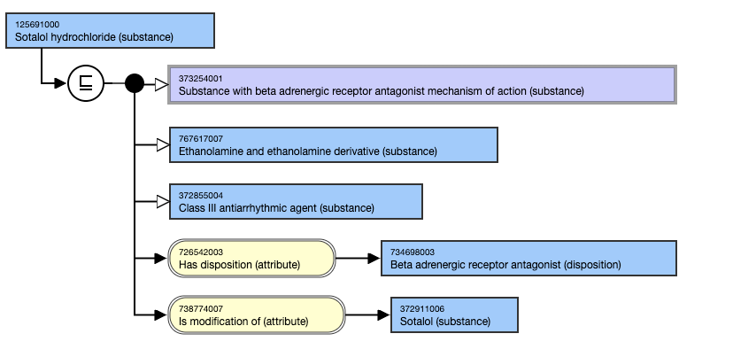<figcaption></figcaption></figure>

## Guidelines for the use of [738774007 | Is modification of (attribute)|](http://snomed.info/id/738774007)

Substances may have zero to many Is modification of attribute(s).

#### For example,

* ```
  * Morphine hydrochloride (substance)
  ```

<figure>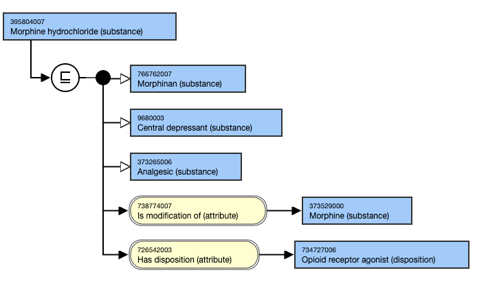<figcaption></figcaption></figure>

#### For example,

* ```
  * Fluorothymidine (18-F) (substance)
  ```

<figure>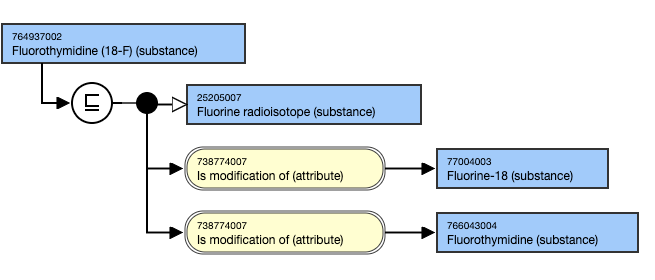<figcaption><p>Hydrates have an [ 738774007 | Is modification of (attribute)|](http://snomed.info/id/738774007 "738774007 | Is modification of \(attribute\) |") relationship to the unspecified salt.</p></figcaption></figure>

For example,

* ```
  * Caffeine hydrate (substance) IS MODIFICATION OF Caffeine (substance). 
  ```

This is the **stated** view:

\*\*

<figure>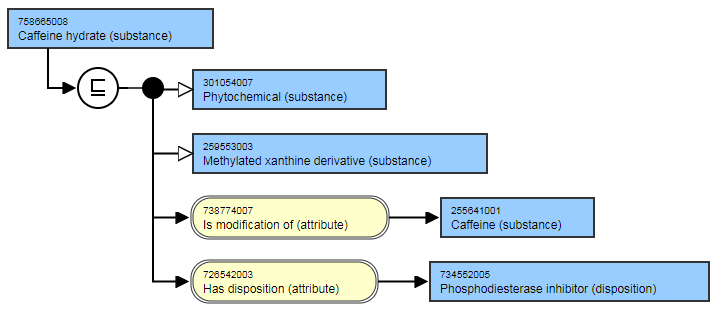<figcaption><p>**</p></figcaption></figure>

This is the **inferred** view:

\*\*

<figure><figcaption><p>**</p></figcaption></figure>

For example,

* ```
  * Clindamycin hydrochloride monohydrate (substance) IS MODIFICATION OF Clindamycin hydrochloride (substance). **  
  ```

\*\*

This is the**stated** view:

\*\*

<figure>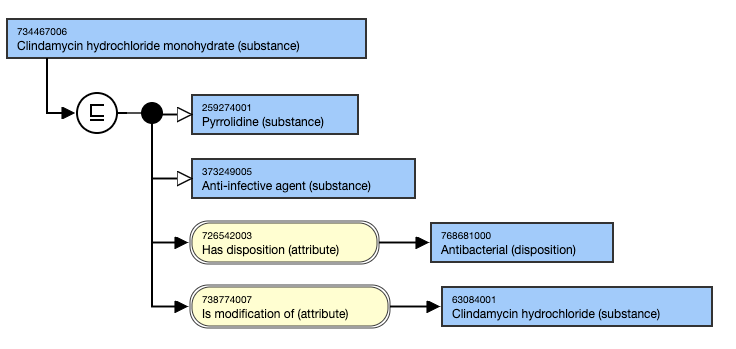<figcaption><p>**</p></figcaption></figure>

This is the **inferred** view:

\*\*

<figure>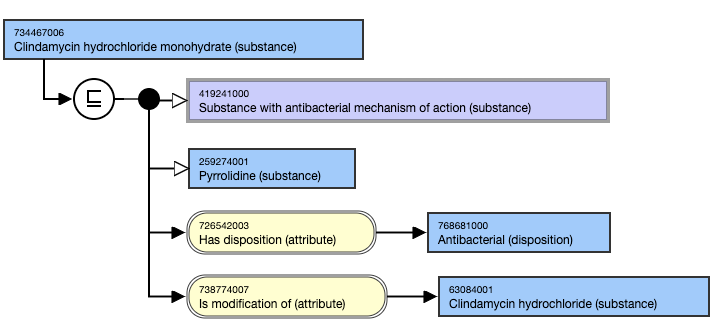<figcaption><p>**</p></figcaption></figure>

For example,

* ```
  * Calcium lactate pentahydrate (substance) IS MODIFICATION OF Calcium lactate (substance)
  ```

This is the **stated and inferred** view.

***

<figure>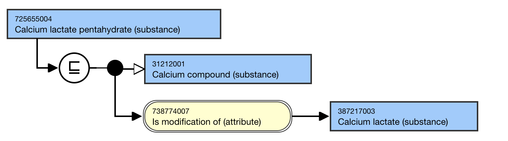<figcaption><p>********</p></figcaption></figure>

Anhydrous salts have an [738774007 | Is modification of (attribute)|](http://snomed.info/id/738774007) relationship to the unspecified salt.

For example,

* ```
  * Theophylline anhydrous (substance) IS MODIFICATION OF Theophylline (substance).
  ```

This is the **stated** view:

<figure>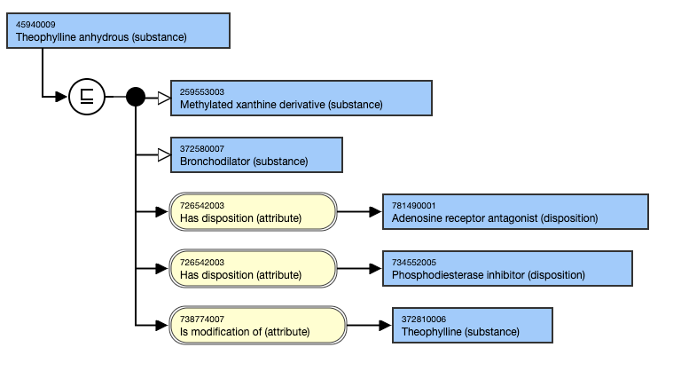<figcaption><p>This is the <strong>inferred</strong> view:</p></figcaption></figure>

<figure>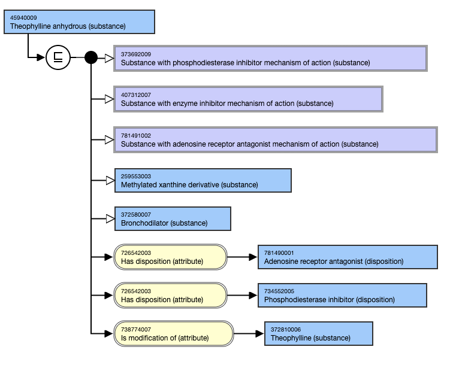<figcaption><p>The salts are modeled with an [ 738774007 | Is modification of (attribute)|](http://snomed.info/id/738774007 "738774007 | Is modification of \(attribute\) |") the acid substance.</p></figcaption></figure>

For example,

* ```
  * Pamidronate monosodium (substance) IS MODIFICATION OF Pamidronic acid (substance). This is the****stated**** and****inferred**** view.
  ```

<figure>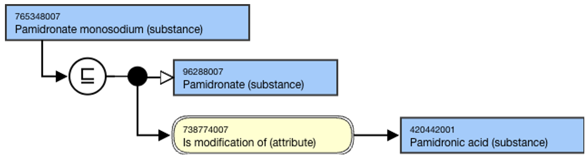<figcaption><p>Liposomal preparations are modifications of the chemical substance.</p></figcaption></figure>

For example,

* ```
  * Daunorubicin citrate liposome (substance)|
  ```

<figure>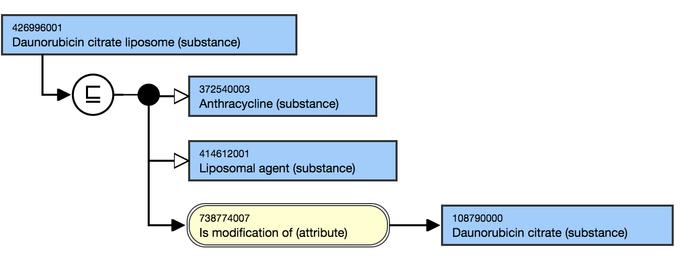<figcaption><p>Pegylated substances are modeled with |s modification of (attribute)| generic substance, if such a substance has been made available. Not all pegylated medicinal substances have a non-pegylated form, as the non-pegylated form may have been too immunogenic or too toxic.</p></figcaption></figure>

For example,

* ```
  * 785674001 |Turoctocog alfa pegol (substance)|
  ```

<figure>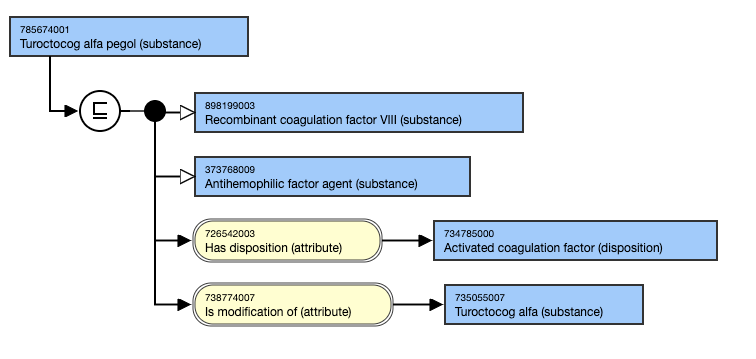<figcaption><p>Concepts specifying a particular physical form (e.g., micronized, macrocrystal, microsphere) should have a parent concept that relates to the structure of the substance and also an |Is modification of (attribute)| relationship to the unspecified substance concept.</p></figcaption></figure>

For example,

* ```
  * 414246008 |Fenofibrate micronized (substance)|
  ```

<figure>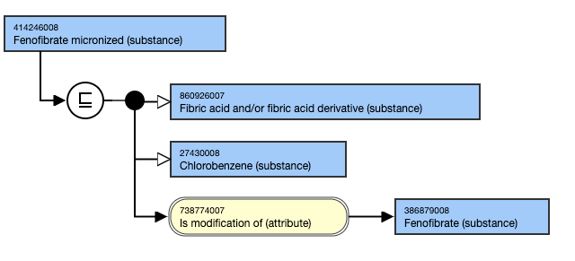<figcaption><p>Grouper concepts should not be targets of an [ 738774007 | Is modification of (attribute)|](http://snomed.info/id/738774007 "738774007 | Is modification of \(attribute\) |") relationship.</p></figcaption></figure>

In general, an [738774007 | Is modification of (attribute)|](http://snomed.info/id/738774007) is not applicable to prodrugs. This is because there is no requirement for the |Has active ingredient (attribute)| of medicinal products containing prodrug substances to use any relationship to the active substance to manage relationships within the medicinal product hierarchy.

For example, aspirin is not generally considered a modification of the substance salicylic acid.

When a prodrug is an esterified form of substance, there should be an [738774007 | Is modification of (attribute)|](http://snomed.info/id/738774007) relationship between the substance and its esterified form.

For exemplar,

* ```
  * 715220007 |Tenofovir alafenamide (substance)|  
  ```
  * 89678001 |Cefuroxime axetil (substance)|

[738774007 | Is modification of (attribute)|](http://snomed.info/id/738774007) is not applicable:

* Between a glycan and its glycoconjugate.
  * For example, 259289005 |Trimethylene glycol (substance)| is not a modification of 52086008 |Glycol (substance)|.
* To genetic engineering process variations (e.g., Somatropin(epr), Somatropin(rbe), or Somatropin(rmc)), as SNOMED CT does not generally differentiate substances based on production process.
* Between a chemical element and its salt.
  * For example, 387307005 |Calcium carbonate (substance)| is not a modification of |Calcium (substance)|.
