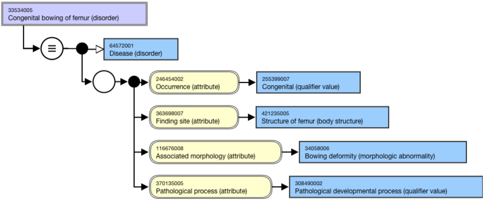
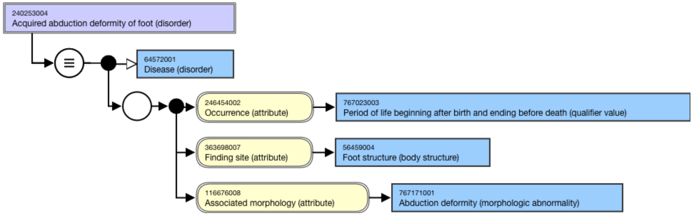

# Congenital

The concept  [66091009 |Congenital disease (disorder)|](http://snomed.info/id/66091009), means present at birth. Though the word  _congenital_ may be applied to genetic disorders, the term  _genetic_ is preferred for those disorders. 

The logical definition of a congenital disorder must include:

Occurrence = Congenital (qualifier value).

It may also include:

Finding site = X (body structure)

Associated morphology = X (morphologic abnormality)

Pathological process = Pathological development process (qualifier value)

All of these defining relationships should be grouped to indicate that the abnormal morphology occurs at the finding site, results from a pathological development process, and is present at birth. Where a morphologic abnormality occurs at more than one finding site, or one body structure has multiple morphologic abnormalities, multiple relationship groups should be created and the pathological process and occurrence relationships included in each relationship group.

The following guidelines apply:

A disorder with the word  _congenital_ in the FSN should classify under [66091009 |Congenital disease (disorder)|](http://snomed.info/id/66091009). 

Congenital X (morphologic abnormality) concepts are being inactivated hence Congenital anomaly disorder grouper concepts, such as  [9904008 |Congenital anomaly of cardiovascular system (disorder)|](http://snomed.info/id/9904008), should be modeled with an Associated morphology (attribute) of 49755003 |Morphologically abnormal structure (morphologic abnormality)I and a Pathological process relationship. 

Whether creating new or revising existing concepts, only use Congenital X (morphologic abnormality) concepts if no non-congenital supertype of that morphologic abnormality is active.  

  *     * For example, use[ 399898009 |Misalignment (morphologic abnormality)|](http://snomed.info/id/399898009) not[ 102283003 |Congenital misalignment (morphologic abnormality)|](http://snomed.info/id/102283003)

According to the American Medical Association, the periods of life in the  _postnatal period_ include all periods after birth including the neonatal or immediate postpartum period. It may be challenging to differentiate a congenital disorder from a neonatal disorder. A condition may be present at birth, i.e. congenital; however, clinical manifestations may take longer to appear, i.e. during the neonatal period (e.g. [14333004 |Alloimmune neonatal neutropenia (disorder)|](http://snomed.info/id/14333004)).

When modeling a congenital neoplasm disorder, the attribute-value relationship of _Pathological process (attribute) = Pathological development process (qualifier value)_ is not used.

## Congenital versus acquired

While some disorders are _only_ congenital or _only_ acquired, some disorders may be _either_ congenital or acquired. The _ acquired_ form should only exist when there is a need to differentiate from the congenital form. Do not model a disorder as acquired if a congenital variant does not exist. 

Congenital disorders are modeled using [246454002 |Occurrence (attribute)|](http://snomed.info/id/246454002) of [255399007 |Congenital (qualifier value)|](http://snomed.info/id/255399007). If the FSN does not include  _congenital_ , it should not be modeled as congenital. The precise meaning of the FSN should be followed (e.g. many hereditary disorders have congenital appearances).

For example,

[33534005 |Congenital bowing of femur (disorder)|](http://snomed.info/id/33534005) is modeled with [246454002 |Occurrence (attribute)|](http://snomed.info/id/246454002) of  [255399007 |Congenital (qualifier value)|](http://snomed.info/id/255399007)

<figure><figcaption>
Figure 1: Stated view of 33534005 |Congenital bowing of femur (disorder)|
</figcaption></figure>

  

  

  

Acquired disorders are those that originate and manifest after birth. The disorders are associated with a period of life, as opposed to a specific process or structure. All diseases (disorders) that occur after birth are considered  _acquired_. 

Generally, concepts that explicitly state  _acquired_ in the FSN or in a synonym should be modeled with Occurrence = 767023003 |Period of life beginning after birth and ending before death (qualifier value)|.

For example,

240253004 |Acquired abduction deformity of foot (disorder)| has _acquired_ in the FSN and is modeled with Occurrence = 767023003 |Period of life beginning after birth and ending before death (qualifier value)|.

<figure><figcaption>
Figure 2: Stated view of 240253004 |Acquired abduction deformity of foot (disorder)|
</figcaption></figure>

  

When revising acquired disorders, remove any acquired morphologies and replace with general parent morphologies, e.g. replace  [127560004 |Acquired deformity (morphologic abnormality)|](http://snomed.info/id/127560004) with  [6081001 |Deformity (morphologic abnormality)|](http://snomed.info/id/6081001). Then add Occurrence attribute with a value of 767023003 | Period of life beginning after birth and ending before death (qualifier value)|. One of its children may also be used if the FSN states the period of life, such as  _Childhood_ or  _Adulthood_.

## Congenital absence

Congenital absence can represent at least three different classes of absence:

  1. Total developmental absence of the affected organ/structure
  2. Partial absence of the affected organ/structure
  3. In utero amputation of all or part of the affected organ/structure

Conventional use of the terms _aplasia_ and _agenesis_ often regard these as synonymous. However, proper definitions of these terms suggests a distinction that should be made in the terminology when included in the FSN.

  * Aplasia - defective development resulting in the absence of all or part of an organ or tissue.
  * Agenesis - absence of an organ due to nonappearance of its primordium in the embryo. (implies complete absence)

In order to conform to the intended meaning of the FSNs as described by the original source, the following modeling patterns are proposed for congenital absence terms:

Congenital absence of X

  * Associated morphology = Absence (morphologic abnormality)

  * Occurrence = Congenital (qualifier value)

  * Finding site = Structure of X (body structure)

  * Pathological process = Pathological developmental process (qualifier value)

Aplasia

  * Associated morphology = Aplasia (morphologic abnormality)
  * Occurrence = Congenital (qualifier value)
  * Finding site = Structure of X (body structure)
  * Pathological process = Pathological developmental process (qualifier value)

Partial absence of X

  * Associated morphology = Aplasia (morphologic abnormality) or Transverse deficiency (morphologic abnormality)
  * Occurrence = Congenital (qualifier value)
  * Finding site = Part of X (body structure)
  * Pathological process = Pathological developmental process (qualifier value)

Agenesis of X or Complete absence of X 

  * Associated morphology = Agenesis (morphologic abnormality)
  * Occurrence = Congenital (qualifier value)
  * Finding site = Entire X (body structure)
  * Pathological process = Pathological developmental process (qualifier value)

#### _See also relative sections:_

  * _Acquired abnormality of congenital anomaly_
  *  _Malformation, deformation, anomaly_

  

