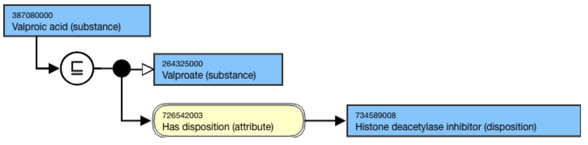
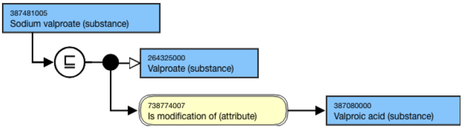
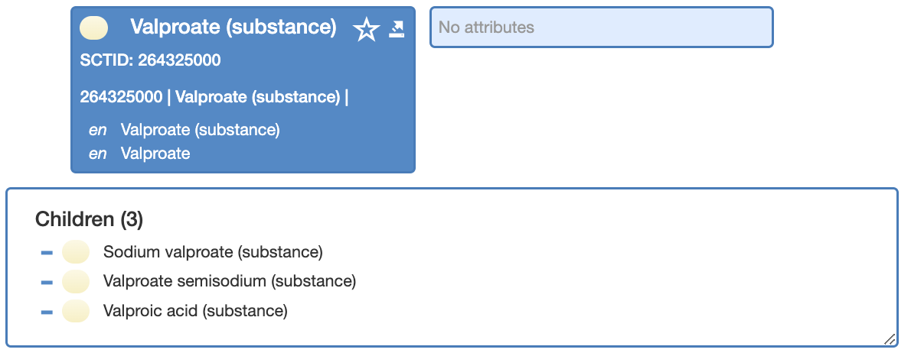
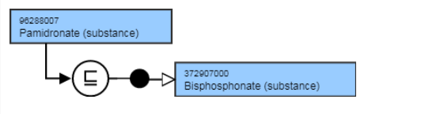

# Conjugate acids, bases and salts

## Overview

Acids substance concepts should be modeled with a structural parent concept.

Salts should be modeled with a conjugate base as parent (if one exists, otherwise they are modeled with a structural parent). Salts may have an Is modification of (attribute) relationship to the conjugate acid where a specific use case is identified. See examples of such use cases at [Concepts Representing a Substance or its Modifications](Concepts-Representing-a-Substance-or-its-Modifications_174691445.html).

Conjugate base concepts (e.g., valproate, pamidronate, etidronate) should only be created where a specific use case is identified, for example, when required to support the definition of other concepts in the terminology.

Conjugate bases should be created as separate concepts - not added as synonyms to the corresponding acid concept.

New instances of substance concepts containing the word _salt_ will not be added. The existing concepts will be reviewed, and if possible, will be replaced by equivalent compounds.

## Modeling

| Parent concept | Most distal appropriate descendant of 312413002 \|Substance categorized structurally (substance)\| |
|---|---|
| Semantic tag | (substance) |
| Definition status | Primitive |
| Attribute: Is Modification of | Range <105590001 \|Substance (substance)\| Cardinality: 0..1 Used to identify the conjugate acid |
| Attribute: Has disposition | While the allowed range is broader, substance concepts should only use <726711005 \|Disposition (disposition)\| as the attribute value. Range: <726711005 \|Disposition (disposition)\| Cardinality: 0..1 |

## Naming

Where INN names exist, these should be used for the FSN and PT.  
  

| FSN | X sulfate (substance) X pamidronate (substance) Copper sulfate (substance) Disodium pamidronate (substance) Valproate sodium (substance) Pattern: For example, Etidronate (substance) Exception: |
|---|---|
| Preferred Term | X sulfate X pamidronate Copper sulfate Pamidronate monosodium Etidronate Valproate sodium Pattern: For example, Exception: |
| Synonyms | Pamidronate monosodium Valproate sodium Pattern: Pamidronate X For example, |

## Exemplar

<figure><figcaption>
Figure 1. Stated view of 387080000 |Valproic acid (substance)|
</figcaption></figure>

  

  

<figure><figcaption>
Figure 2. Stated and inferred view of 387481005 |Sodium valproate (substance)|
</figcaption></figure>

  

  

<figure><figcaption>
Figure 3. Hierarchy view of 264325000 |Valproate (substance)| subtypes
</figcaption></figure>

  

  

The following illustrates the **stated** and **inferred** views.

<figure></figure>

<figure><figcaption>
**
</figcaption></figure>

**
