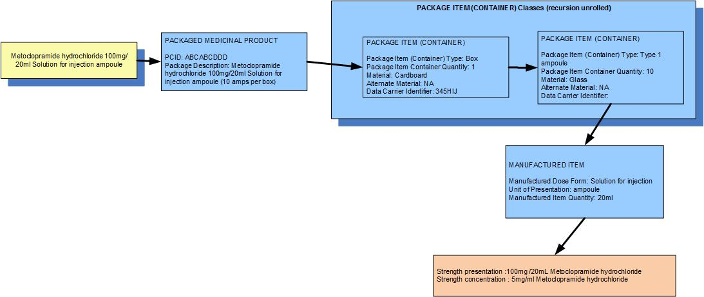
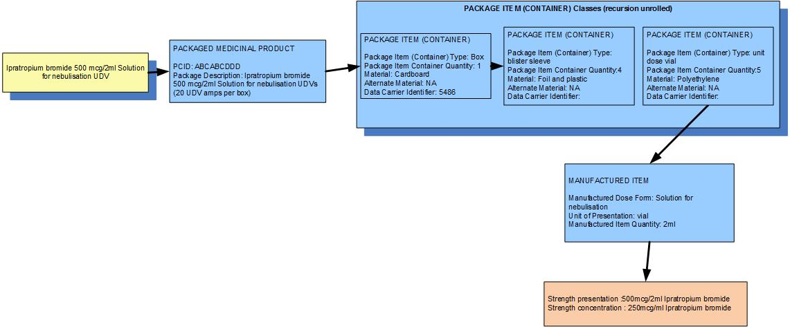

# Continuous presentation: bounded by container; liquid dose forms

_Examples: parenteral solutions, unit dose nebuliser solutions_

The unit of presentation usually either uses the same word (even though it is a different concept) as the (package item) container, or the (package item) container is a more granular concept and the unit of presentation uses a less granular term.  
Presentation strength is expressed as "per the amount of liquid bounded by the unit of presentation" but concentration strength is per mL (and therefore is often different).

### **Example 1: A pack of 10 ampoules each containing 20mL of metoclopramide hydrochloride for solution for injection**

**

<figure><figcaption>
**
</figcaption></figure>

  
  

| Manufactured dose form | Solution for injection |   |
|---|---|---|
| Unit of presentation | Ampoule | The ampoule "bounds" the liquid |
| [Pack size] | 10 ampoules in the box |   |
| Precise active ingredient | metoclopramide hydrochloride |   |
| Basis of strength substance | metoclopramide hydrochloride |   |
| Presentation strength (logical) | 100 mg per volume contained in the unit of presentation | The amount of the dose form bounded in the unit of presentation |
| Presentation strength | 100 mg per 20 mL |   |
| Concentration strength | 5 mg per 1 mL |   |

  

### **Example 2: A pack of 20 UDVs each containing 2mL of ipratropium bromide for solution for nebulisation**

**

<figure><figcaption>
**
</figcaption></figure>

| Manufactured dose form | Solution for nebulisation |   |
|---|---|---|
| Unit of presentation | Unit dose vial | The vial "bounds" the liquid |
| [Pack size] | 5 vials in a sleeve, 4 sleeves in the box |   |
| Precise active ingredient | ipratropium bromide |   |
| Basis of strength substance | ipratropium bromide |   |
| Presentation strength (logical) | 500 mcg per volume contained in the unit of presentation | The amount of the dose form bounded in the unit of presentation |
| Presentation strength | 500 mcg per 2 mL |   |
| Concentration strength | 250 mcg per 1 mL |   |

  

