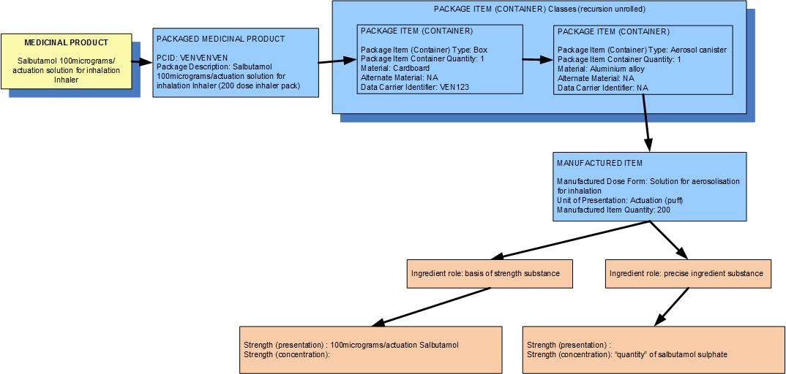

# Continuous presentation: Metered dose unit of presentation

_Examples: various inhalers, nasal sprays, some cutaneous sprays/foams_

The unit of presentation is the actuation, the “single operation of a metered-dose pump, valve or other equivalent dosing mechanism” [EDQM].

Strength is expressed as “per one unit of presentation” and the presentation strength and the concentration are exactly the same.

### Example 1: A single inhaler containing a total of 200 actuations worth of salbutamol, 100 micrograms per actuation, packaged in a box

**

<figure><figcaption>
**
</figcaption></figure>

| Manufactured dose form | Solution for aerosolisation |   |
|---|---|---|
| Unit of presentation | Actuation |   |
| [Pack size] | 200 actuations in the inhaler |   |
| Precise active ingredient | salbutamol sulphate |   |
| Basis of strength substance | salbutamol |   |
| Presentation strength (logical) | 100 mcg per 1 unit of presentation |   |
| Presentation strength | 100 mcg per 1 actuation | UCUM: 100 mcg per 1 each |
| Concentration strength |   | The concentration of salbutamol sulphate in the inhalant solution inside the inhaler container is probably known to the regulatory agency but is not deemed clinically significant. |

