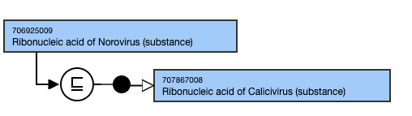
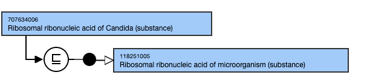
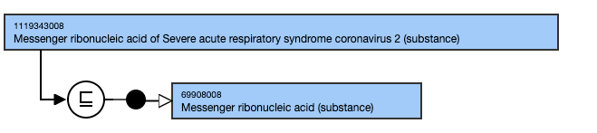
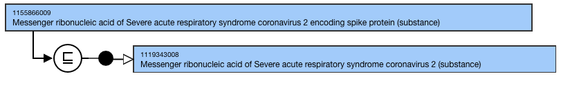
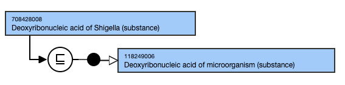

# Deoxyribonucleic acid and ribonucleic acid

## Modeling - Ribonucleic acid of X organism

Parent concept| Most distal appropriate descendant of 118248003 |Microbial ribonucleic acid (substance)|  
---|---  
Semantic tag| (substance)  
Definition status| Primitive  
**Attribute: Is modification of**|  Range <105590001 |Substance (substance)|Cardinality: 0..*One relationship to be created to represent each modified component of the substance  
**Attribute:****Has disposition**|  Range: <726711005 |Disposition (disposition)|

  *     * While the allowed range is broader, substance concepts should only use <726711005 |Disposition (disposition)| as the attribute value.

Cardinality: 0..*  
  
## Naming Guidelines - Ribonucleic acid of X organism****

**FSN**|  Pattern:

  * Ribonucleic acid of X organism (substance)

For example,

  *     *       * Ribonucleic acid of Norovirus genogroup I (substance)

  
---|---  
**Preferred Term**|  Preferred Term (US/GB) with initial letter case sensitive:Pattern:

  * X organism RNA

For example,

  *     *       * Norovirus genogroup I

  
**Synonyms**|  Pattern: A synonym that matches FSNFor example,

  *     *       * Ribonucleic acid of Norovirus genogroup I 

  
  
  * Additional synonyms (when a legitimate synonym exists for Organism name) are applicable.

  
  
## Exemplar

The following illustrates the **stated** and **inferred** view:

<figure></figure>

## Modeling - Ribosomal ribonucleic acid of X organism

Parent concept| Most distal appropriate descendant of 118251005 | Microbial ribosomal ribonucleic acid (substance)|  
---|---  
Semantic tag| (substance)  
Definition status| Primitive  
**Attribute: Is Modification of**|  Range <105590001 |Substance (substance)|Cardinality: 0..*One relationship to be created to represent each modified component of the substance  
**Attribute:****Has disposition**|  Range: < 726711005 |Disposition (disposition)|

  *     * While the allowed range is broader, substance concepts should only use <726711005 |Disposition (disposition)| as the attribute value.

Cardinality: 0..*  
  
## Naming - Ribosomal ribonucleic acid of X organism

**FSN**|  Pattern:

  * Ribosomal ribonucleic acid of X organism (substance)

For example,

  *     *       * Ribosomal ribonucleic acid of Candida (substance)

  
---|---  
**Preferred Term**|  Preferred Term, with Initial letter case sensitive.Pattern:

  * X organism rRNA

For example,

  *     *       * Candida rRNA

  
**Synonyms**|  Pattern:

  * A synonym that matches FSN

For example,

  *     *       * Ribosomal ribonucleic acid of Candida

  
  
  * Additional synonyms (when a legitimate synonym exists for Organism name) are applicable.

  
  
## Exemplar

The following illustrates the **stated** and **inferred** view:

<figure></figure>

  

## Modeling - Messenger ribonucleic acid of X organism

Parent concept| Most distal appropriate descendant of 69908008 |Messenger ribonucleic acid (substance)|  
---|---  
Semantic tag| (substance)  
Definition status| Primitive  
**Attribute: Is modification of**|  Range <105590001 |Substance (substance)|Cardinality: 0..*One relationship to be created to represent each modified component of the substance  
**Attribute:****Has disposition**|  Range: <726711005|Disposition (disposition)

  *     * While the allowed range is broader, substance concepts should only use <726711005 |Disposition (disposition)| as the attribute value.

Cardinality: 0..*  
  
## Naming - Messenger ribonucleic acid of X organism

**FSN**|  Pattern: Messenger ribonucleic acid of X organism (substance)For example,

  *     *       * Messenger ribonucleic acid of Severe acute respiratory syndrome coronavirus 2 (substance)

  
---|---  
**Preferred Term**|  Preferred Term, with Initial letter case sensitive.Pattern: X organism mRNAFor example,

  *     *       * SARS-CoV-2 mRNA

  
**Synonyms**|  Pattern: A synonym that matches FSNFor example,

  *     *       * Messenger ribonucleic acid of Severe acute respiratory syndrome coronavirus 2

  
Additional synonyms (when a legitimate synonym exists for Organism name) are applicable.  
  
## Exemplar

<figure></figure>

  

## Modeling - Messenger ribonucleic acid of X organism encoding for specific protein

Parent concept| Most distal appropriate descendant of 69908008 |Messenger ribonucleic acid (substance)|  
---|---  
Semantic tag| (substance)  
Definition status| Primitive  
**Attribute: Is modification of**|  Range <105590001 |Substance (substance)|Cardinality: 0..*One relationship to be created to represent each modified component of the substance  
**Attribute:****Has disposition**|  Range: <726711005 |Disposition (disposition)

  *     * While the allowed range is broader, substance concepts should only use <726711005 |Disposition (disposition)| as the attribute value.

Cardinality: 0..*  
  
## Naming - Messenger ribonucleic acid of X organism encoding for specific protein

**FSN**|  Pattern: Messenger ribonucleic acid of X organism encoding for protein Y (substance)For example,

  *     *       * Messenger ribonucleic acid of Severe acute respiratory syndrome coronavirus 2 encoding spike protein (substance)

  
---|---  
**Preferred Term**|  Preferred Term, with Initial letter case sensitive.Pattern: X organism mRNA encoding for protein YFor example,

  *     *       * SARS-CoV-2 mRNA encoding spike protein

  
**Synonyms**|  Pattern: A synonym that matches FSNFor example,

  *     *       * Messenger ribonucleic acid of Severe acute respiratory syndrome coronavirus 2 encoding spike protein (substance)

  
Additional synonyms (when a legitimate synonym exists for Organism name) are applicable.  
  

<figure></figure>

## Modeling - Deoxyribonucleic acid of X organism

Parent concept| Most distal appropriate descendant of 118249006 |Microbial deoxyribonucleic acid (substance)|  
---|---  
Semantic tag| (substance)  
Definition status| Primitive  
**Attribute: Is modification of**|  Range <105590001 |Substance (substance)|Cardinality: 0..*One relationship to be created to represent each modified component of the substance  
**Attribute:****Has disposition**|  Range: <726711005 |Disposition (disposition) 

  * While the allowed range is broader, substance concepts should only use <726711005 |Disposition (disposition)| as the attribute value.

Cardinality: 0..*  
  
## Naming - Deoxyribonucleic acid of X organism

**FSN**|  Pattern: Deoxyribonucleic acid of X organism (substance)For example,

  *     *       *         * Deoxyribonucleic acid of Aspergillus terreus (substance)

  
---|---  
**Preferred Term**|  Preferred Term (US/GB), with Initial letter case sensitive:Pattern: X organism DNAFor example,

  *     *       *         * Aspergillus terreus DNA

  
**Synonyms**|  Pattern: A synonym that matches FSNFor example,

  *     *       *         * Deoxyribonucleic acid of Aspergillus terreus

  
Additional synonyms (when a legitimate synonym exists for Organism name) are applicable.  
  
## Exemplar

The following illustrates the **stated** and **inferred** view:

<figure></figure>
