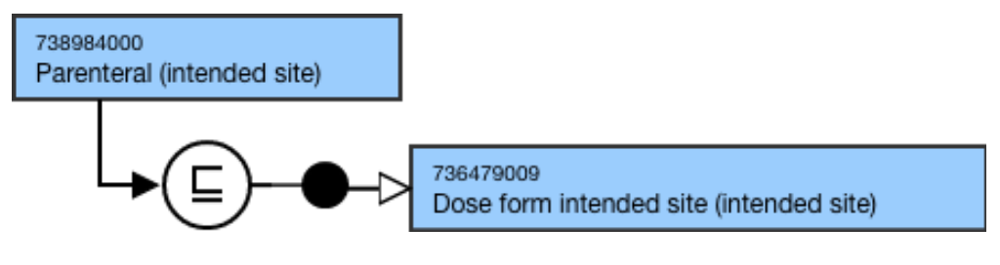

# Dose Form Intended Site

## Overview

736479009 |Dose form intended site (intended site)| represents a general type of site of administration (e.g. cutaneous, nasal, oral, parenteral). This subhierarchy is a descendant of 362981000 |Qualifier value (qualifier value)| that supports fully defining the 736542009 |Pharmaceutical dose form (dose form)| hierarchy. |Dose form intended site (intended site)| is used to model concepts in the |Pharmaceutical dose form (dose form)| hierarchy; they are not used to model 763158003 |Medicinal product (product)|.

|Dose form intended site| should not be confused with _route of administration_ , which is a concept used in dosage instructions for the administration of a particular medicinal product to a particular patient. 

## Modeling

Parent concept| <<736479009 |Dose form intended site (intended site)   
---|---  
Semantic tag| (intended site)  
Definition status| Primitive  
Attributes| None  
  
## Naming

**FSN**|  Use the following pattern for the FSN where X is the intended site:X (intended site)For example,

  *     *       * Oral (intended site)
      * Otic (intended site)
      * Parenteral (intended site)
      * Vaginal (intended site)

  
---|---  
**Preferred Term**|  Use the following pattern for the PT where X is the intended site:X**  
**For example,

  *     *       * Oral
      * Otic
      * Parenteral
      * Vaginal

  
**Synonyms**|  Synonyms are not allowed unless explicitly identified as an exception in the Editorial Guidelines.  
**Text Definitions**|  Preferred; not required.  
  
## Exemplars

The following illustrates the ****stated**** and****inferred**** view for 738984000 |Parenteral (intended site)|:

<figure></figure>
