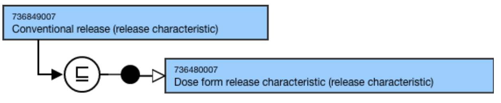
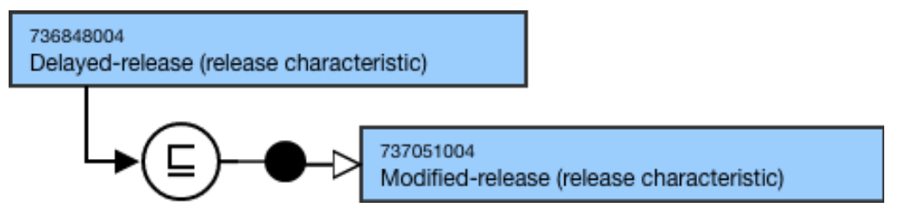
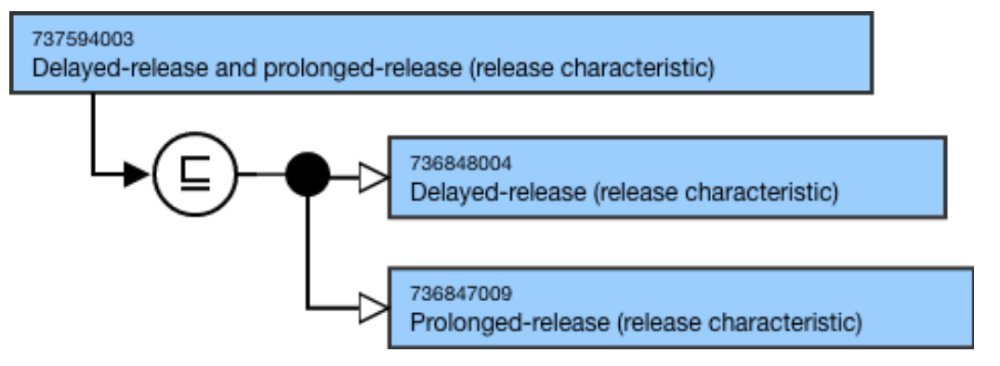

# Dose Form Release Characteristic

## Overview

736480007 |Dose form release characteristic (release characteristic)| represents a general type of pattern of release (e.g. conventional, modified, delayed, prolonged) of the active ingredient substance(s) from the dose form.

|Dose form release characteristic (release characteristic)| is a descendant of 362981000 |Qualifier value (qualifier value) that supports fully defining the 736542009 |Pharmaceutical dose form (dose form)| hierarchy. 

|Dose form release characteristic (release characteristic)| are used to model the 736542009 |Pharmaceutical dose form (dose form)| hierarchy; they are not used to model 763158003 |Medicinal product (product)|.

## Modeling

| Parent concept | 736480007 \|Dose form release characteristic (release characteristic) or one or more descendants of 736480007 \|Dose form release characteristic (release characteristic) |
|---|---|
| Semantic tag | (release characteristic) |
| Definition status | Primitive |
| Attributes | None |

## Naming

| FSN | X (release characteristic) Conventional release (release characteristic) Delayed-release (release characteristic) Prolonged-release (release characteristic)* Modified-release (release characteristic)** Delayed-release and prolonged-release (release characteristic) Use the following pattern for the FSN where X is the release characteristic, adding a hyphen when appropriateCombined release-characteristic concepts may be created to support modeling of concepts that display multiple release characteristics in a single formulation. For example, *Prolonged was selected rather than Extended because feedback was received that it is more clear to translate for non-English speaking users; existing national drug extensions appear to use one or the other of these terms. **Modified-release is a grouper that is not allowed to be used to model an internationalclinical drugconcept. |
|---|---|
| Preferred Term | X Conventional release Delayed-release Prolonged-release Modified-release Delayed-release and prolonged-release Use the following pattern for the PT where X is the release characteristic, adding a hyphen when appropriate: For example, |
| Synonyms | Synonyms are not allowed unless explicitly identified as an exception in the Editorial Guidelines. |
| Text Definitions | Preferred; not required. |

## Exemplars

The following illustrates the ****stated**** and****inferred**** view for 736849007 |Conventional release (release characteristic)|:

<figure><figcaption>
The following illustrates the *<em><strong>stated</strong><strong> and</strong><strong>inferred</strong></em>* view for 736848004 |Delayed-release (release characteristic)|:
</figcaption></figure>

  

<figure><figcaption>
The following illustrates the *<em><strong>stated</strong><strong> and</strong><strong>inferred</strong></em>* view for 737594003 |Delayed-release and prolonged-release (release characteristic)|:
</figcaption></figure>

  

<figure></figure>
