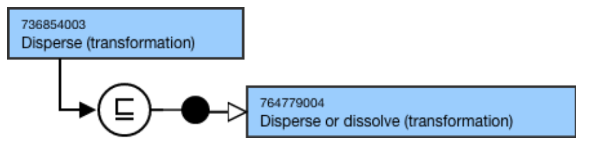

# Dose Form Transformation

## Overview

736477006 |Dose form transformation (transformation)| represents a process where a dose form is transformed from that supplied by the manufacturer into a new dose form, usually to make it suitable for administration (e.g. dissolving a "powder for solution for injection" dose form into a "solution for injection" dose form). This may occur as part of the dispensing act or immediately before administration.

|Dose form transformation (transformation)| is a descendant of 362981000 |Qualifier value (qualifier value) that supports fully defining the 736542009 |Pharmaceutical dose form (dose form)| hierarchy. |Dose form transformation (transformation)| is used to model the |Pharmaceutical dose form (dose form)| hierarchy; they are not used to model the 763158003 |Medicinal product (product)| hierarchy.

## Modeling

Parent concept| <<736477006 |Dose form transformation (transformation)|  
---|---  
Semantic tag| (transformation)  
Definition status| Primitive  
Attributes| None  
  
## Naming

**FSN**|  Use the following pattern for the FSN where X is the transformation:

  * X (transformation)

For example,

  *     *       * Dissolve (transformation)
      * Disperse (transformation)
      * No transformation (transformation)
      * Disperse or dissolve (transformation)

  
---|---  
**Preferred Term**|  Use the following pattern for the PT where X is the transformation:

  * X

For example,

  *     *       * Dissolve
      * Disperse
      * No transformation
      * Disperse or dissolve

  
**Synonyms**|  Synonyms are not allowed unless explicitly identified as an exception in the Editorial Guidelines.  
**Text Definitions**|  Preferred; not required.  
  
## Exemplars

The following illustrates the ****stated**** and****inferred**** view for 761954006 |No transformation (transformation)|:

<figure><figcaption>
The following illustrates the *<em><strong>stated</strong><strong> and</strong><strong>inferred</strong></em>* view for 764779004 |Disperse or dissolve (transformation)|:
</figcaption></figure>

<figure><figcaption>
The following illustrates the *<em><strong>stated</strong><strong> and</strong><strong>inferred</strong></em>* view for 736854003 |Disperse (transformation)|:
</figcaption></figure>

<figure></figure>

  

  

