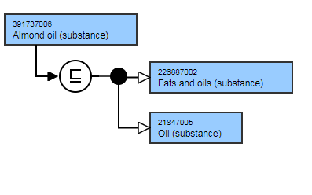
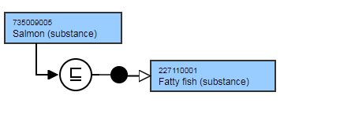

# Edible substance and descendants

## Overview

Substance concepts should, where possible, be modeled with either a structural parent or one that denotes source or origin.

## Modeling

Parent concept| Most distal appropriate descendant of 762766007 |Edible substance (substance)|Additional parent concepts may be modeled to denote origin or structural characteristics.  
---|---  
Semantic tag| (substance)  
Definition status| Primitive  
  
## Naming Guidelines

FSN, PT or Synonym should not contain "- dietary" context in descriptions

FSN, PT or Synonym should not contain brand or trade names.

Culinary name should be used for the FSN and PT when referring to meat products and food E.g. Beef dripping (substance), Pork sausage (substance)

If there are additional adjectives such as baked, boiled, fried, lean, minced, low-fat, roast, or stewed, these adjectives should proceed the name of source organism, e.g. Fried beef steak (substance), Tinned fish (substance).

FSN| Pattern:

  * X (substance)  
  

For example,

  *     *       * Betel nut (substance)
      * Wheat dextrin (substance)
      * Tinned fish (substance)

  
---|---  
Preferred Term| Pattern:

  * X

For example,

  *     *       * Betel nut
      * Wheat dextrin
      * Tinned fish

  
Synonyms| Pattern: scientific name if appropriateFor example,

  *     *       * Areca catechu

  
  
## Exemplar

The following illustrates the **stated** and **inferred** view

<figure></figure>

## Exemplar

The following illustrates the **stated** and **inferred** view

<figure></figure>

  

