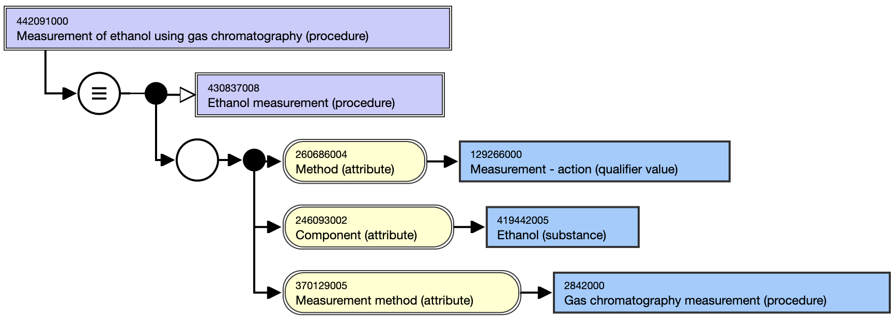
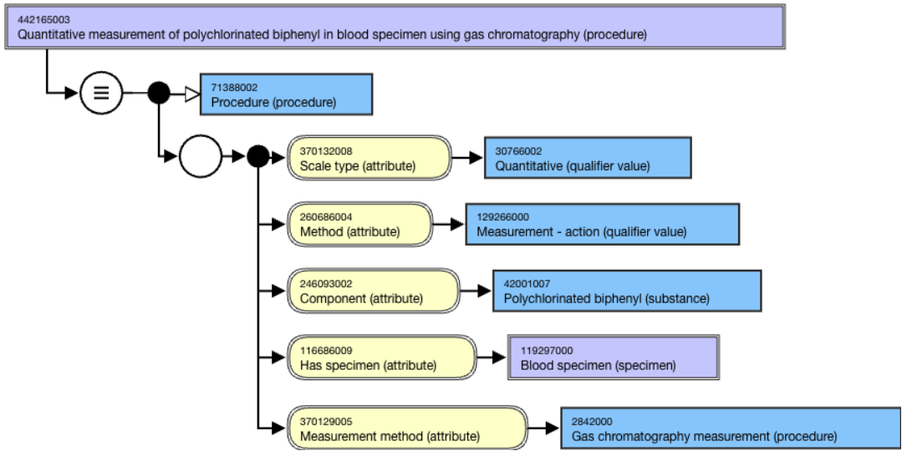
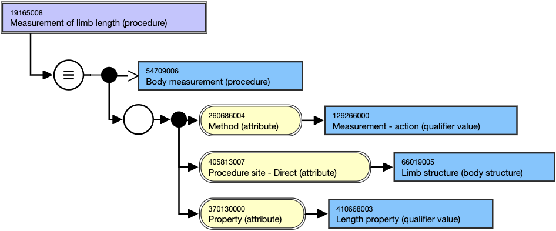
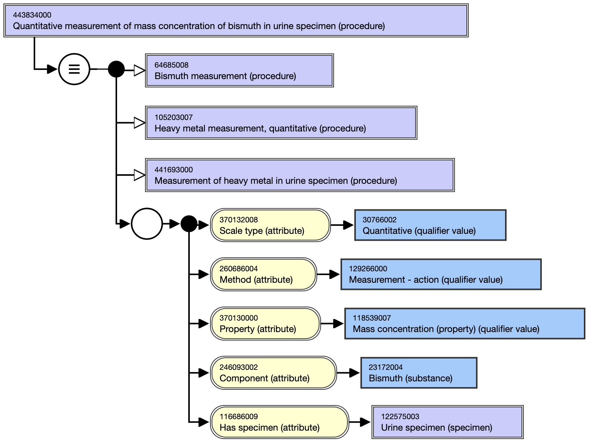
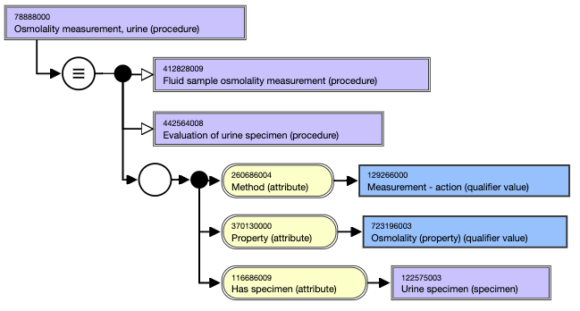

# Evaluation Procedure Attributes

The following defining attributes are unique in the context of the 386053000 |Evaluation procedure (procedure)| subhierarchy. Many of these attributes (e.g., Component, Scale type) are used to define Observable entity concepts. Evaluation procedures may use the attributes below in addition to those attributes allotted to the [ 71388002 | Procedure (procedure)|](http://snomed.info/id/71388002 "71388002 | Procedure \(procedure\) |") hierarchy (see  _Procedure Attributes Summary_ page). All of the attributes for Evaluation procedure concepts should be grouped. Some of the current modeling does not reflect this guidance. The future of this hierarchy in relation to the observable entity hierarchy is under review. See 'Observable Entity vs. Evaluation Procedure' at [Observable Entity](https://confluence.ihtsdotools.org/display/WIPEG/Observable+Entity).

## Component

Component refers to what is being observed or measured by a procedure.

For example,

  * [ 442091000 | Measurement of ethanol using gas chromatography (procedure)|](http://snomed.info/id/442091000 "442091000 | Measurement of ethanol using gas chromatography \(procedure\) |") has [ 246093002 | Component (attribute)|](http://snomed.info/id/246093002 "246093002 | Component \(attribute\) |") of [ 419442005 | Ethanol (substance)|](http://snomed.info/id/419442005 "419442005 | Ethanol \(substance\) |")

<figure><figcaption>
Figure 1: Inferred view of 442091000 |Measurement of ethanol using gas chromatography (procedure)|
</figcaption></figure>

  

Although Pharmaceutical / biologic product (product) and its descendants are considered valid values for the Component (attribute), they are not currently used as values for this attribute in the International Release. The only exception is 787859002 |Vaccine product (medicinal product)| and its descendants, which are used as valid values for this attribute.

## Has specimen

 _Has Specimen_ indicates the type of specimen on which a measurement or observation is performed.

For example,

  * [ 442165003 | Quantitative measurement of polychlorinated biphenyl in blood specimen using gas chromatography (procedure)|](http://snomed.info/id/442165003 "442165003 | Quantitative measurement of polychlorinated biphenyl in blood specimen using gas chromatography \(procedure\) |") uses [ 116686009 | Has specimen (attribute)|](http://snomed.info/id/116686009 "116686009 | Has specimen \(attribute\) |") of [ 119297000 | Blood specimen (specimen)|](http://snomed.info/id/119297000 "119297000 | Blood specimen \(specimen\) |")

## Measurement method

 _Measurement Method_ specifies the method by which an evaluation procedure is performed. It provides additional specificity. For measurement procedures, the [ 260686004 | Method (attribute)|](http://snomed.info/id/260686004 "260686004 | Method \(attribute\) |") is given the value [ 129266000 | Measurement - action (qualifier value)|](http://snomed.info/id/129266000 "129266000 | Measurement - action \(qualifier value\) |") . No concept can be defined with a [ 370129005 | Measurement method (attribute)|](http://snomed.info/id/370129005 "370129005 | Measurement method \(attribute\) |") unless it is being used to refine a  _[ 260686004 | Method (attribute)|](http://snomed.info/id/260686004 "260686004 | Method \(attribute\) |") _ that has a value of  _[ 129266000 | Measurement - action (qualifier value)|](http://snomed.info/id/129266000 "129266000 | Measurement - action \(qualifier value\) |") _or one of its subtypes that is also specified in the concept definition. That is, use of  _[ 370129005 | Measurement method (attribute)|](http://snomed.info/id/370129005 "370129005 | Measurement method \(attribute\) |") _ must be**in addition** to a  _[ 260686004 | Method (attribute)|](http://snomed.info/id/260686004 "260686004 | Method \(attribute\) |") _ of  _[ 129266000 | Measurement - action (qualifier value)|](http://snomed.info/id/129266000 "129266000 | Measurement - action \(qualifier value\) |") _or one of its subtypes. 

Also, the [ 370129005 | Measurement method (attribute)|](http://snomed.info/id/370129005 "370129005 | Measurement method \(attribute\) |") and its value must be grouped with the [ 260686004 | Method (attribute)|](http://snomed.info/id/260686004 "260686004 | Method \(attribute\) |") and its value of the concept or subtype of [ 129266000 | Measurement - action (qualifier value)|](http://snomed.info/id/129266000 "129266000 | Measurement - action \(qualifier value\) |") .

For example,

  * [ 442165003 | Quantitative measurement of polychlorinated biphenyl in blood specimen using gas chromatography (procedure)|](http://snomed.info/id/442165003 "442165003 | Quantitative measurement of polychlorinated biphenyl in blood specimen using gas chromatography \(procedure\) |") has a [ 370129005 | Measurement method (attribute)|](http://snomed.info/id/370129005 "370129005 | Measurement method \(attribute\) |") of [ 2842000 | Gas chromatography measurement (procedure)|](http://snomed.info/id/2842000 "2842000 | Gas chromatography measurement \(procedure\) |")

<figure><figcaption>
Figure 2: Stated view of 442165003 |Quantitative measurement of polychlorinated biphenyl in blood specimen using gas chromatography (procedure)|
</figcaption></figure>

## Property

 _Property_ specifies the kind of property (quality or characteristic) being measured.

For example,

  * [ 19165008 | Measurement of limb length (procedure)|](http://snomed.info/id/19165008 "19165008 | Measurement of limb length \(procedure\) |") has a [ 370130000 | Property (attribute)|](http://snomed.info/id/370130000 "370130000 | Property \(attribute\) |") of [ 410668003 | Length property (qualifier value)|](http://snomed.info/id/410668003 "410668003 | Length property \(qualifier value\) |")

<figure><figcaption>
Figure 3: Stated view of 19165008 |Measurement of limb length (procedure)|
</figcaption></figure>

  

## Scale type

 _Scale Type_ refers to the scale of the result of an observation of a diagnostic test.

For example,

  * [ 442165003 | Quantitative measurement of polychlorinated biphenyl in blood specimen using gas chromatography (procedure)|](http://snomed.info/id/442165003 "442165003 | Quantitative measurement of polychlorinated biphenyl in blood specimen using gas chromatography \(procedure\) |") has [ 370132008 | Scale type (attribute)|](http://snomed.info/id/370132008 "370132008 | Scale type \(attribute\) |") of [ 30766002 | Quantitative (qualifier value)|](http://snomed.info/id/30766002 "30766002 | Quantitative \(qualifier value\) |")

## Time aspect

 _Time Aspect_ specifies temporal relationships __ for a measurement procedure. While this attribute has been approved, guidelines for its implementation await development.

  

## Further clarification

An evaluation procedure may evaluate a property of a component, or a property may be the sole focus of the method. In the latter case, component isn’t included since only the property is being evaluated.

For example - an evaluation procedure evaluating a property of a component:

  * [ 443834000 | Quantitative measurement of mass concentration of bismuth in urine specimen (procedure)|](http://snomed.info/id/443834000 "443834000 | Quantitative measurement of mass concentration of bismuth in urine specimen \(procedure\) |") has [ 370130000 | Property (attribute)|](http://snomed.info/id/370130000 "370130000 | Property \(attribute\) |") of [ 118539007 | Mass concentration (property) (qualifier value)|](http://snomed.info/id/118539007 "118539007 | Mass concentration \(property\) \(qualifier value\) |") and [ 246093002 | Component (attribute)|](http://snomed.info/id/246093002 "246093002 | Component \(attribute\) |") of [ 23172004 | Bismuth (substance)|](http://snomed.info/id/23172004 "23172004 | Bismuth \(substance\) |")

<figure><figcaption>
Figure 4: Inferred view of 443834000 |Quantitative measurement of mass concentration of bismuth in urine specimen (procedure)|
</figcaption></figure>

  

  

For example - where property may be the sole focus of the method:  

  * [ 78888000 | Osmolality measurement, urine (procedure)|](http://snomed.info/id/78888000 "78888000 | Osmolality measurement, urine \(procedure\) |")

<figure><figcaption>
Figure 5: Inferred view of 78888000 |Osmolality measurement, urine (procedure)|
</figcaption></figure>

  

