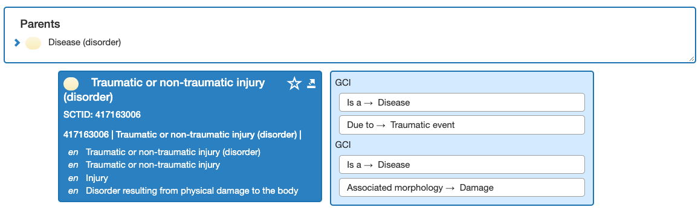
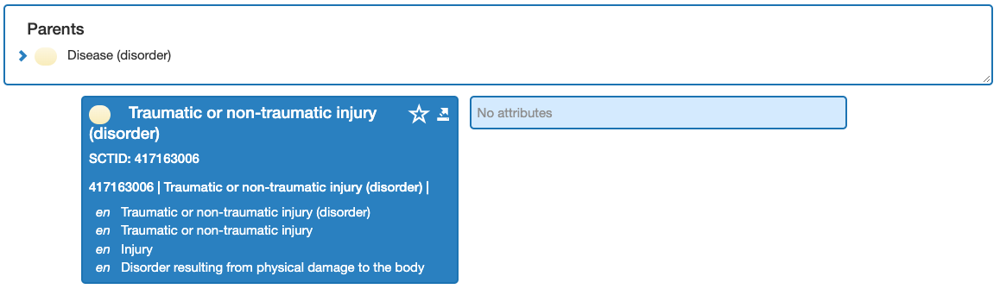
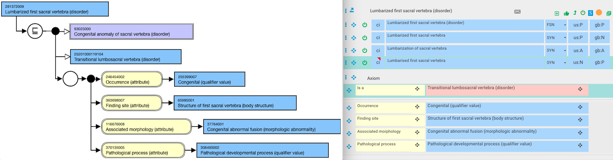
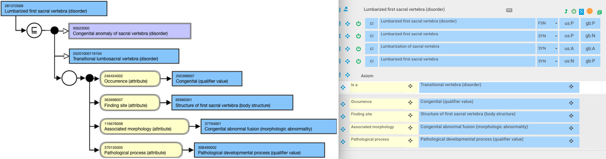
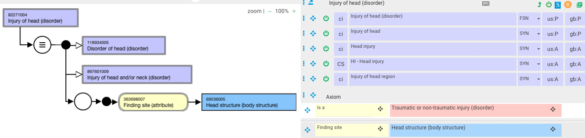

# General Concept Inclusions - GCIs

## Draft guidance

See the background, use cases, and examples for general concept inclusion axioms as well as explanation of the definition status at [General Concept Inclusion 0.01](https://docs.google.com/document/d/1-Tvswkw5USXydVWpBsT3iORdOFzx3qKAyownS4Enor4/edit).

## Authoring Platform User Guide for GCIs

Reference the [SNOMED International Authoring Platform User Guide](https://confluence.ihtsdotools.org/display/SIAPUG/Authoring+-+Description+Logic+%28DL%29+Support+Features) for technical information describing how to add an additional axiom and general concept inclusion.

## GCI display in the browser

A concept with GCIs will display in the browser in the stated view only. 

For example, 

Below is [ 417163006 | Traumatic or non-traumatic injury (disorder)|](http://snomed.info/id/417163006 "417163006 | Traumatic or non-traumatic injury \(disorder\) |") in the _stated_ view with the GCIs appearing to the right of the concept:

<figure><figcaption>
Here is the same concept in the <em>inferred</em> view without the GCIs appearing:
</figcaption></figure>

  

  

<figure></figure>

  

  

## Modeling concepts with a GCI-modeled supertype

General concept inclusions allow multiple definitions of a concept. A group of subtypes may be defined using GCIs and be considered subtypes of the parent concept without fully defining that parent concept. That parent concept could have multiple definitions, each of which is valid but none of which completely describes the parent concept on its own. 

When modeling a concept that will be classified under a GCI-modeled concept, there is no need to add the GCI-modeled concept as a stated parent, even if that GCI concept is primitive, because subsumption still occurs due to the GCI axiom.

For example,

  *     * 281372009 |Lumbarized first sacral vertebra (disorder)|

The diagram below shows Lumbarized first sacral vertebra (disorder) incorrectly modeled on the right, with a stated primitive GCI-modeled parent of Transitional lumbosacral vertebra (disorder). Transitional lumbosacral vertebra (disorder) is modeled with a GCI, as notified by the salmon pink color. The left side of the diagram shows the inferred view with two parents. 

  

<figure><figcaption>
The GCI-modeled primitive concept, Transitional lumbosacral vertebra (disorder), is unnecessary to state as a parent. The diagram below shows correct modeling of Lumbarized first sacral vertebra (disorder) with the absence of Transitional lumbosacral vertebra (disorder) as a parent, and yet the inferred view diagram on the left is still the same as compared to the incorrectly modeled diagram above.
</figcaption></figure>

  

<figure><figcaption>
Alternatively, if a GCI-modeled parent will not subsume an appropriate child concept, then the GCI-modeled concept should be stated as a primitive supertype.
</figcaption></figure>

  

  

  

  

Finally, the example below of 82271004 |Injury of head (disorder)| illustrates a concept with a GCI-modeled supertype of 417163006 |Traumatic or non-traumatic injury (disorder)|. In this case, the concept Injury of head (disorder) is sufficiently defined.

<figure></figure>

# Defining GCI-modeled concepts

Though most are primitive, it is possible to define concepts modeled with GCIs. A concept must continue to meet the necessary conditions in order to be considered defined. GCIs can be added to extend the subtypes a defined concept will infer when appropriate. 

# Points to Consider

  * GCIs are not restricted to particular hierarchies; they can be used as applicable in any hierarchy that has a concept model. 
  * The Authoring Platform does not currently have the ability to create templates that include GCIs.
  * A concept which has a stated "is a" relationship to a concept with GCIs will need to have GCIs added to it directly if GCIs are required to appropriately represent the concept. GCI axioms are not inherited from supertype to a subtype concept.

