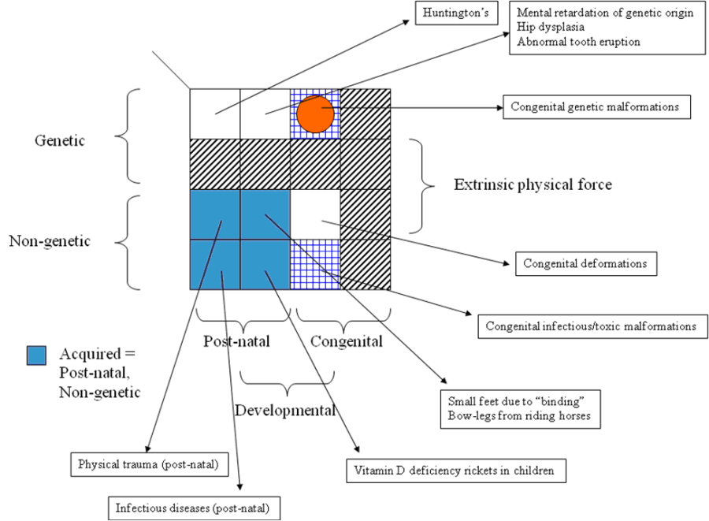

# Genetic, developmental, congenital, and physical origin

The following figure shows the structure of genetic, developmental, and congenital categories, along with non-genetic, non-developmental, and postnatal categories. A dimension, called  _extrinsic physical force_ , is included to distinguish  _deformations_ from  _malformations._ The sections of the diagram represent categories formed from the combination of the dimensions, each which represents the answer to one of the following questions:

  *     * Is it genetic or not?
    * Is it developmental or not?
    * Is it present at birth or not?
    * Is it due to an extrinsic physical force or not?

<figure><figcaption>
Figure 1: The relationships of genetic, congenital, developmental, and acquired disorders
</figcaption></figure>

**Explanation of Figure**

The sections with diagonal hashed lines represent combination categories that do not occur.

For example, there are no genetic disorders that are due to an extrinsic physical force. Likewise, there are no congenital disorders that are considered non-developmental.

The sections with blue crossing lines represent congenital malformations; they may be either genetic or non-genetic. 

For example, congenital infectious malformations

The red circle represents congenital genetic malformations. 

The blue sections represent  _acquired_ , i.e. disorders that are non-genetic and not present at birth.

For example, Vitamin D deficiency (rickets) in children is a non-genetic, non-congenital, developmental malformation.

The white sections represent genetic congenital or genetic postnatal disorders.

For example, Huntington's disease is a genetic disease that is neither congenital nor developmental. The gene defect is present at birth, but the disease does not manifest until adulthood. 

Arrows leading from the sections point to examples of disorders for the category. 

  

## Developmental

 _Developmental_ is a useful label for disorders that affect developing structures or functions that may occur pre- or postnatally. They may be present at birth or develop later.

## Familial

The term  _familial_ may also be ambiguous when used for broad categories. It may mean that the disorder is found in higher proportions in the immediate or extended family compared to other groups. Or, it may mean there is a possibility of a disease being inherited. It may be used; however, it may require clarification of meaning from the requestor. It should not be used as a synonym for  _genetic_. 

## Hereditary

It may be a challenge to classify a condition as a [32895009 |Hereditary disease (disorder)|](http://snomed.info/id/32895009).  _H_ _ereditary_ requires case-by-case definition; it cannot be applied to broad categories. Nevertheless, the names by which many diseases are known include the term, and it is permitted, as long as it does not introduce ambiguity.

  

