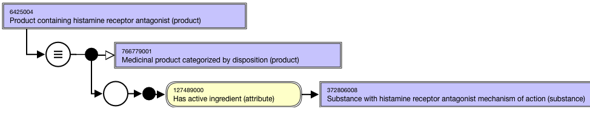
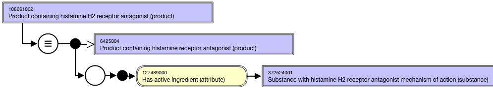

# Groupers Based on Disposition

## Overview

A high-level grouper concept supports the organization of the medicinal product concepts based on disposition: 766779001 |Medicinal product categorized by disposition (product)|

Disposition is a behaviour that something can exhibit (or participate in) given the appropriate context in which to do this. For example, a person may be "disposed" (or pre-disposed) to fidget in their seat when in a stressful situation such as an interview. For medicinal products, disposition behaviour can be thought of as "mechanism of action" of its active ingredient substance(s): the behaviour that the active ingredient substance(s) in the product exhibit when used clinically. Disposition (mechanism of action) is distinguishable from therapeutic role, which is context dependent: for example the mechanism of action of timolol is as a beta-adrenoceptor antagonist; this action can be used therapeutically to reduce hypertension when administered in a product given orally or to treat glaucoma when administered in a product intended to be given ophthalmically. Medicinal products can be collected together into groups based on the disposition of their active ingredient substance(s). 

Disposition is a characteristic of the active ingredient substance(s) present in the Medicinal Product, therefore disposition grouping concepts are assigned (inferred) by the classifier to medicinal products and to all their child concepts (medicinal product form and clinical drug concepts) although in a browser such as DailyBuild the inferred grouping concepts will be shown on the proximal concept only (the "medicinal product containing" concept).

<figure><figcaption>
Figure 1. Inferred view of Medicinal product showing membership of a disposition grouping (carbonic anydrase inhibitor)
</figcaption></figure>

  

This section applies to grouper concepts representing a **single** disposition; groupers comprised of multiple dispositions are described in [Groupers Based on Multiple Dispositions, Structures](174691077.html).

## Modeling

| Stated parent concept | 763158003 \|Medicinal product (product) |
|---|---|
| Semantic tag | (product) |
| Definition status | Defined |
| Attribute: Has active ingredient | While the allowed range is broader, the \|Medicinal product\| grouper concepts based on disposition should only use sufficiently defined grouper concepts that are descendants of 766739005 \|Substance categorized by disposition (substance)\| as attribute values. While the allowed range is broader, the \|Medicinal product\| grouper concepts based on disposition should have one and only one \|Has active ingredient\| attribute . Range: <<105590001 \|Substance (substance) Cardinality: 0..* |

## Naming

| FSN | Product containing histamine receptor antagonist (product) Product containing histamine H2 receptor antagonist (product) Product containing<Active ingredient PT>(product) For example, Align naming and case sensitivity with the PT for the concept that is selected as the 726542003 \|Has disposition (attribute)\| attribute value for the substance concept used as the attribute value for the 127489000 \|Has active ingredient (attribute)\|. |
|---|---|
| Preferred Term | Histamine receptor antagonist-containing product Histamine H2 receptor antagonist-containing product <Active ingredient PT>-containingproduct For example, Align naming and casesignificancewith the PTfor the concept that is selected as the726542003 \|Has disposition (attribute)\|attribute value for the substance concept used as the attribute value for the127489000 \|Has active ingredient (attribute)\|. |
| Synonyms | Synonyms matching the FSN are not required. |

## Exemplars

The following illustrates the **stated** view for grouper concept 6425004 |Product containing histamine receptor antagonist (product)|:

<figure><figcaption>
The following illustrates the <strong>inferred</strong> view for grouper concept 6425004 |Product containing histamine receptor antagonist (product)|:
</figcaption></figure>

  

<figure><figcaption>
The following illustrates the <strong>stated</strong> view for grouper concept 108661002 |Product containing histamine H2 receptor antagonist (product)|:
</figcaption></figure>

  

<figure><figcaption>
The following illustrates the <strong>inferred</strong> view for grouper concept 108661002 |Product containing histamine H2 receptor antagonist (product)|:
</figcaption></figure>

  

<figure></figure>

  

