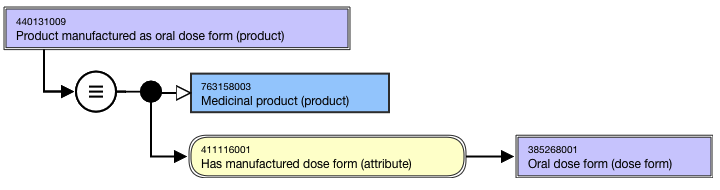
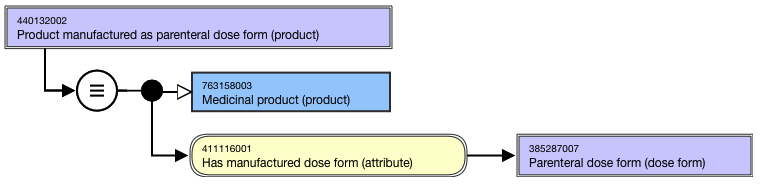

# Groupers Based on Dose form intended site

## Overview

Groupers based on "Dose form intended site" that can be sufficiently defined may be included in the 763158003 |Medicinal product (product)| hierarchy.

For example,

  *     * Product manufactured as oral dose form (product)
    * Product manufactured as parenteral dose form (product)

## Modeling

**Stated parent**|  763158003 |Medicinal product (product)  
---|---  
**Semantic tag**| (product)  
**Definition status**|  Defined  
**Attribute:****Has manufactured dose form**|  Range: <<736542009 |Pharmaceutical dose form (dose form)

  *     * While the allowed range is broader, the |Medicinal product| grouper concepts based on dose form intended site should use sufficiently defined grouper concepts that are descendants of 736542009 |Pharmaceutical dose form (dose form)| representing intended site as attribute values.  
  

Cardinality: 0..*

  *     *       * While the allowed range is broader, the |Medicinal product| grouper concepts based on disposition should have one and only one Has manufactured dose form (attribute).

  
  
## Naming

**FSN**|  Product manufactured as <Manufactured dose form FSN> (product)For example,

  *     *       * Product manufactured as oral dose form (product)
      * Product manufactured as parenteral dose form (product)

Align naming and case significance with the FSN for the concepts that are selected as the attribute value, excluding the semantic tag.  
---|---  
**Preferred Term**|  Product manufactured as <Manufactured dose form PT>For example,

  *     *       * Product manufactured as oral dose form
      * Product manufactured as parenteral dose form

Use the following pattern for the Preferred Term; align naming and case significance with the PT for the concept that is selected as the attribute value.   
**Synonyms**|  Synonyms are not generally created.  
  
## Exemplars

The following illustrates the **stated and inferred** view for 440131009 |Product manufactured as oral dose form (product)|:

<figure><figcaption>
The following illustrates the <strong>stated and inferred</strong> view for 440132002 |Product manufactured as parenteral dose form (product)|:
</figcaption></figure>

<figure></figure>

  

  

