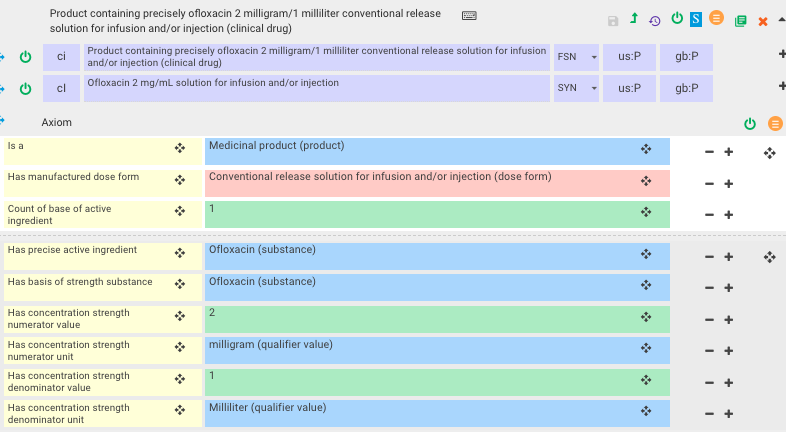
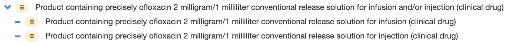

# Groupers Based on Infusion and or Injection

Pharmaceutical dose form grouper concepts specifying "infusion _and/or_ injection" are modeled using General Concept Inclusions (GCIs). 

For example,

  *     * 1208958005 |Conventional release solution for infusion and/or injection (dose form)|
    * 1236769008 |Gas for conventional release dispersion for infusion and/or injection (dose form)|
    * 1237269000 |Concentrate for conventional release solution for infusion and/or injection (dose form)|

The following are out of scope for the international release but can be added to national extensions, concepts that specify:

  * "infusion or injection" 
  * "infusion and injection"

## Clinical drugs with _infusion and/or injection_

Clinical drugs modeled using pharmaceutical dose form groupers for “infusion _and/or_ injection” are in scope for the International Release.

For example,

  *     * 1252729004 |Product containing precisely ofloxacin 2 milligram/1 milliliter conventional release solution for infusion and/or injection (clinical drug)| is modeled with |Has manufactured dose form (attribute)| of |Conventional release solution for infusion and/or injection (dose form)|.

<figure><figcaption>
Figure 1: Stated view of 1252729004 |Product containing precisely ofloxacin 2 milligram/1 milliliter conventional release solution for infusion and/or injection (clinical drug)|
</figcaption></figure>

In cases where corresponding clinical drugs for both injection and infusion exist, the grouper for “infusion and/or injection” should be created. In other words, when creating a new clinical drug for infusion and an existing injection concept exists with the same substance and strength, then the grouper "for infusion and/or injection" should be created. 

For example,

<figure></figure>

  

