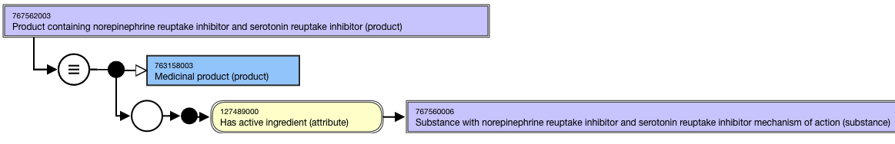
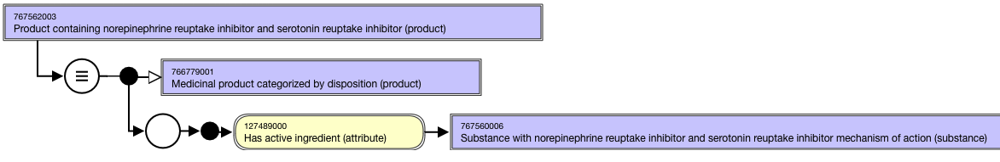
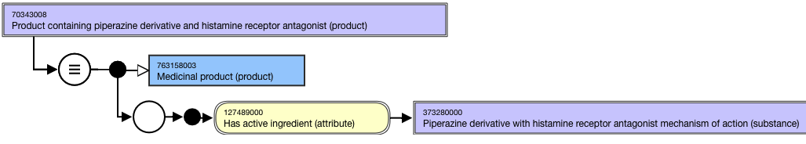
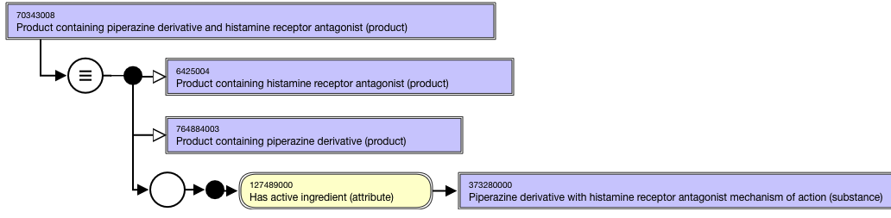

# Groupers Based on Multiple Dispositions, Structures

## Overview

Groupers comprised of two or more existing disposition and/or structure groupers that can be sufficiently defined may be included in the |Medicinal product| hierarchy.

High-level grouper concepts support the organization of the combined groupers based on disposition and/or structure:

  * 766779001 |Medicinal product categorized by disposition (product)|
  * 763760008 |Medicinal product categorized by structure (product)|

## Modeling

**Stated parent concept**|  763158003 |Medicinal product (product)  
---|---  
**Semantic tag**| (product)  
**Definition status**|  Defined  
**Attribute:****Has active ingredient**|  Range: <<105590001 |Substance (substance)

  *     * While the allowed range is broader, the |Medicinal product| combined grouper concepts based on disposition and/or structure should only use sufficiently defined grouper concepts that are descendants of 766739005 |Substance categorized by disposition (substance)| and/or primitive grouper concepts that are descendants of 312413002 |Substance categorized by structure (substance)| as attribute values.  
  

Cardinality: 0..*

  *     * While the allowed range is broader, the |Medicinal product| combined grouper concepts should have one or more |Has active ingredient| attributes.

  
  
## Naming

**FSN**|  Use the following pattern for the FSN if the combined grouper is comprised of two dispositions or two structural groupers; align naming and case significance with the PT as described in Section 4.1 and 4.2, respectively. The active ingredients must be in alphabetical order and separated by the word “and”.

  * Product containing <Active ingredient PT> and <Active ingredient PT> (product)

For example,

  *     *       * Product containing norepinephrine reuptake inhibitor and serotonin reuptake inhibitor (product)

  
Use the following pattern for the FSN if the combined grouper is comprised of one disposition and one structural grouper; align naming and case significance with the FSN for the concept with the FSN as described in Section 4.1 and 4.2, respectively.

  * Product containing <Structural grouper active ingredient PT> and <Disposition grouper active ingredient PT> (product)

For example,

  *     *       * Product containing piperazine derivative and histamine receptor antagonist (product)

  
---|---  
**Preferred Term**|  Use the following pattern for the PT if the combined grouper is comprised of two dispositions or two structural groupers; align naming and case significance with the PT for the concept that is selected as the attribute value. The active ingredients must be in alphabetical order and separated by the word “and".

  * <Active ingredient PT> and <Active ingredient PT>-containing product

For example,

  *     *       * Norepinephrine reuptake inhibitor and serotonin reuptake inhibitor-containing product

  
Use the following pattern for the FSN if the combined grouper is comprised of one disposition and one structural grouper; align naming and case significance with the FSN for the concept that is selected as the attribute value.

  * <Structural grouper active ingredient PT> and <Disposition grouper active ingredient PT>-containing product

For example,

  *     *       * Piperazine derivative and histamine receptor antagonist-containing product

  
**Synonyms**|  Synonyms matching the FSN are not required.  
  
## Exemplars

The following illustrates the **stated** view for combined grouper concept 767562003 |Product containing norepinephrine reuptake inhibitor and serotonin reuptake inhibitor (product)|:

<figure><figcaption>
The following illustrates the<strong>inferred</strong> view for combined grouper concept 767562003 |Product containing norepinephrine reuptake inhibitor and serotonin reuptake inhibitor (product)|:
</figcaption></figure>

  

<figure><figcaption>
The following illustrates the <strong>stated</strong> view for combined grouper concept 70343008 |Product containing piperazine derivative and histamine receptor antagonist (product)|:
</figcaption></figure>

  

<figure><figcaption>
The following illustrates the <strong>inferred</strong> view for combined grouper concept 70343008 |Product containing piperazine derivative and histamine receptor antagonist (product)|:
</figcaption></figure>

  

<figure></figure>

  

