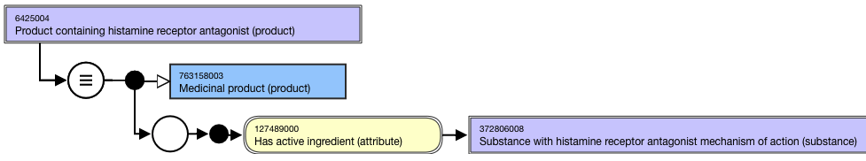
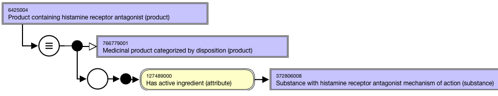
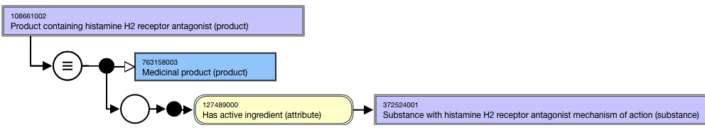
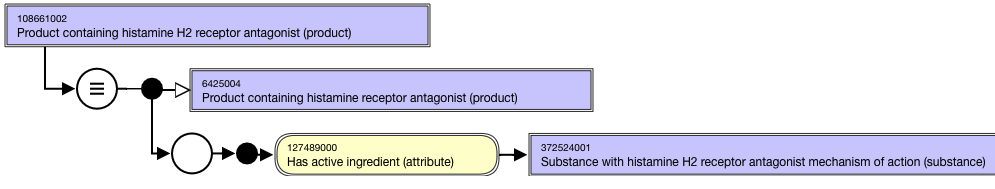

# Groupers Based on Single Disposition

## Overview

Grouper concepts based on disposition of an active ingredient that can be sufficiently defined may be included in the 763158003 |Medicinal product (product)| hierarchy. 

A high-level grouper concept supports the organization of the medicinal product concepts based on disposition:

  * 766779001 |Medicinal product categorized by disposition (product)|

## Modeling

Stated parent concept| 763158003 |Medicinal product (product)  
---|---  
Semantic tag| (product)  
Definition status| Defined  
Attribute:Has active ingredient| Range: <<105590001 |Substance (substance)

  *     * While the allowed range is broader, the |Medicinal product| grouper concepts based on disposition should only use sufficiently defined grouper concepts that are descendants of 766739005 |Substance categorized by disposition (substance)| as attribute values.  

Cardinality: 0..*

  *     * While the allowed range is broader, the |Medicinal product| grouper concepts based on disposition should have one and only one |Has active ingredient| attribute.

  
  
## Naming

**FSN**|  Product containing <Active ingredient PT> (product)For example,

  *     *       * Product containing histamine receptor antagonist (product)
      * Product containing histamine H2 receptor antagonist (product)

Align naming and case sensitivity with the PT for the concept that is selected as the 726542003 |Has disposition (attribute)| attribute value for the substance concept used as the attribute value for the 127489000 |Has active ingredient (attribute)|.  
---|---  
**Preferred Term**|  <Active ingredient PT>-containing productFor example,

  *     *       * Histamine receptor antagonist-containing product  

      * Histamine H2 receptor antagonist-containing product

Align naming and case significance with the PT for the concept that is selected as the 726542003 |Has disposition (attribute)| attribute value for the substance concept used as the attribute value for the 127489000 |Has active ingredient (attribute)|.  
**Synonyms**|  Synonyms matching the FSN are not required.  
  
## Exemplars

The following illustrates the **stated** view for grouper concept 6425004 |Product containing histamine receptor antagonist (product)|:

<figure><figcaption>
The following illustrates the <strong>inferred</strong> view for grouper concept 6425004 |Product containing histamine receptor antagonist (product)|:
</figcaption></figure>

  

<figure><figcaption>
The following illustrates the <strong>stated</strong> view for grouper concept 108661002 |Product containing histamine H2 receptor antagonist (product)|:
</figcaption></figure>

  

<figure><figcaption>
The following illustrates the <strong>inferred</strong> view for grouper concept 108661002 |Product containing histamine H2 receptor antagonist (product)|:
</figcaption></figure>

  

<figure></figure>

  

