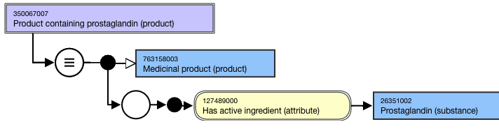
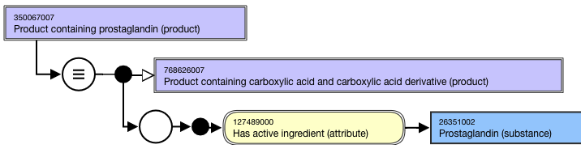
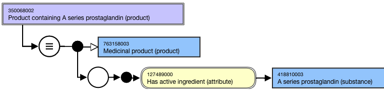
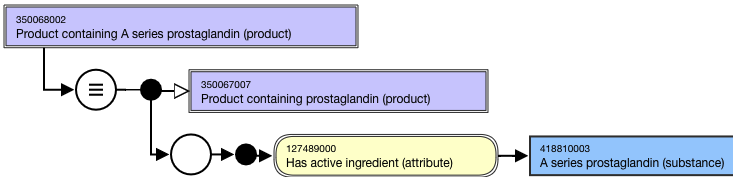

# Groupers Based on Single Structure

## Overview

Grouper concepts based on chemical structure of an active ingredient that can be sufficiently defined may be included in the |Medicinal product| hierarchy.

This section applies to grouper concepts representing a **single** structure; groupers comprised of multiple structures are described in [Groupers Based on Multiple Dispositions, Structures](225055029.html).

A high-level grouper concept supports the organization of the hierarchy based on structure: 763760008 |Medicinal product categorized by structure (product)|

## Modeling

| Stated parent concept | 763158003 \|Medicinal product (product) |
|---|---|
| Semantic tag | (product) |
| Definition status | Defined |
| Attribute: Has active ingredient | While the allowed range is broader, the \|Medicinal product\| grouper concepts based on structure should only use primitive grouper concepts that are descendants of 312413002 \|Substance categorized by structure (substance)\| as attribute values. While the allowed range is broader, the \|Medicinal product\| grouper concepts based on structure should have one and only one \|Has active ingredient (attribute)\| . Range: << 105590001 \|Substance (substance)\| Cardinality: 0..* |

## Naming

| FSN | Product containing prostaglandin (product) Product containing A series prostaglandin (product) Product containing<active ingredient>(product) Align naming and case sensitivity with the Preferred Term for the concept that is selected as the attribute value for the 127489000 \|Has active ingredient (attribute)\|. For example, |
|---|---|
| Preferred Term | Prostaglandin-containing product A series prostaglandin-containing product <Active ingredient>-containingproduct Align naming and case significance with the Preferred Term for the concept that is selected as the attribute value. For example, |
| Synonyms | Synonyms matching the FSN are not required. |

## Exemplars

The following illustrates the **stated** view for 350067007 |Product containing prostaglandin (product)|:

<figure><figcaption>
The following illustrates the <strong>inferred</strong> view for 350067007 |Product containing prostaglandin (product)|:
</figcaption></figure>

  

<figure><figcaption>
The following illustrates the <strong>stated</strong> view for 350068002 |Product containing A series prostaglandin (product)|:
</figcaption></figure>

  

<figure><figcaption>
The following illustrates the <strong>inferred</strong> view for 350068002 |Product containing A series prostaglandin (product)|:
</figcaption></figure>

  

<figure></figure>

  

