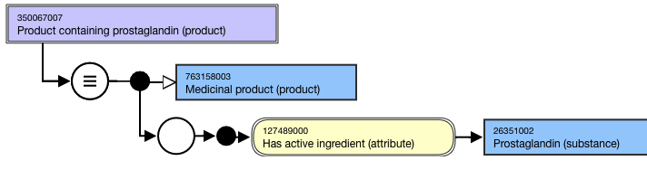
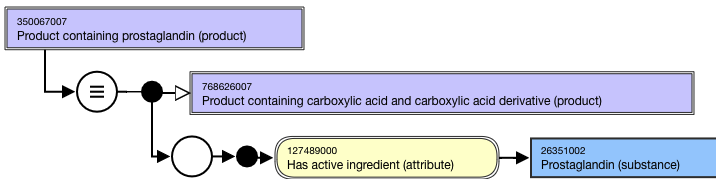
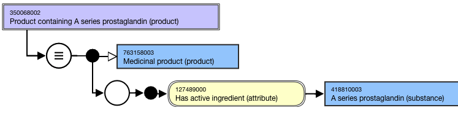
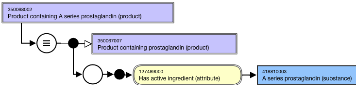

# Groupers Based on Structure

## Overview

A high-level grouper concept supports the organization of the hierarchy based on structure: 763760008 |Medicinal product categorized by structure (product)| 

All substances have spatial arrangement of the atoms and molecules and bonds that they are constituted from and which therefore govern the final shape that the substance takes; this arrangement is their "structure". Substance structures often follow patterns so that similar structures are grouped together and often share particular name patterns. Medicinal products can be collected together into groups based on the structural pattern(s) of their active ingredient substance(s).

Structure-based grouping is a characteristic of the active ingredient substance(s) present in the medicinal product, therefore structure-based grouping concepts are assigned (inferred) by the classifier to medicinal products and include all their child concepts (medicinal product form and clinical drug concepts) although in a browser such as DailyBuild the inferred grouping concepts will be shown on the proximal concept only (the "medicinal product containing" concept).

<figure><figcaption>
Figure 1: Inferred view of Medicinal product showing membership of a structural grouping (sulfonamide)
</figcaption></figure>

  

This section applies to grouper concepts representing a **single** structure; groupers comprised of multiple structures are described in [Groupers Based on Multiple Dispositions, Structures](174691077.html).

## Modeling

| Stated parent concept | 763158003 \|Medicinal product (product) |
|---|---|
| Semantic tag | (product) |
| Definition status | Defined |
| Attribute: Has active ingredient | While the allowed range is broader, the \|Medicinal product\| grouper concepts based on structure should only use primitive grouper concepts that are descendants of 312413002 \|Substance categorized by structure (substance)\| as attribute values. While the allowed range is broader, the \|Medicinal product\| grouper concepts based on structure should have one and only one \|Has active ingredient (attribute)\| . Range: << 105590001 \|Substance (substance)\| Cardinality: 0..* |

## Naming

| FSN | Product containing prostaglandin (product) Product containing A series prostaglandin (product) Product containing<active ingredient>(product) Align naming and case sensitivity with the Preferred Term for the concept that is selected as the attribute value for the 127489000 \|Has active ingredient (attribute)\|. For example, |
|---|---|
| Preferred Term | Prostaglandin-containing product A series prostaglandin-containing product <Active ingredient>-containingproduct Align naming and case significance with the Preferred Term for the concept that is selected as the attribute value. For example, |
| Synonyms | Synonyms matching the FSN are not required. |

## Exemplars

The following illustrates the **stated** view for 350067007 |Product containing prostaglandin (product)|:

<figure><figcaption>
The following illustrates the <strong>inferred</strong> view for 350067007 |Product containing prostaglandin (product)|:
</figcaption></figure>

  

<figure><figcaption>
The following illustrates the <strong>stated</strong> view for 350068002 |Product containing A series prostaglandin (product)|:
</figcaption></figure>

  

<figure><figcaption>
The following illustrates the <strong>inferred</strong> view for 350068002 |Product containing A series prostaglandin (product)|:
</figcaption></figure>

  

<figure></figure>

  

