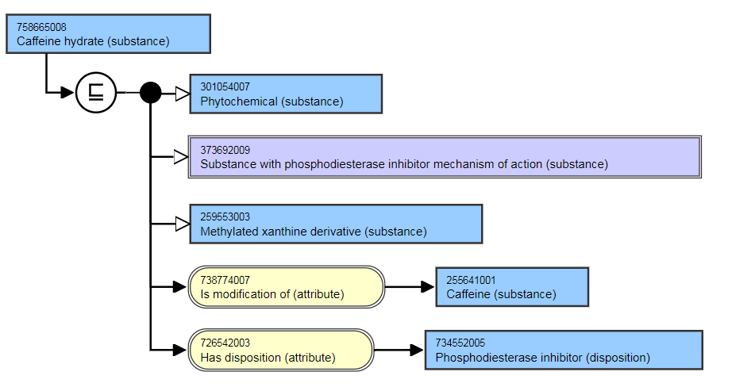
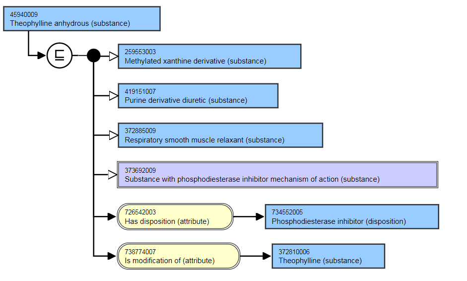

# Hydrates and anhydrous substances

## Modeling 

| Parent concept | Most distal appropriate descendant of 105590001 \|Substance (substance)\| |
|---|---|
| Semantic tag | (substance) |
| Definition status | Primitive |
| Attribute | 738774007 \|Is modification of (attribute)\| relationship to the substance with unspecified hydration 726542003 \|Has disposition (attribute)\|, as appropriate |

## Hydrates

Hydates are modeled with an [ 738774007 | Is modification of (attribute)|](http://snomed.info/id/738774007 "738774007 | Is modification of \(attribute\) |") relationship to the substance with unspecified hydration. 

For example,

  *     * Ferrous oxalate dihydrate (substance) is modification of → Ferrous oxalate
    * Caffeine hydrate (substance) is modification of → Caffeine
    * Zinc sulfate heptahydrate (substance) is modification of → Zinc sulfate

### Naming Guidelines

| FSN | X hydrate (substance) X dihydrate (substance) X monohydrate (substance) Pattern: For example, Copper sulfate pentahydrate (substance) |
|---|---|
| Preferred Term | X hydrate X dihydrate X monohydrate Copper sulfate pentahydrate Pattern: For example, |

### Exemplar

The following illustrates the **inferred** view.

Caffeine hydrate (substance) IS MODIFICATION OF Caffeine (substance)

**

<figure><figcaption>
**
</figcaption></figure>

## Anhydrous compounds

Anhydrous compounds have an [ 738774007 | Is modification of (attribute)|](http://snomed.info/id/738774007 "738774007 | Is modification of \(attribute\) |") relationship to the unspecified substance, i.e. where the level hydration is not specified.

For example,

  *     * Sodium carbonate anhydrous (substance) is modification of → Sodium carbonate  

    * Theophylline anhydrous (substance) is modification of → Theophylline

### Naming Guidelines

| FSN | X anhydrous (substance) Pattern: For example, Theophylline anhydrous (substance) |
|---|---|
| Preferred Term | X anhydrous Theophylline anhydrous Pattern: For example, |
| Synonyms | Anhydrous X |

### Exemplar

The following illustrates the **inferred** view.

Theophylline anhydrous (substance) IS MODIFICATION OF Theophylline (substance)

**

<figure><figcaption>
**
</figcaption></figure>

**  
**
