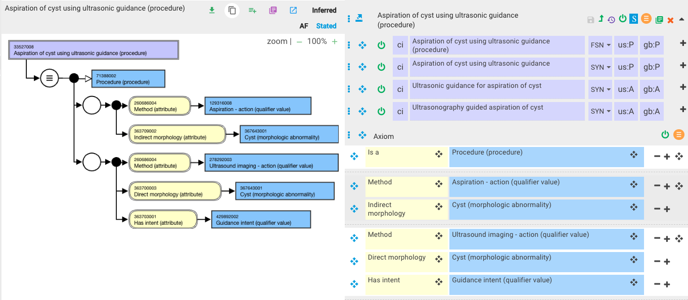

# Imaging-guided procedure modeling

Imaging guidance can be modeled using the  _Has intent (attribute)_. The concept [429892002 |Guidance intent (qualifier value)|](http://snomed.info/id/429892002), a child of [363675004 |Intents (nature of procedure values) (qualifier value)|](http://snomed.info/id/363675004), is the value for the Has intent (attribute) for imaging-guided procedures. 

For example,

  *     * [432666003 |Biopsy of brain using computed tomography guidance (procedure)|](http://snomed.info/id/432666003) has two relationship groups:
      * Group 1: 
        * Method (attribute) of Biopsy - action (qualifier value)
        * Procedure Site - Direct (attribute) of Brain structure (body structure)

  *     *       * Group 2:
        * Procedure Site - Direct (attribute) of Brain structure (body structure)
        * Method (attribute) of Computed tomography imaging - action (qualifier value)
        * Has intent (attribute) of Guidance intent (qualifier value)

[432666003 |Biopsy of brain using computed tomography guidance (procedure)|](http://snomed.info/id/432666003) is subsumed by [702707005 |Biopsy of head (procedure)|](http://snomed.info/id/702707005) and by [34227000 |Computerized axial tomography of brain (procedure)|](http://snomed.info/id/34227000).

Where the procedure involves a device and/or morphology as the object of the action for which imaging guidance is being performed, that morphology, device, and/or anatomic structure in/on which the procedure is being performed are all the direct object of the imaging action. The direct device or direct morphology is included in the imaging role group.

For example,

In Aspiration of cyst using ultrasonic guidance (procedure), the Ultrasound imaging role group will include a Direct morphology (attribute) of Cyst (morphologic abnormality). 

<figure></figure>

## Fluoroscopic guidance

 _X**** using fluoroscopic guidance (procedure) _is a subtype of Fluoroscopy (procedure).

For example, 

  *     * [ 710291004 |Endoscopy using fluoroscopic guidance (procedure)|](http://snomed.info/id/710291004) has the following relationship groups
      * Group 1:
        * Using device (attribute) of Endoscopic device (physical object)
        * Method (attribute) of Inspection - action (qualifier value)

  *     *       * Group 2:
        * Method (attribute) of Fluoroscopic imaging - action (qualifier value)
        * Has intent (attribute) of Guidance intent (qualifier value)

See also  _Clinical imaging procedure naming conventions_ section
