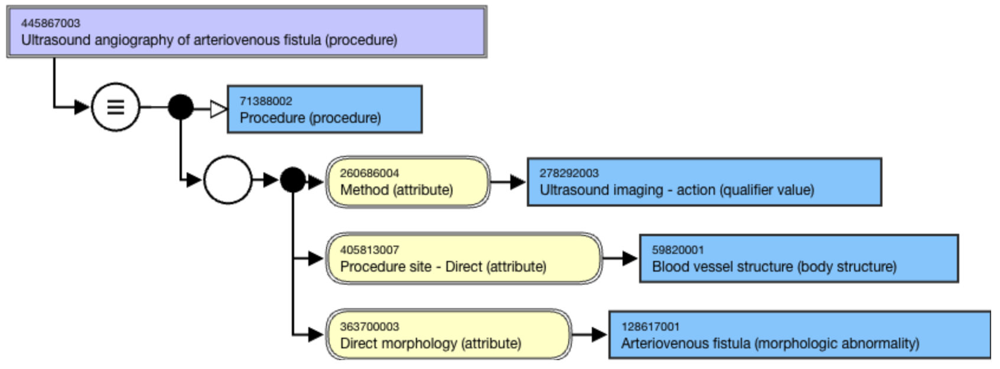

# Imaging

When an imaging procedure involves visualization of a device and/or a morphologic abnormality in addition to an anatomic site, all of these are direct objects of imaging and therefore are represented using Direct morphology, Direct device, and Procedure site Direct attributes.

For example, 

<figure><figcaption>
Figure 1: Stated view of 445867003 |Ultrasound angiography of arteriovenous fistula (procedure)|
</figcaption></figure>

  

