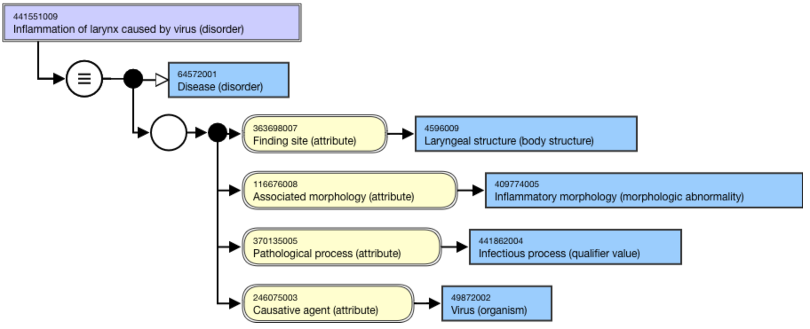
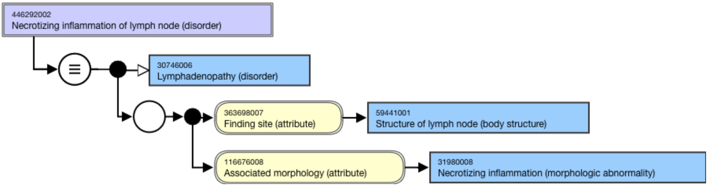

# Infectious vs. inflammatory

Disorders with the suffix "-itis" (e.g. cystitis, prostatitis, tonsillitis, appendicitis) are often infectious as well as inflammatory in nature. 

For inflammatory conditions whose FSNs specify an  _infective_  _cause_ , the modeling should include:

  *     * [|Causative agent (attribute)|](http://snomed.org/-fictid) with the specified organism 
    * [|Pathological process (attribute)|](http://snomed.org/-fictid) with the type of infectious process
    * [|Associated morphology (attribute)|](http://snomed.org/-fictid) with Inflammatory morphology or subtype
    * [|Finding site (attribute)|](http://snomed.org/-fictid) with a body structure when known

For inflammatory conditions whose FSNs do  _not_ specify an infective cause, an infectious cause should neither be assumed nor modeled when the FSN does not specify it. The modeling would then exclude a Causative agent and Pathological process and should include only:

  *     * [|Associated morphology (attribute)|](http://snomed.org/-fictid) of Inflammatory morphology or subtype
    * [|Finding site (attribute)|](http://snomed.org/-fictid) with a body structure when known

Example of inflammatory  _and_ infectious disorder,

[441551009 |Inflammation of larynx caused by virus (disorder)|](http://snomed.info/id/441551009) (synonym, Viral laryngitis) includes a [|Causative agent (attribute)|](http://snomed.org/-fictid) of [|Virus (organism)|](http://snomed.org/-fictid) and a [|Pathological process (attribute)|](http://snomed.org/-fictid) of [|Infectious process (qualifier value)|](http://snomed.org/-fictid). 

<figure><figcaption>
Figure 1: Stated view of 441551009 |Inflammation of larynx caused by virus (disorder)|
</figcaption></figure>

  

Example of inflammatory disorder  _not_ specified as infectious,

[446292002 |Necrotizing inflammation of lymph node (disorder)|](http://snomed.info/id/446292002) (synonym, Necrotizing lymphadenitis) does not specify an infective cause, so it is neither modeled with Causative agent nor Pathological process. The model contains an [|Associated morphology (attribute)|](http://snomed.org/-fictid) and a [|Finding site (attribute)|](http://snomed.org/-fictid). 

<figure><figcaption>
Figure 2: Stated view of 446292002 |Necrotizing inflammation of lymph node (disorder)|
</figcaption></figure>

