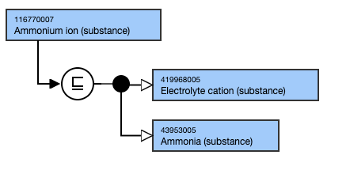
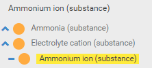

# Ions and electrolyte substances

## Overview

Previously, SNOMED CT represented ions and electrolytes as separate concepts. Although the two terms are subtly different, there is considerable overlap in their definitions, and they seem to be used interchangeably in medicine. The Substances Redesign Project Group considered this issue and determined the following:

  * Ions should be modeled as child concepts of the substance. 

  * A second parent (in addition to X (substance)), that indicates the concept is an ionized substance, should be modeled. 
    * Use a descendant of 86355000 |Electrolyte (substance)| as the additional parent. (<<86355000 |Electrolyte (substance)| are used in LOINC term expression associations.)
  * Non-Ionized/Non-Ionised substances should not be created.  
  

## Modeling 

Parent concepts| Most distal appropriate descendant of 86355000 | Electrolyte (substance)|Most distal appropriate descendant of 312413002 |Substance categorized structurally (substance)|  
---|---  
Semantic tag| (substance)  
Definition status| Primitive  
Attribute| None  
  
## Naming

FSN| Pattern:

  * **X ion (substance)**   
  

For example,

  *     *       * Ferric ion (substance)

  
---|---  
Preferred Term| Pattern:

  * **X ion**

For example,

  *     *       * Ferric ion

  
Synonyms| Pattern:**"Ionized X" and "X electrolyte"**  
**Add "Ionised X" as GB synonym.** For example,

  *     *       * Ionised fluorine
      * Ionized fluorine
      * Fluoride electrolyte

Where an element can exist with more than one level of oxidation, for example, iron can exist in either the ferric (Fe3+) or ferrous (Fe 2+) ionization states, the synonyms "Ionised X" and "Ionized X" should not be added since they are ambiguous.  
  
  
## Exemplar

The following illustrates the **Stated** and**Inferred** view:

<figure><figcaption>
The following illustrates the hierarchy view:
</figcaption></figure>

  

<figure></figure>
