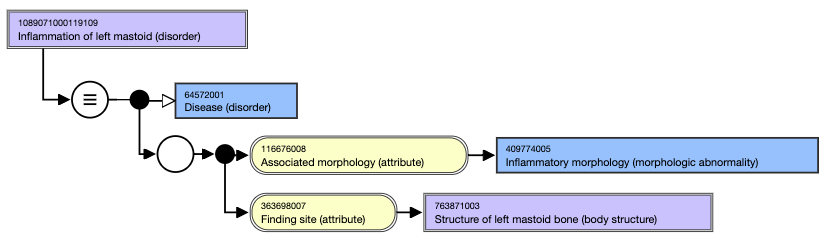
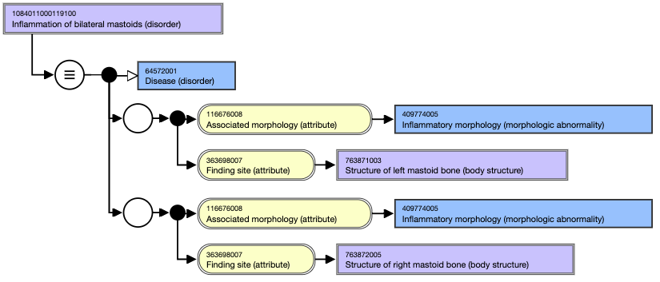

# Lateralized Disorder Naming Conventions

## Right, left disorder concepts

When creating a lateralized disorder concept, two concepts should be created: 

  1. concept for the left side
  2. concept for the right side

Descriptions

  *     * FSN: <morphologic abnormality> of _right/left_ <body structure> (disorder)
    * PT: _Right/left_ <disorder>

For example, [ 1089071000119109 | Inflammation of left mastoid (disorder)|](http://snomed.info/id/1089071000119109 "1089071000119109 | Inflammation of left mastoid \(disorder\) |")

  *     * FSN: Inflammation of left mastoid (disorder)
    * PT: Left mastoiditis

<figure><figcaption>
Figure 1: Stated view of Inflammation of left mastoid (disorder)
</figcaption></figure>

  

When creating a lateralized disorder concept, if a non-lateralized parent does not exist, then it should be created as well. In other words, do not just create the right and left versions, but also create a concept to represent the laterality-agnostic parent. 

For example,

When creating _Inflammation of left mastoid_ and _Inflammation of right mastoid_ , also ensure a concept for _Inflammation of mastoid_ exists. 

Where the disorder is left/right of a specific anatomical site, and the preferred term naming pattern of  _Right/left_ <disorder> causes a combination that does not sound like natural flowing English, the guidance above can be circumvented. See the section [Naming Convention for Digits of Hand and Foot](https://confluence.ihtsdotools.org/display/WIPEG/Naming+Convention+for+Digits+of+Hand+and+Foot?src=sidebar "Follow link") and Laterality section [Laterality](https://confluence.ihtsdotools.org/display/WIPEG/Laterality?src=sidebar "Follow link").

For example,

_Left interphalangeal thumb joint open traumatic dislocation_ should follow naming guidance of _Open traumatic dislocation of interphalangeal joint of left thumb_.

_Left abscess of foot_ is an incorrect term; instead, this should read _Abscess of left foot_. 

  

## Bilateral disorder concepts

Where the bilateral disorder description causes a combination that does not sound like natural flowing English, the guidance below can be circumvented. 

### When the body structure and the morphologic abnormality are combined into one word, the following naming pattern applies:

FSN: <Morphologic abnormality> of bilateral <body structure> (disorder)

PT: Bilateral <disorder>

SYN: <Disorder> of bilateral <body structure>

SYN: <Disorder> of both <body structure>

For example,  [ 1084011000119100 | Inflammation of bilateral mastoids (disorder)|](http://snomed.info/id/1084011000119100 "1084011000119100 | Inflammation of bilateral mastoids \(disorder\) |")

    *       * FSN: Inflammation of bilateral mastoids (disorder)
      * PT: Bilateral mastoiditis
      * SYN: Inflammation of bilateral mastoids
      * SYN: Inflammation of both mastoids

### When the body structure and morphologic abnormality are separate, the following naming pattern applies:

FSN: <Morphologic abnormality> of bilateral <body structure> (disorder)

PT: <Morphologic abnormality> of bilateral <body structure>

SYN: <Morphologic abnormality> of both <body structure>

Note the PT of Bilateral <disorder> is not required. _Bilateral_ is to describe the body site, not the morphologic abnormality.

For example, [ 15725081000119100 | Effusion of joint of bilateral feet (disorder)|](http://snomed.info/id/15725081000119100 "15725081000119100 | Effusion of joint of bilateral feet \(disorder\) |")

  *     *       * FSN: Effusion of joint of bilateral feet (disorder)
      * PT: Effusion of joint of bilateral feet
      * SYN: Effusion of joint of both feet

Also note that _joint_ is singular. This is to denote that the joint may be singular on each side of the body; the plurality of feet will represent the laterality. Using _joints_ as plural may incorrectly reflect that there are multiple joints affected in both feet. 

  

## Modeling of bilateral disorders

Bilateral disorders should be modeled using two relationship groups, one for each lateralized body structure.

<figure><figcaption>
Figure 2: Stated view of Inflammation of bilateral mastoids (disorder) with a role group for each side
</figcaption></figure>

  

  

