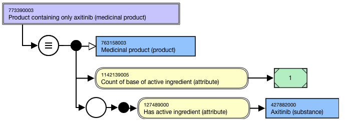
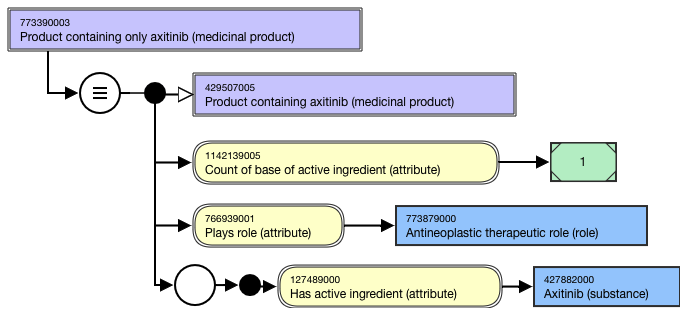
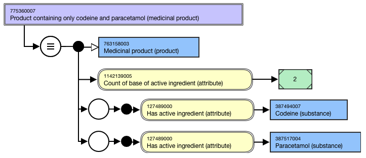
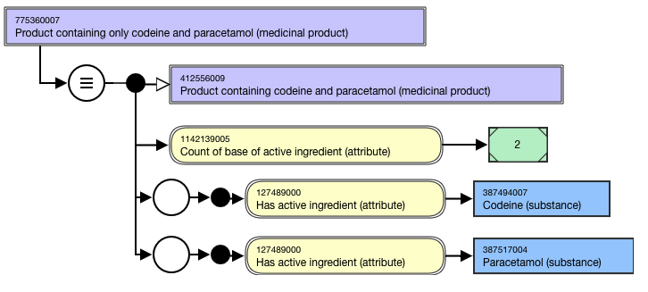

# Medicinal Product containing only

## Overview

The |Product containing only x (medicinal product)| concepts are abstract representations of the active ingredient(s) for a medicinal product. The medicinal product contains only the active ingredient(s) specified in the FSN but may also contain a modification of the active ingredient(s) specified in the FSN.

For example,

  *     * Product containing only axitinib (medicinal product)
    * Product containing only abacavir and lamivudine (medicinal product)

## Modeling

| Stated parent | 763158003 \|Medicinal product (product) |
|---|---|
| Semantic tag | (medicinal product) |
| Definition status | Defined |
| Attribute: Has active ingredient | Range: <105590001 \|Substance (substance), excluding concepts representing structural groupers, dispositions, or combined substances Cardinality: 1..* - there is no technical limit on the number of Has active ingredient attributes that may be added to a concept; a practical limit may be imposed at a later date. |
| Attribute: Count of base of active ingredient | Concrete Type: Integer Range: >#0.. Cardinality: 1..1 |

### Exception for Benzylpenicillin

774826003 |Product containing only benzylpenicillin (medicinal product)| is primitive and is a proximal primitive parent to 786119008 |Product containing only benzylpenicillin in oral dose form (medicinal product form)| plus 2 subtype clinical drugs, and 778490002 |Product containing only benzylpenicillin in parenteral dose form (medicinal product form)| plus 3 subtype clinical drugs. 774826003 |Product containing only benzylpenicillin (medicinal product)| is intentionally not modeled as a supertype of 1234764000 |Product containing only benzathine benzylpenicillin (medicinal product)| and 1234762001 |Product containing only procaine benzylpenicillin (medicinal product)| because clinically the child concepts are not considered as specialisations of the supertype, but as sibling concepts.

## Naming

Use the following pattern for the FSN and PT. Align naming and case sensitivity with the FSN for the concept that is selected as the attribute value. 

For multiple ingredient drug products, the active ingredients must be in alphabetical order and separated by the word “and”.

| FSN | Product containing only axitinib (medicinal product) Product containing only abacavir and lamivudine (medicinal product) Product containing only abacavir and lamivudine and zidovudine (medicinal product) Product containing only<Active ingredient FSN>(medicinal product) Product containing only<Active ingredient FSN>and<Active ingredient FSN>(medicinal product) Product containing only<Active ingredient FSN>and<Active ingredient FSN>and<Active ingredient FSN>(medicinal product) For example, |
|---|---|
| Preferred Term | Axitinib only product Abacavir and lamivudine only product Abacavir and lamivudine and zidovudine only product <Active ingredient PT>onlyproduct <Active ingredient PT>and<Active ingredient PT>onlyproduct <Active ingredient PT>and<Active ingredient PT>and<Active ingredient PT>onlyproduct For example, |
| Synonym | Synonyms matching the FSN are not required. |

## Exemplars

The following illustrates the **stated** view for 773390003 |Product containing only axitinib (medicinal product)|:

<figure><figcaption>
The following illustrates the <strong>inferred</strong> view for 773390003 |Product containing only axitinib (medicinal product)|:
</figcaption></figure>

<figure><figcaption>
The following illustrates the <strong>stated</strong> view for 775360007 |Product containing only codeine and paracetamol (medicinal product)|:
</figcaption></figure>

<figure><figcaption>
The following illustrates the <strong>inferred</strong> view for 775360007 |Product containing only codeine and paracetamol (medicinal product)|:
</figcaption></figure>

<figure></figure>
