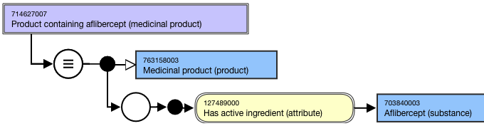
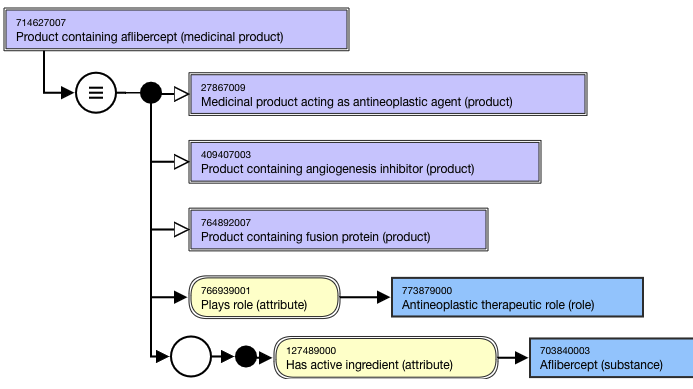
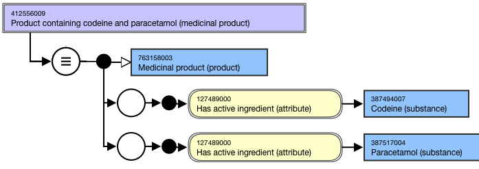
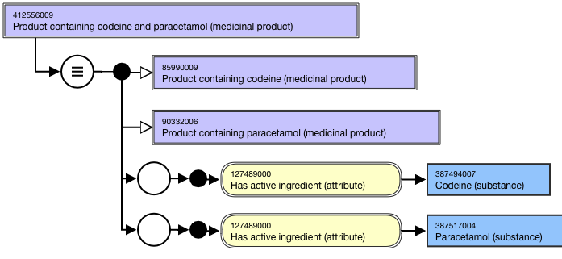

# Medicinal Product containing

## Overview

|Product containing x (medicinal product)| concepts are abstract representations of the active ingredient(s) for a medicinal product. The medicinal product must contain the active ingredient(s) specified in the FSN but may also contain a modification of the active ingredient(s) specified in the FSN or may contain additional active ingredient(s).

For example,

  *     * Product containing axitinib (medicinal product)
    * Product containing abacavir and lamivudine (medicinal product) 

## Modeling

| Stated parent | 763158003 \| Medicinal product (product) |
|---|---|
| Semantic tag | (medicinal product) |
| Definition status | Defined |
| Attribute: Has active ingredient | There is no technical limit on the number of Has active ingredient attributes that may be added to a concept; a practical limit may be imposed at a later date. Range: <105590001\|Substance (substance) excluding concepts representing structural groupers, dispositions, or combined substances Cardinality: 1..* |

## Naming

Use the following pattern for the FSN and PT. Align naming and case sensitivity with the FSN for the concept that is selected as the attribute value. 

For multiple ingredient drug products, the active ingredients must be in alphabetical order and separated by the word “and”.

| FSN | Product containing axitinib (medicinal product) Product containing abacavir and lamivudine ( m edicinal product) Product containing abacavir and lamivudine and zidovudine (medicinal product) Product containing<Active ingredient FSN>(medicinal product) Product containing<Active ingredient FSN>and<Active ingredient FSN>(medicinal product) Product containing<Active ingredient FSN>and<Active ingredient FSN>and<Active ingredient FSNtag>(medicinal product) For example, |
|---|---|
| Preferred Term | Axitinib-containing product Abacavir- and lamivudine-containing product Abacavir- and lamivudine- and zidovudine-containing product <Active ingredient PT>-containingproduct <Active ingredient PT>-and<Active ingredient PT>-containingproduct <Active ingredient PT>-and<Active ingredient PT>-and<Active ingredient PT>-containingproduct For example, |
| Synonym | Synonyms matching the FSN are not required. |

## Exemplars

The following illustrates the **stated** view for 714627007 |Product containing aflibercept (medicinal product)|:

<figure><figcaption>
The following illustrates the <strong>inferred</strong> view for 714627007 |Product containing aflibercept (medicinal product)|:
</figcaption></figure>

<figure><figcaption>
The following illustrates the <strong>stated</strong> view for 412556009 |Product containing codeine and paracetamol (medicinal product)|:
</figcaption></figure>

<figure><figcaption>
The following illustrates the <strong>inferred</strong> view for 412556009 |Product containing codeine and paracetamol (medicinal product)|:
</figcaption></figure>

  

<figure></figure>
