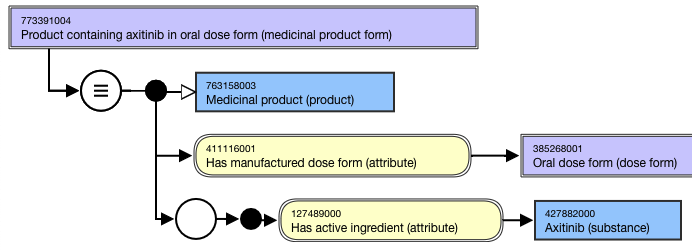
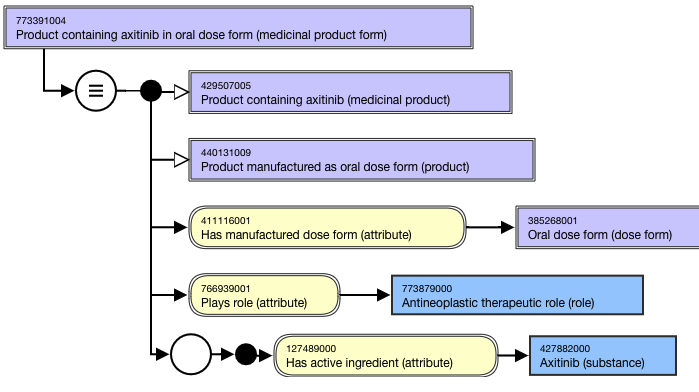
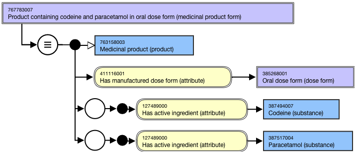
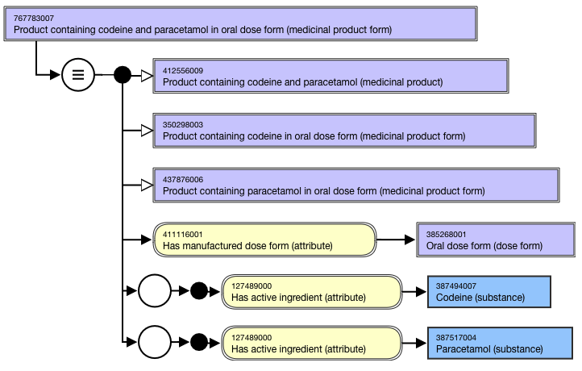

# Medicinal Product Form containing

## Overview

The |Product containing x in y dose form (medicinal product form)| concept is an abstract representation of active ingredient(s) and dose form intended site for a medicinal product. The medicinal product must contain the active ingredient(s) specified in the FSN but may also contain a modification of the active ingredient(s) specified in the FSN or may contain additional active ingredient(s) as well.

For example,

  *     * Product containing axitinib in oral dose form (medicinal product form)
    * Product containing abacavir and lamivudine in oral dose form (medicinal product form)

## Modeling

Stated parent| 763158003 |Medicinal product (product)  
---|---  
Semantic tag| (medicinal product form)  
Definition status| Defined  
Attribute:Has active ingredient| Range: <105590001 |Substance (substance)|, excluding concepts representing structural groupers, dispositions, or rolesCardinality: 1..*There is no technical limit on the number of Has active ingredient attributes that may be added to a concept; a practical limit may be imposed at a later date.  
**Attribute:****Has manufactured dose form**|  Range: 736542009 |Pharmaceutical dose form (dose form) - descendants that are groupers representing intended site only (e.g. 385268001 |Oral dose form (dose form)|, 385287007 |Parenteral dose form (dose form)|)Cardinality: 1..1Exceptions: 

  * 385217004 |Conventional release gas for inhalation (dose form)| may be used as manufactured dose form for Medicinal product form concepts.
  * 785898006 |Conventional release solution for irrigation (dose form)| does not have 736474004 |Has dose form intended site (attribute)| but can be used as a target for manufactured dose form for Medicinal product form concepts.

  
  
## Naming

Use the following pattern for the FSN and PT. Align naming and case sensitivity with the FSN for the concepts that are selected as the attribute value.

For multiple ingredient drug products, active ingredients must be in alphabetical order and separated by the word “and”.

FSN| Product containing <Active ingredient FSN> in <Manufactured dose form FSN> (medicinal product form)Product containing <Active ingredient FSN> and <Active ingredient FSN> in <Manufactured dose form FSN> (medicinal product form)Product containing <Active ingredient FSN> and <Active ingredient FSN> and <Active ingredient FSN> in <Manufactured dose form FSN> (medicinal product form)For example,

  *     *       * Product containing axitinib in oral dose form (medicinal product form)
      * Product containing abacavir and lamivudine in oral dose form (medicinal product form)
      * Product containing abacavir and lamivudine and zidovudine in oral dose form (medicinal product form)

_Creation of MPF-containing concepts for all possible combinations of active ingredients contained in multiple ingredient products is not recomm ended at this time (no specific use case has been identified). For example, a product containing three active ingredients would only require creation of one MPF-containing concept. If any of the active ingredients is available as a single ingredient product, or as part of another multiple ingredient concept, then appropriate concepts would be created for those products._  
---|---  
Preferred Term| <Active ingredient PT>-containing product in <Manufactured dose form PT><Active ingredient PT>\- and <Active ingredient PT>-containing product in <Manufactured dose form PT><Active ingredient PT>\- and <Active ingredient PT>\- and <Active ingredient PT>-containing product in <Manufactured dose form PT>For example,

  *     *       * Axitinib-containing product in oral dose form
      * Abacavir- and lamivudine-containing product in oral dose form
      * Abacavir- and lamivudine- and zidovudine-containing product in oral dose form

  
Synonym| Synonyms matching the FSN are not required.  
  
## Exemplars

The following illustrates the **stated** view for 773391004 |Product containing axitinib in oral dose form (medicinal product form)|

<figure><figcaption>
The following illustrates the <strong>inferred</strong> view for 773391004 |Product containing axitinib in oral dose form (medicinal product form)|:
</figcaption></figure>

<figure><figcaption>
The following illustrates the <strong>stated</strong> view for 767783007 |Product containing codeine and paracetamol in oral dose form (medicinal product form)|:
</figcaption></figure>

<figure><figcaption>
The following illustrates the <strong>inferred</strong> view for 767783007 |Product containing codeine and paracetamol in oral dose form (medicinal product form)|:
</figcaption></figure>

<figure></figure>
