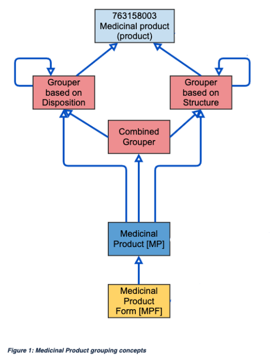

# Medicinal Product Groupers

A _grouper_ is a concept designed to aggregate concepts based on specific characteristics or commonalities. Medicinal products and their representations in a terminology can be put into groups in many ways, both in terms of abstraction and aggregation of product descriptions. In the SNOMED CT medicinal product model, the following grouping concepts will be used:

  * Groupings based on the pharmaceutical characteristics of manufactured medicinal products, and the primary subject of this model and documentation: in each of the sections below, these various model classes and their attributes are defined, described in detail and diagrams provided. In addition, their relationship to IDMP is described and a note as to their population status within the upcoming releases of SNOMED CT is provided.
    * Medicinal product - grouping based on active ingredient substance(s)
    * Medicinal product form - grouping based on active ingredient substance(s) combined with a grouping of the site of administration of manufactured dose form (parenteral dose forms, oral dose forms etc.)
      * These concepts are also grouped using the site of administration of manufactured dose form as a grouping concept
    * Clinical drug - a grouping based on active ingredient substance(s), with their strength, combined with manufactured dose form
  * Groupings based on the structural or behavioural characteristics exhibited by the active substance(s) that the products contain:  

    * Disposition - grouping based on mechanism of action of the active ingredient substance(s) in the product
    * Structure - grouping based on structural patterns of the active ingredient substance(s) in the product
    * Structure and Disposition - combination of the above

<figure><figcaption>
<em> [Groupers Based on Structure](Groupers-Based-on-Structure</em>174691043.html)
</figcaption></figure>

  

  * [Groupers Based on Disposition](Groupers-Based-on-Disposition_174690991.html)
  * [Groupers Based on Multiple Dispositions, Structures](174691077.html)
  * [Groupers Based on Infusion and or Injection](Groupers-Based-on-Infusion-and-or-Injection_174691096.html)
  * [Groupers Based on Dose form intended site](Groupers-Based-on-Dose-form-intended-site_174690976.html)

