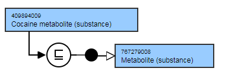

# Metabolites

## Overview

Concepts representing _Metabolites of X_ will be considered for inclusion based upon project requirements.

## Modeling

**Parent concept**|  767279008 |Metabolite (substance)|  
---|---  
**Semantic tag**| (substance)  
**Definition status**|  Primitive  
**Attribute**|  None  
  
## Naming

**FSN**|  Pattern: X metabolite (substance)For example,

  *     *       * Cocaine metabolite (substance)

  
---|---  
**Preferred Term**|  Pattern: X metaboliteFor example,

  *     *       * Cocaine metabolite

  
  
## Exemplar

The following illustrates the **stated** and **inferred** view:

<figure></figure>
