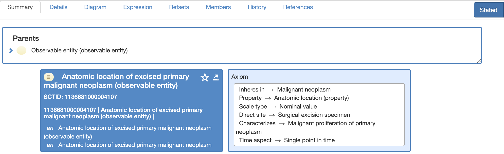
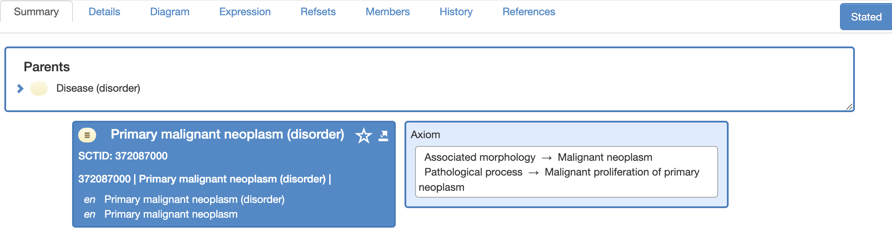

# Neoplasm Observables

Observable entity concepts representing histopathology examination observables of neoplasms are being modeled according to a series of templates. 

Please see the templates listed here: <https://confluence.ihtsdotools.org/x/SonUAw.> See the [Community Content](https://confluence.ihtsdotools.org/x/VHXoBg) area for more information about the project. 

Concepts containing a _primary_ malignant neoplasm from the observable entity subhierarchy employ the 704321009 |Characterizes (attribute)| with the target qualifier value of 1234914003 |Malignant proliferation of primary neoplasm (qualifier value)| in order to define _primary_ (which matches the target value of the Pathological process (attribute) used by concepts in the Disorder hierarchy). 

For example, 

1136681000004107 |Anatomic location of excised primary malignant neoplasm (observable entity)| applies the Characterizes (attribute) with a target of Malignant proliferation of primary neoplasm (qualifier value). 

<figure><figcaption>
Figure 1: Stated view of 1136681000004107 |Anatomic location of excised primary malignant neoplasm (observable entity)|
</figcaption></figure>

  

<figure><figcaption>
Figure 2: Stated view of 372087000 |Primary malignant neoplasm (disorder)|
</figcaption></figure>

  

Concepts containing a _metastatic_ malignant neoplasm from the observable entity subhierarchy do not use 704321009 |Characterizes (attribute)|, but instead are defined by the specific  _metastatic_ morphologic abnormality. For example, 444384007 |Number of regional lymph nodes containing metastatic neoplasm in excised specimen (observable entity)| has the attribute 246093002 |Component (attribute)| with a target value of 14799000 |Neoplasm, metastatic (morphologic abnormality)|.

  

The terms _colorectal_ and _colorectum_ , commonly used by pathologists, are included in descriptions for concepts referring to neoplasms modeled with 1285733009 |Structure of cecum and/or colon and/or rectum (body structure)|. 1285733009 |Structure of cecum and/or colon and/or rectum (body structure)| is needed because neoplasms are the same from the cecum to rectum and are considered as a group in cancer synoptic reporting protocols. Note, there is no consensus concerning the definition of _colon_ in the literature and between different domains.

  

Concepts containing a _metastatic_ malignant neoplasm from the observable entity subhierarchy do not use 704321009 |Characterizes (attribute)|, but instead are defined by the specific  _metastatic_ morphologic abnormality. For example, 444384007 |Number of regional lymph nodes containing metastatic neoplasm in excised specimen (observable entity)| has the attribute 246093002 |Component (attribute)| with a target value of 14799000 |Neoplasm, metastatic (morphologic abnormality)|.

Concepts containing a _metastatic_ malignant neoplasm from the observable entity subhierarchy do not use 704321009 |Characterizes (attribute)|, but instead are defined by the specific  _metastatic_ morphologic abnormality. For example, 444384007 |Number of regional lymph nodes containing metastatic neoplasm in excised specimen (observable entity)| has the attribute 246093002 |Component (attribute)| with a target value of 14799000 |Neoplasm, metastatic (morphologic abnormality)|.
