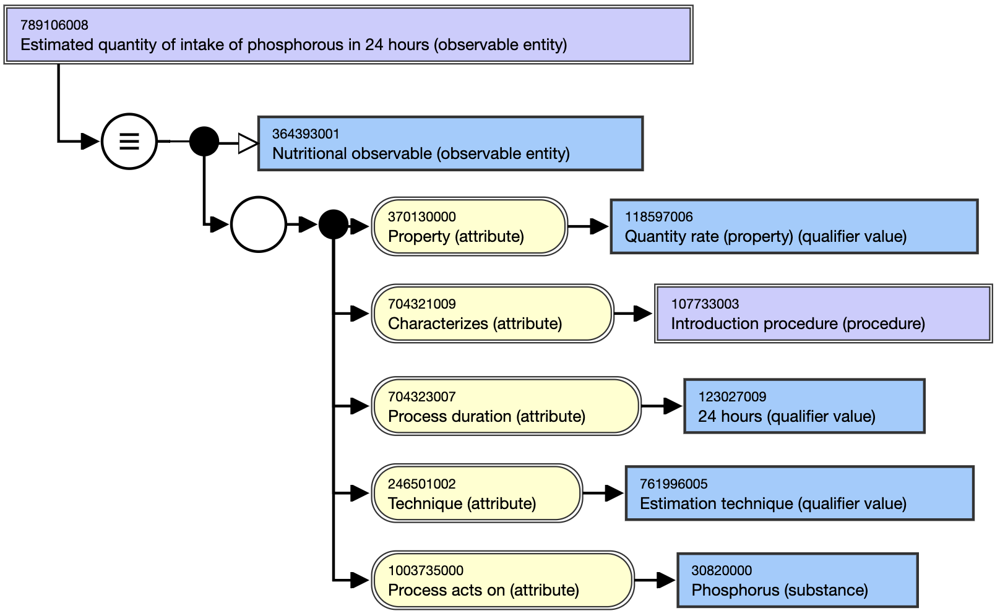

# Nutritional intake observable entities

Naming conventions for estimated and measured intake or nutrient administration, in aggregate or as a portion of intake via a specified route (ie, oral, gastroenteral [enteral nutrition], parenteral nutrition, and via intravenous fluids), is as follows:

FSN: [technique] quantity of intake of [substance] via [route] in [timeframe] (observable entity)

SYN: [technique] quantity of intake of [substance] via [route] in [timeframe]

See the specific template [here](https://confluence.ihtsdotools.org/pages/viewpage.action?pageId=87041725). 

For example,

[ 789106008 | Estimated quantity of intake of phosphorous in 24 hours (observable entity)|](http://snomed.info/id/789106008 "789106008 | Estimated quantity of intake of phosphorous in 24 hours \(observable entity\) |")

FSN: Estimated quantity of intake of phosphorous in 24 hours (observable entity)

PT: Estimated quantity of intake of phosphorous in 24 hours

<figure><figcaption>
Figure 1: Stated view of 789106008 |Estimated quantity of intake of phosphorous in 24 hours (observable entity)|
</figcaption></figure>

  

  

