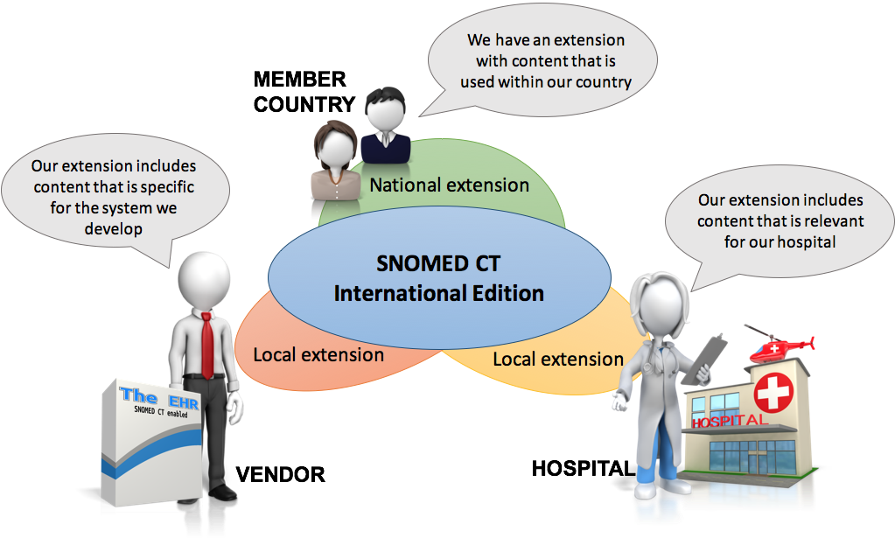

# Out of Scope

## National and local extensions

SNOMED CT has an international and multilingual scope but can be localized to represent meanings and terms unique to particular organizations or localities. A National Extension includes content outside of the scope of the International Release, but necessary for national conformance and interoperability. Each member-state determines the application and interpretation of this scope and whether or not concepts should be added to their extension.

<figure><figcaption>
National Extension criteria include affirmative answers to the following:
</figcaption></figure>

  * Is the concept outside of the scope of the International Release, but necessary for national conformance and interoperability?
  * Is it useful throughout the national healthcare system?
  * Does it need to be understandable throughout the national healthcare system?
  * Does it need to be shared in a reproducible manner within the national healthcare system?

Extensions are created, structured, maintained, and distributed in accordance with SNOMED CT specifications and guidelines to ensure compatibility with the SNOMED CT International Release. Members may create, maintain, and distribute extensions to address specific national, regional, and language requirements. Affiliates may also create, maintain, and distribute extensions to meet the needs of particular software solutions and customers. Content that is within the scope of the International Release is restricted to the International Release and may not be modified or replaced by an extension, unless explicitly permitted by SNOMED International. Please see the _Practical Guide to Extensions_ for more information.

## Veterinary extension

SNOMED CT is not intended to cover all medical knowledge. Content that is strictly related to animals is out of the scope of the SNOMED CT international release. Non-human content may be included in a request for new content via the SNOMED International Content Request System (CRS) or may be identified in the International Release. Careful consideration is required to differentiate content that belongs in the International Release versus an extension. The basic principle is that content used in human medicine should be in the core. Content that is strictly non-human may be managed in an extension.

Examples of non-human content,

  *     * Egg-related coelomitis (disorder)
    * Dehorning (procedure)
    * Bone structure of wing (body structure)

Types of content that should be in the core include the following:

  * **Diseases and findings.** Anything that can occur in both humans and animals should be in the core.
  * **Material entities.** A material entity is a concept found within the Substance, Physical object, Pharmaceutical/biologic product, Physical force, or Organism subhierarchies. Every substance that can cause adverse effects should be in the core (with the understanding that poisonings and adverse effects in humans may be caused by virtually any substance). Some material entities may be of interest only in a non-human or veterinary context. These entities may be added to, or left in, a veterinary extension.
  * **Organisms.** Most organisms should be in the core:
    * In general, microorganisms will be added to the core as they can be either human pathogens or they can change host or take advantage of immunosuppression in humans. Also, human laboratories may need to report animal pathogens.
    * Macroorganisms are added to the core when used in public health or human medicine or when requested by more than one SNOMED International member country. Otherwise, they maybe added the Veterinary Extension maintained by the Veterinary Terminology Services Laboratory (VTSL) at Virginia Tech University. The Veterinary extension content is not transferred to the core, except when used in public health or human medicine or when requested by more than one SNOMED International member country.
    * Breeds are restricted to the veterinary domain.

The Veterinary Extension is publicly available to SNOMED International member countries and to Affiliate Licensees. To access to the Veterinary Extension, please see [http://vtsl.vetmed.vt.edu](http://vtsl.vetmed.vt.edu/), or contact the VTSL at [vtsl.e](mailto:vtsl.extension@gmail.com)[xtension@gmail.com](mailto:xtension@gmail.com).

## Classification-derived phrases

Classification-derived phrases are not accepted. Concepts with unclear, unspecified, or ambiguous meaning should not be used. Rejections are expected for requests with the following phrases:

  * Not otherwise specified (NOS)
    * For example, Mental disorder,  _not otherwise specified_
  * Not elsewhere classified (NEC)
    * For example, Chronic hepatitis,  _not elsewhere classified_
  * No mention
    * For example, Bile duct calculus with  _no mention_ of cholecystitis and with obstruction
  * With or without
    * For example, Tubal pregnancy  _with or without_ intrauterine pregnancy
  * No organism identified
    * For example, Infective myocarditis with _no organism identified_

##  Regulatory or legal status

The determination of whether something is legal or illegal cannot be universally stated, as it is subject to jurisdictional variability and the specific laws, regulations, and interpretations that apply in different regions or legal systems. For this reason, the notion of legality should not be included in SNOMED CT International concepts.

Concepts referring to regulatory status or characterization (e.g., over-the-counter) are out of scope for the International Release _._ Meaning may vary by jurisdiction and may not be consistent internationally.

A person's citizenship or legal residence is not an intrinsic characteristic of a person and is out of scope. SNOMED International recommends use of ISO country codes for recording residency. 

## Funding care delivery

Because of the jurisdictional and administrative aspects of medical insurance, this has been deemed out of scope for the SNOMED CT International release. It is up to individual member countries to determine if that type of content should be included in their extensions. Users should contact their country's extension administrator to determine if this type of content is acceptable.

  

