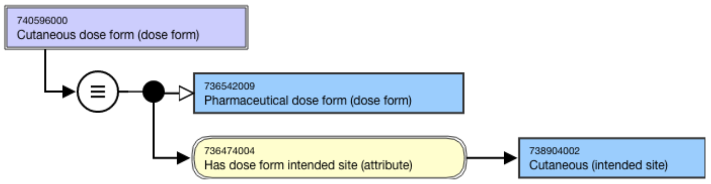

# Pharmaceutical Dose Form Grouper Based on Intended Site

## Overview

Pharmaceutical dose form grouper concepts based on intended site of use for the dose form that are deemed to be clinically useful, or which provide a helpful organizing grouper, and that can be sufficiently defined, may be included in the 736542009 |Pharmaceutical dose form (dose form)| hierarchy.

These concepts are used in modeling (medicinal product form) concepts in the International Release; they are not allowed to model (clinical drug) concepts in the International Release.

## Modeling

Pharmaceutical dose form grouper concepts based on intended site shall be modeled using the proximal primitive modeling pattern. 

**Parent concept**|  736542009 |Pharmaceutical dose form (dose form)  
---|---  
**Semantic tag**| (dose form)  
**Definition status**|  Defined  
**Attribute:****Has dose form intended site**|  Range: << 736479009 |Dose form intended site (intended site)Cardinality: 0..*  

  *     * While the allowed range is broader, the grouper concepts based on dose form intended site should have one or more |Has dose form intended site| attributes.

  
  
## Naming

**FSN**|  Use the following pattern for the FSN; align naming and case sensitivity with the FSN for the concept that is selected as the attribute value. For multiple intended sites, the intended sites must be in alphabetical order and separated by the word “and”.

  * <Dose form intended site FSN> dose form (dose form)
  * <Dose form intended site FSN> and <Dose form intended site FSN> dose form (dose form)

For example,

  *     *       * Conventional release cutaneous dose form (dose form)
      * Conventional release oral dose form (dose form)
      * Conventional release parenteral dose form (dose form)
      * Conventional release ear and eye and nose drops (dose form)
      * Conventional release ear and eye drops (dose form)

  
---|---  
**Preferred Term**|  Use the following pattern for the PT; align naming and case sensitivity with the PT for the concept that is selected as the attribute value. For multiple intended sites, the intended sites must be in alphabetical order and separated by the word “and”.

  * <Dose form intended site PT> dose form (dose form)
  * <Dose form intended site PT> and <Dose form intended site PT> dose form (dose form)

For example,

  *     *       * Cutaneous dose form
      * Oral dose form
      * Parenteral dose form
      * Ear and eye and nose drops 
      * Ear and eye drops

  
**Synonyms**|  Synonyms are not allowed unless explicitly identified as an exception in the Editorial Guidelines.  
**Text definitions**|  Optional  
  
## Exemplar

The following illustrates the stated**** view for grouper concept 740596000 |Cutaneous dose form (dose form)|:

<figure></figure>
