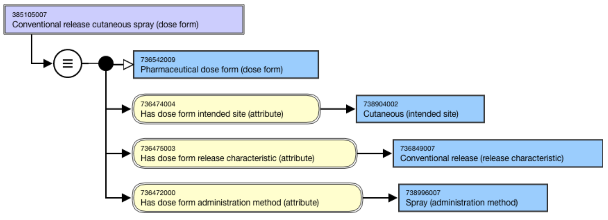
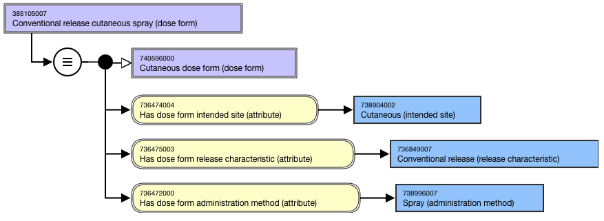
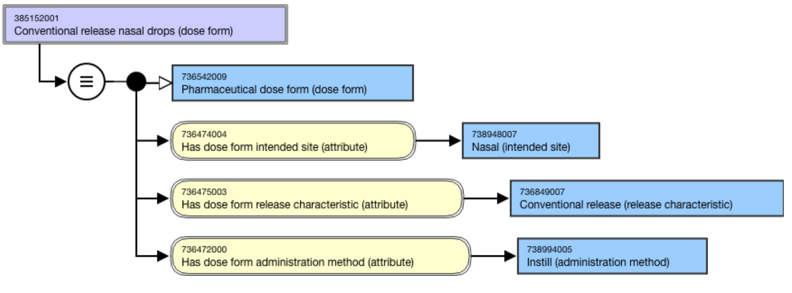
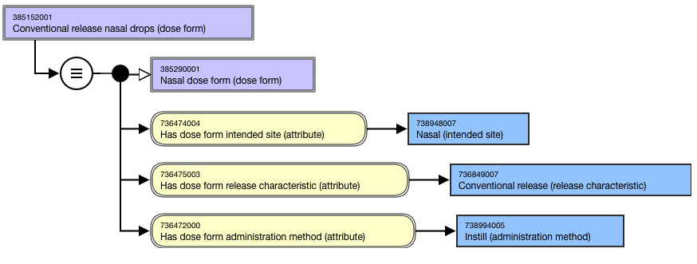
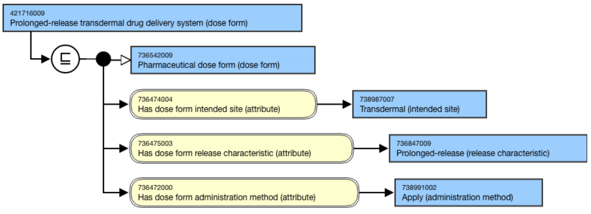
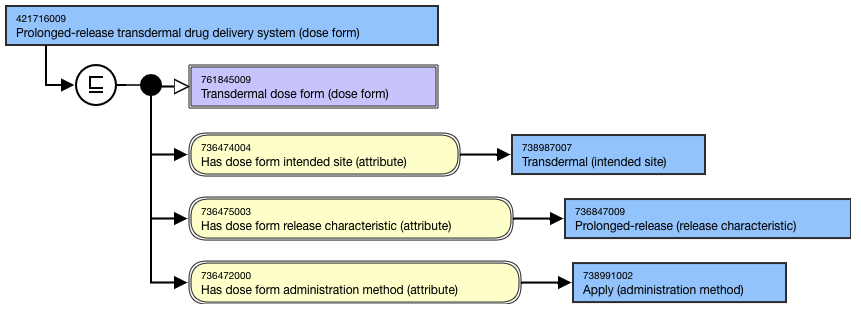

# Pharmaceutical Dose Form Grouper Without Basic Dose Form

## Overview

Pharmaceutical dose form grouper concepts that do not include a basic dose form but are deemed to be clinically useful and that can be sufficiently defined will be included in the 736542009 |Pharmaceutical dose form (dose form)| hierarchy.

## Modeling

Grouper concepts concepts that do not include a basic dose form shall be modeled using the proximal primitive modeling pattern. 

**Parent concept**|  736542009 |Pharmaceutical dose form (dose form)  
---|---  
**Semantic tag**| (dose form)  
**Definition status**|  DefinedException:

  *     * Grouper concepts representing drug delivery systems will have a definition status of Primitive

  
**Attribute:****Has dose form release characteristic**|  Range: << 736480007 |Dose form release characteristic (release characteristic)|Cardinality: 0..*  

  *     * While the allowed range is broader, the grouper concepts without basic dose form should have 1..1 |Has dose form release characteristic| attributes.

  
**Attribute:****Has dose form intended site**|  Range: << 736479009 |Dose form intended site (intended site)Cardinality: 0..*  

  *     * While the allowed range is broader, the grouper concepts without basic dose form should have 1..* |Has dose form intended site| attributes.

  
**Attribute:****Has dose form administration method**|  Range: << 736665006 |Dose form administration method (administration method) Cardinality: 0..*

  *     * While the allowed range is broader, the grouper concepts without basic dose form should have 1..1 |Has dose form administration method| attributes.

  
  
## Naming

**FSN**|  For concepts with 736472000 |Has dose form administration method (attribute)| = 738996007 |Spray (administration method)|, use the following pattern for the FSN; align naming and case sensitivity with the FSN for the concept that is selected as the attribute value. For multiple intended sites, the intended sites must be in alphabetical order and separated by the word “and”.

  * <Dose form release characteristic> <Dose form intended site FSN> <Dose form administration method> (dose form)

For example,

  *     *       * Conventional release cutaneous spray (dose form)
      * Conventional release nasal spray (dose form)
      * Conventional release sublingual spray (dose form)

\---------------For concepts representing drops with 736472000 |Has dose form administration method (attribute)| = 738994005 |Instill (administration method)|, use the following pattern for the FSN; align naming and case sensitivity with the FSN for the concept that is selected as the attribute value. For multiple intended sites, the intended sites must be in alphabetical order and separated by the word “and”.

  * <Dose form release characteristic> <Dose form intended site FSN> <Dose form administration method> (dose form)

For example,

  *     *       * Conventional release nasal drops (dose form)
      * Prolonged-release eye drops (dose form)

\---------------For concepts representing drug delivery systems, use the following pattern for the FSN; align naming and case sensitivity with the FSN for the concept that is selected as the attribute value. For multiple intended sites, the intended sites must be in alphabetical order and separated by the word “and”.

  * <Dose form release characteristic> <Dose form intended site FSN> drug delivery system

For example,

  *     *       * Prolonged-release intrauterine drug delivery system (dose form)
      * Prolonged-release transdermal drug delivery system (dose form)

  
---|---  
**Preferred Term**|  For concepts with 736472000 |Has dose form administration method (attribute)| = 738996007 |Spray (administration method)|, use the following pattern for the PT; align naming and case sensitivity with the PT for the concept that is selected as the attribute value. For multiple intended sites, the intended sites must be in alphabetical order and separated by the word “and”. Exclude <Dose form release characteristic> when = 736849007 |Conventional release (release characteristic)|.

  * <Dose form release characteristic> <Dose form intended site FSN> <Dose form administration method>

For example,

  *     *       * Cutaneous spray
      * Nasal spray
      * Sublingual spray

\---------------For concepts representing drops with 736472000 |Has dose form administration method (attribute)| = 738994005 |Instill (administration method)|, use the following pattern for the PT; align naming and case sensitivity with the PT for the concept that is selected as the attribute value. For multiple intended sites, the intended sites must be in alphabetical order and separated by the word “and”. Exclude <Dose form release characteristic> when = 736849007 |Conventional release (release characteristic)|.

  * <Dose form release characteristic> <Dose form intended site FSN> <Dose form administration method>

For example,

  *     *       * Nasal drops
      * Prolonged-release eye drops

\---------------For concepts representing drug delivery systems, use the following pattern for the PT; align naming and case sensitivity with the PT for the concept that is selected as the attribute value. For multiple intended sites, the intended sites must be in alphabetical order and separated by the word “and”. Exclude <Dose form release characteristic> when = 736849007 |Conventional release (release characteristic)|.

  * <Dose form release characteristic> <Dose form intended site FSN> drug delivery system

For example,

  *     *       * Prolonged-release intrauterine drug delivery system (dose form)
      * Prolonged-release transdermal drug delivery system (dose form)

  
**Synonyms**|  A synonym matching the FSN is required; additional synonyms are not allowed unless explicitly identified as an exception in the Editorial Guidelines.Exceptions:

  * Synonyms with _eye_ instead of _ocular_ , _ear_ instead of _otic_ , or _nose_ instead of _nasal_ may be created.

  
**Text definitions**|  Optional  
  
## Exemplars

The following illustrates the **stated** view for concept 385105007 |Conventional release cutaneous spray (dose form)|:

<figure><figcaption>
The following illustrates the <strong>inferred</strong> view for concept 385105007 |Conventional release cutaneous spray (dose form)|:
</figcaption></figure>

<figure><figcaption>
The following illustrates the <strong>stated</strong> view for concept 385152001 |Conventional release nasal drops (dose form)|:
</figcaption></figure>

<figure><figcaption>
The following illustrates the <strong>inferred</strong> view for concept 385152001 |Conventional release nasal drops (dose form)|:
</figcaption></figure>

<figure><figcaption>
The following illustrates the <strong>stated</strong> view for concept 421716009 |Prolonged-release transdermal drug delivery system (dose form)|:_
</figcaption></figure>

_

<figure><figcaption>
The following illustrates the <strong>inferred</strong> view for concept 421716009 |Prolonged-release transdermal drug delivery system (dose form)|:
</figcaption></figure>

_

<figure><figcaption>
_
</figcaption></figure>

  
