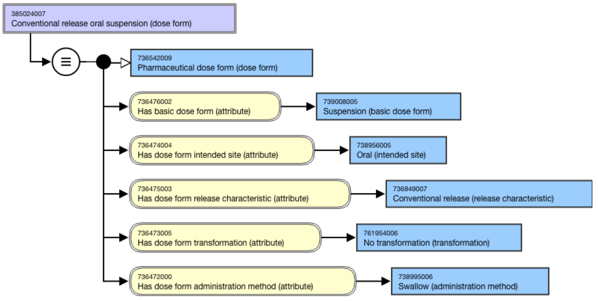
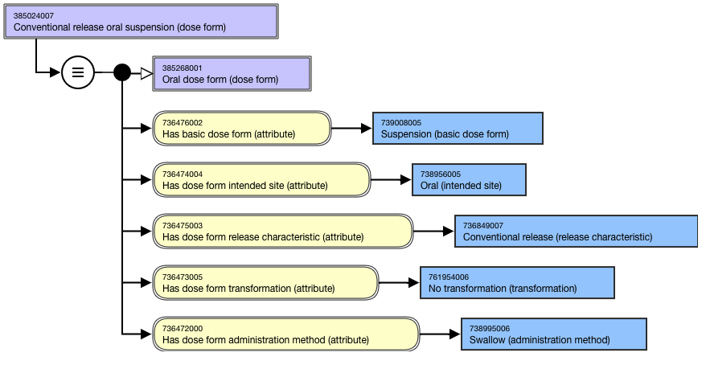
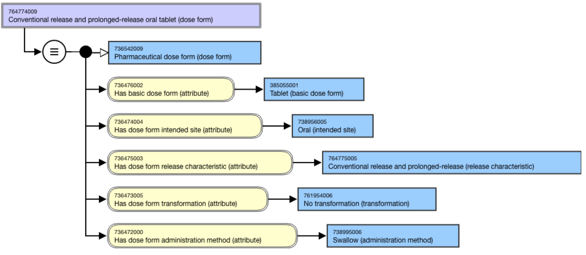
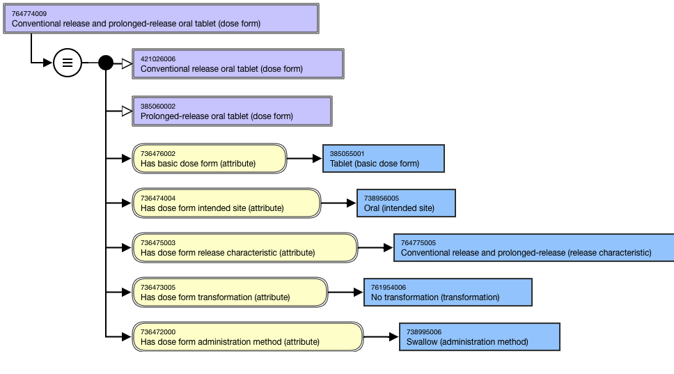

# Pharmaceutical Dose Form Naming and Modeling Conventions

## Overview

Pharmaceutical dose form concepts (e.g. conventional release oral tablet, prolonged-release oral capsule) that are deemed to be clinically useful and that can be sufficiently defined will be included in the 736542009 |Pharmaceutical dose form (dose form)| hierarchy. Primitive concepts may be included if documented as an exception. 

### Out of Scope

Lyophilized dose forms are out of scope for the international edition of SNOMED CT.

## Modeling

**Parent concept**|  736542009 |Pharmaceutical dose form (dose form)|  
---|---  
**Semantic tag**| (dose form)  
**Definition status**|  DefinedExceptions:

  *     * The following referenced in concepts cannot be sufficiently defined. They are modeled with a parent of 736542009 |Pharmaceutical dose form (dose form) with all applicable attributes and have a Definition status of _Primitive_. 
      *         * coated
        * drug delivery system
        * iontophoresis (e.g. 385113008 |Conventional release solution for iontophoresis (dose form)|)
        * nebulizer (e.g. 385198000 |Conventional release solution for nebulizer (dose form)|)
        * particle (421535006 |Gastro-resistant oral particles tablet (dose form)|)
        * pellet (e.g. 420767002 |Gastro-resistant oral pellets capsule (dose form)|)
        * syrup (e.g. 385033009 |Powder for conventional release oral syrup (dose form)|)
        * vapor

  
**Attribute:****Has basic dose form**|  Range: <736478001 |Basic dose form (basic dose form)|Cardinality: 0..1

  *     * While the allowed range is broader, concepts representing a sufficiently defined pharmaceutical dose form should have one and only one |Has basic dose form| attribute.

  
**Attribute:****Has dose form intended site**|  Range: <736479009 |Dose form intended site (intended site)|Cardinality: 0..*

  *     * While the allowed range is broader, concepts representing a sufficiently defined pharmaceutical dose form should have one or more |Has dose form intended site| attributes.  

Exceptions: 

  *     * 785898006 |Conventional release solution for irrigation (dose form)|  

    * 785910004 |Prolonged-release intralesional implant (dose form)|  

  
**Attribute:****Has dose form release characteristic  
**|  Range: <736480007 |Dose form release characteristic (release characteristic)|  
Cardinality: 0..1

  *     * While the allowed range is broader, concepts representing a sufficiently defined pharmaceutical dose form should have one and only one |Has dose form release characteristic| attribute._  
_

  
**Attribute:****Has dose form administration method**|  Range: <736665006 |Dose form administration method (administration method)|Cardinality: 0..*

  * While the allowed range is broader, concepts representing a sufficiently defined pharmaceutical dose form should have one and only one |Has dose form administration method| attribute.

  
**Attribute:****Has dose form transformation**|  Range: <736477006 |Dose form transformation (transformation)|Cardinality: 0..*

  *     * While the allowed range is broader, concepts representing a sufficiently defined pharmaceutical dose form should have one and only one |Has dose form transformation| attribute. 

  
  
## Naming Guidelines

**FSN**|  Use the following pattern for the FSN; align naming and case sensitivity with the FSN for the concepts that are selected as the attribute values, excluding the semantic tag. For multiple intended sites, the sites must be in alphabetical order and separated by the word “and”.<Dose form release characteristic FSN> <Dose form intended site FSN> <Basic dose form> (dose form)For example,

  *     *       * Conventional release oral capsule (dose form)
      * Conventional release oral suspension (dose form)  

      * Prolonged-release oral capsule (dose form)
      * Conventional release and prolonged-release oral tablet (dose form)
      * Conventional release cutaneous cream (dose form)  

      * Conventional release vaginal ointment (dose form)  

      * Gastro-resistant oral suspension (dose form)  

  
---|---  
**Preferred Term**|  Use the following pattern for the PT; align naming and case sensitivity with the PT for the concepts that are selected as the attribute values, excluding the semantic tag. For multiple intended sites, the sites must be in alphabetical order and separated by the word “and”. Exclude <Dose form release characteristic> when = 736849007 |Conventional release (release characteristic)|.<Dose form release characteristic FSN> <Dose form intended site FSN> <Basic dose form>For example,

  *     *       * Oral capsule
      * Oral suspension
      * Prolonged-release oral capsule
      * Conventional release and prolonged-release oral tablet
      * Cutaneous cream
      * Vaginal ointment
      * Gastro-resistant oral suspension

  
**Synonyms**|  A synonym matching the FSN is required; other synonyms are not allowed unless explicitly identified as an exception in the Editorial Guidelines.Exceptions:

  *     * Synonyms with _eye_ instead of _ocular_ , _ear_ instead of _otic_ , or _nose_ instead of _nasal_ may be created.

  
**Text Definitions**|  Optional  
  
### Exemplar

The following illustrates the ****stated**** view for 385024007 |Conventional release oral suspension (dose form)|:

<figure><figcaption>
The following illustrates the *<em><strong>inferred</strong></em>* view for 385024007 |Conventional release oral suspension (dose form)|:
</figcaption></figure>

<figure><figcaption>
The following illustrates the *<em><strong>stated</strong></em>* view for 764774009 |Conventional release and prolonged-release oral tablet (dose form)|:
</figcaption></figure>

<figure><figcaption>
The following illustrates the *<em><strong>inferred</strong></em>* view for 764774009 |Conventional release and prolonged-release oral tablet (dose form)|:
</figcaption></figure>

  

<figure></figure>

  

