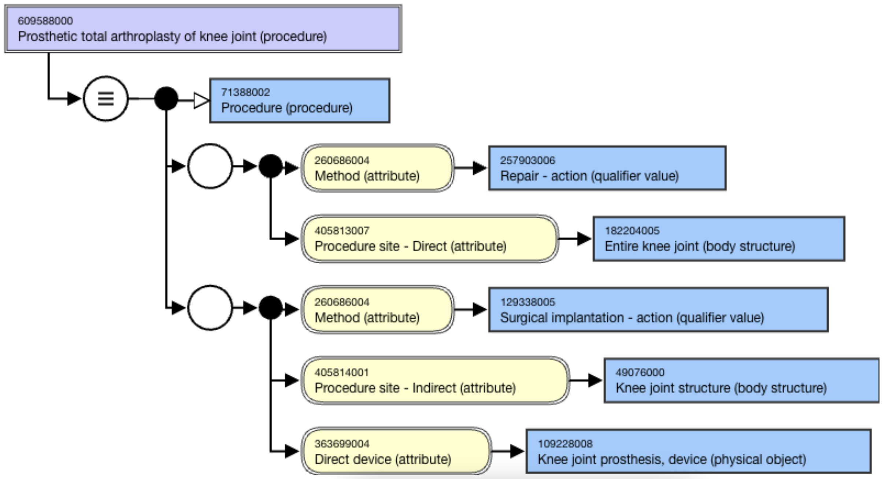
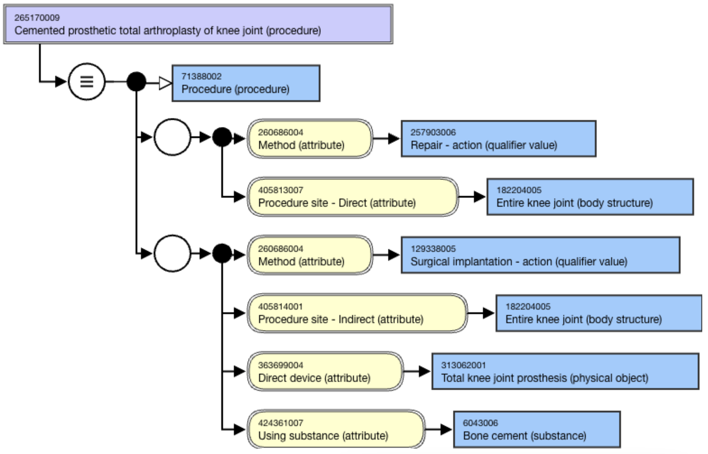
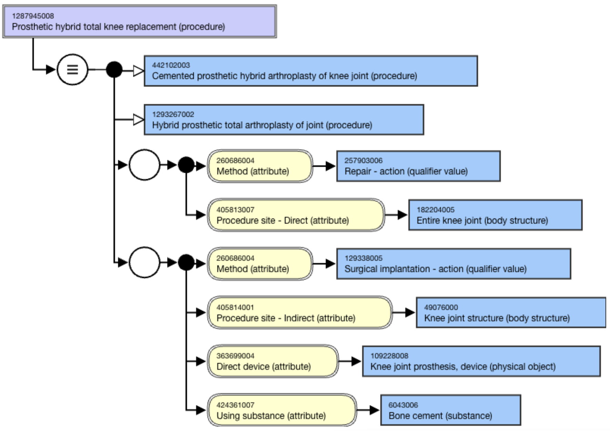
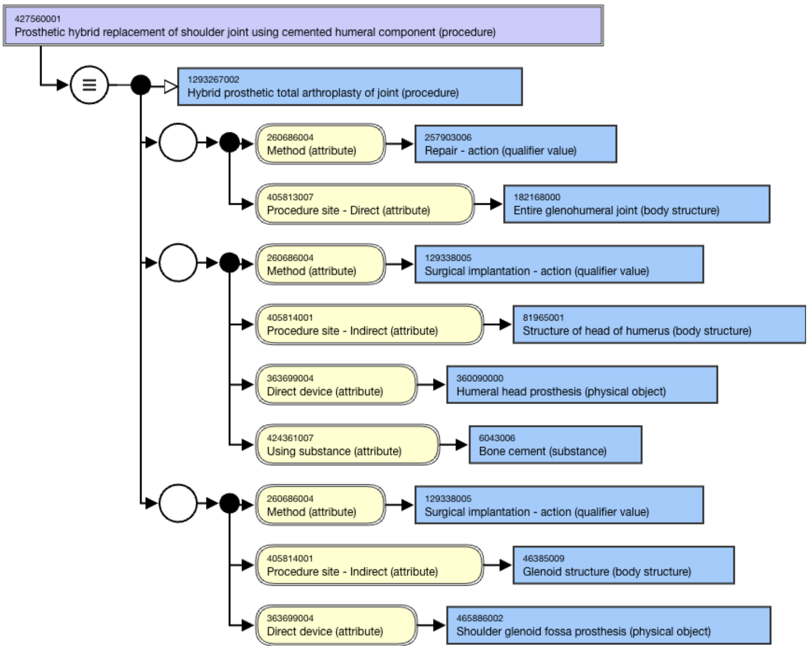

# Prosthetic arthroplasty of joint

<< [ 1288025000 | Prosthetic arthroplasty of joint (procedure)|](http://snomed.info/id/1288025000 "1288025000 | Prosthetic arthroplasty of joint \(procedure\) |")

Prosthetic arthroplasties refer to the partial or total replacement of bones of a joint with a prosthetic device. All prosthetic arthroplasty concepts must be modeled with a _Repair_ role group to ensure they classify under 442095009 |Repair of joint (procedure)|, along with an _Implantation_ role group for the prosthetic device.

## Total joint replacement

Total joint procedures are modeled by repair and implantation role groups. The repair group must have the [ 405813007 | Procedure site - Direct (attribute)|](http://snomed.info/id/405813007 "405813007 | Procedure site - Direct \(attribute\) |") value of the entire joint. In the implantation role group, as the prostheses are applied to all of the bones in a joint, the generic _joint prosthesis_ and _joint structure_ concepts should be used in modeling to subsume hybrid total arthroplasties.

<figure><figcaption>
Figure 1: Stated view of 609588000 |Prosthetic total arthroplasty of knee joint (procedure)|
</figcaption></figure>

  

## Cemented total arthroplasty

The use of bone cement should only be included in the implantation role group. The entire joint in the repair group represents the totality of arthroplasty, as does the total joint prosthesis in the implantation role group.

<figure><figcaption>
Figure 2: Stated view of 265170009 |Cemented prosthetic total arthroplasty of knee joint (procedure)|
</figcaption></figure>

  

## Hybrid total arthroplasty

Bone cement is only applied to one bone in a joint, leaving the other bone uncemented. Hence, a hybrid total arthroplasty should not be a subconcept of a cemented total arthroplasty.

If the cemented component is unspecified, the single implementation role group follows the model of total joint replacements with an additional substance of bone cement.

<figure><figcaption>
Figure 3: Stated view of 1287945008 |Prosthetic hybrid total knee replacement (procedure)|
</figcaption></figure>

  

If the cemented component is known, multiple implantation role groups should be created to represent the prosthesis component of each bone.

<figure><figcaption>
Figure 4: Stated view of 427560001 |Prosthetic hybrid replacement of shoulder joint using cemented humeral component (procedure)|
</figcaption></figure>

  

  

